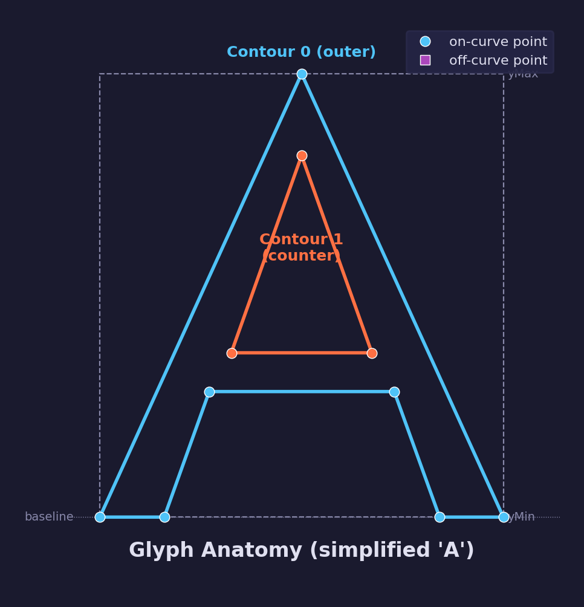
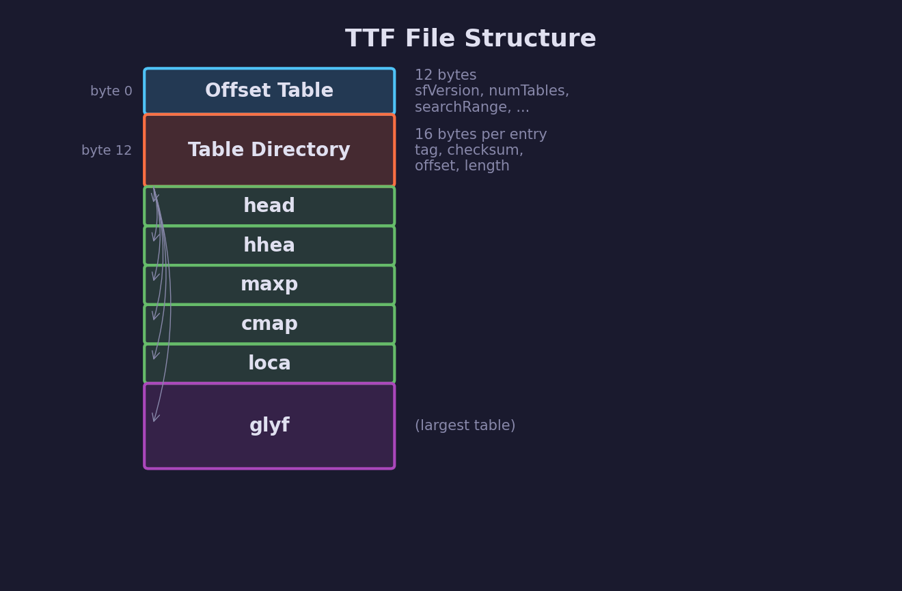
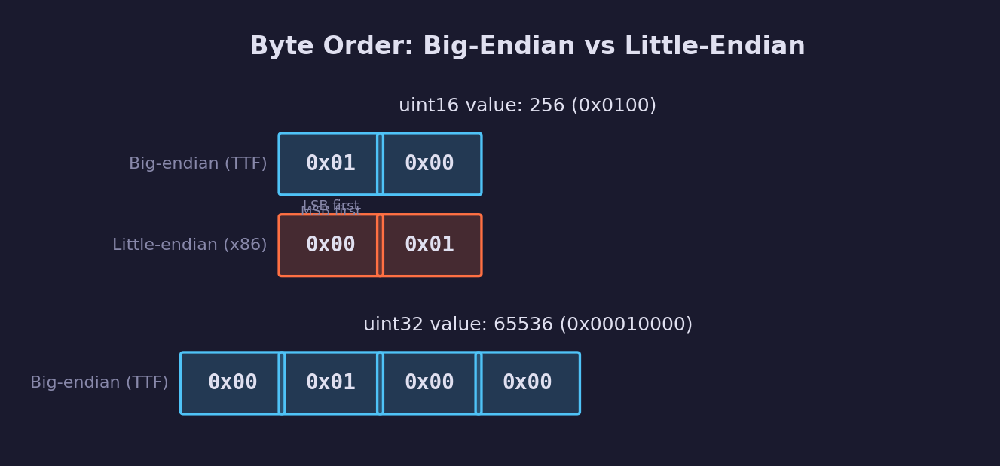

# UI Lesson 01 — TTF Parsing

Parse a TrueType font file from first principles — understand the binary
format, read the table directory, and extract font metrics and glyph outlines.

## What you'll learn

- What a font file actually is — a binary container of tables, not a linear
  stream of glyph data
- **Endianness** — why TTF stores integers in big-endian byte order
- The **offset table** — the first bytes of every TTF file
- The **table directory** — a lookup table for finding any table by its tag
- The **head table** — global font metadata including `unitsPerEm`
- The **hhea table** — horizontal metrics that determine line spacing
- The **maxp table** — the total glyph count
- The **cmap table** — mapping Unicode codepoints to glyph indices (format 4)
- The **loca table** — locating glyph data within the file
- The **glyf table** — parsing glyph outlines (contours, on/off-curve points,
  delta-encoded coordinates)
- How all this data feeds into future lessons (rasterization, text layout)

## Key concepts

- **Font files are table-based databases, not sequential glyph streams** — a
  table of contents (the table directory) maps 4-character tags to byte offsets,
  letting parsers jump directly to the data they need.
- **Glyph indices are not Unicode codepoints** — the `cmap` table translates
  codepoints (like U+0041 for 'A') into internal glyph indices. Without this
  mapping, you cannot locate any glyph.
- **TTF uses big-endian integers** — platforms like x86 store integers in
  little-endian order, so every multi-byte read from a TTF file requires
  explicit byte swapping.
- **The offset table and table directory are the lookup mechanism** — the
  12-byte offset table identifies the file as TrueType and tells you how many
  tables exist; the table directory entries (16 bytes each) give you each
  table's tag, offset, and length.
- **loca/glyf relationship** — `loca` is an index of offsets pointing into
  `glyf`. Each entry in `loca` gives the byte position of a glyph's outline
  data (contours, on/off-curve points, delta-encoded coordinates) within the
  `glyf` table.

## Prerequisites

This is the first UI lesson — no earlier UI lessons are required. If you are
new to the C programming language, work through
[Engine 01 — Intro to C](../../engine/01-intro-to-c/) first. Familiarity with
pointers and memory layout from
[Engine 04 — Pointers & Memory](../../engine/04-pointers-and-memory/) will help
when reading the byte-level parsing code.

## Result

A console program that loads a `.ttf` file and prints its internal structure:
table directory, font metrics, cmap lookups, and parsed glyph outline data.

The program extracts the raw contour points that define each glyph shape —
on-curve points that lie on the outline, and off-curve control points that
define quadratic Bézier curves:



## Background

### TTF file structure

A TTF file is organized as a table directory pointing to independent data
tables at various offsets within the file:



### What is a font file?

A font file is not a simple list of pictures of letters. It is a **binary
container** holding dozens of independent data tables, each serving a different
purpose: one table stores glyph outlines, another stores horizontal spacing,
another maps character codes to glyph indices, and so on.

This table-based architecture exists for three reasons:

1. **Random access** — a text renderer can jump directly to the table it needs
   without scanning through the entire file. When shaping a line of text, you
   need glyph metrics but not hinting instructions; with tables, you read only
   what you need.

2. **Optional features** — some tables are required (`head`, `cmap`, `glyf`),
   others are optional (`kern`, `GPOS`, `GSUB`). A minimal font omits the
   optional tables. A full-featured OpenType font adds tables for advanced
   typographic features without breaking parsers that do not understand them.

3. **Extensibility** — new tables can be added in future font versions without
   changing the format of existing tables. Your parser skips any table tag it
   does not recognize.

Contrast this with simpler file formats you may already know:

- **BMP** images are essentially linear — a fixed header followed by pixel data
  in row order. You read from top to bottom.
- **OBJ** mesh files are line-by-line text — `v` for vertices, `f` for faces,
  parsed sequentially (see
  [GPU Lesson 08 — Mesh Loading](../../gpu/08-mesh-loading/)).
- **TTF** is more like a small database or file system — a table of contents at
  the top, then independent data blocks at arbitrary offsets within the file.

### Endianness



If you have only worked with text file formats, TTF may be your first encounter
with **endianness** — the byte order used to store multi-byte integers.

A `uint16` value like `0x0100` (decimal 256) occupies two bytes. The question
is: which byte comes first in memory?

```text
Big-endian (TTF):     [0x01] [0x00]    (most significant byte first)
Little-endian (x86):  [0x00] [0x01]    (least significant byte first)
```

For a `uint32` value like `0x00010000`:

```text
Big-endian (TTF):     [0x00] [0x01] [0x00] [0x00]
Little-endian (x86):  [0x00] [0x00] [0x01] [0x00]
```

TTF uses **big-endian** byte order — also called **network byte order** because
internet protocols use the same convention. This is a historical artifact: Apple
developed TrueType in the late 1980s for the Macintosh, which used Motorola
68000 processors. The 68000 is a big-endian processor, so the natural byte
order for data on those machines was big-endian.

Today, most desktop CPUs (Intel, AMD, ARM in little-endian mode) are
little-endian. This means every multi-byte integer read from a TTF file must
be **byte-swapped** before use. Our parser provides helper functions for this:

```c
static Uint16 forge_ui__read_u16(const Uint8 *p)
{
    return (Uint16)((Uint16)p[0] << 8 | (Uint16)p[1]);
}

static Uint32 forge_ui__read_u32(const Uint8 *p)
{
    return (Uint32)p[0] << 24 | (Uint32)p[1] << 16 |
           (Uint32)p[2] << 8  | (Uint32)p[3];
}
```

These read the bytes in order from the pointer and reconstruct the value by
shifting each byte into its correct position. This approach works regardless
of the host CPU's endianness — it always produces the correct result because
it explicitly places each byte.

## The Details

### The offset table

The very first structure in a TTF file is the **offset table** — a 12-byte
header that identifies the file format and describes the table directory that
follows.

| Offset | Size | Field | Description |
|--------|------|-------|-------------|
| 0 | 4 | `sfVersion` | `0x00010000` for TrueType, `0x4F54544F` (`OTTO`) for CFF |
| 4 | 2 | `numTables` | Number of tables in the font |
| 6 | 2 | `searchRange` | `(2^floor(log2(numTables))) * 16` |
| 8 | 2 | `entrySelector` | `floor(log2(numTables))` |
| 10 | 2 | `rangeShift` | `numTables * 16 - searchRange` |

The `sfVersion` field is the file's magic number. For TrueType outlines (what
we parse in this lesson), it is always `0x00010000`. **OpenType** fonts (an
extension of TrueType that adds advanced typographic features) with **CFF**
(Compact Font Format) outlines use `OTTO` instead — our parser rejects those
since we only handle TrueType.

The `searchRange`, `entrySelector`, and `rangeShift` fields are a binary search
optimization. They pre-compute values that a table lookup algorithm needs so it
does not have to compute logarithms at runtime. This was designed for 1980s
hardware (Motorola 68000 at 8 MHz) where every saved instruction mattered. On
modern hardware these fields are unnecessary — a linear scan through 16 table
entries takes nanoseconds — but they remain part of the format for
compatibility.

Our parser validates `sfVersion` and reads `numTables`, then moves on to the
table directory:

```c
Uint32 sf_version = forge_ui__read_u32(font->data);
if (sf_version != 0x00010000) {
    SDL_Log("unsupported sfVersion 0x%08X", sf_version);
    return false;
}
font->num_tables = forge_ui__read_u16(font->data + 4);
```

### The table directory

Immediately after the 12-byte offset table comes an array of **table directory
entries** — one per table. Each entry is 16 bytes:

| Offset | Size | Field | Description |
|--------|------|-------|-------------|
| 0 | 4 | `tag` | 4-character ASCII identifier (e.g. `head`, `cmap`) |
| 4 | 4 | `checksum` | Checksum for integrity verification |
| 8 | 4 | `offset` | Byte offset from the beginning of the file |
| 12 | 4 | `length` | Length of the table in bytes |

This is the font's table of contents. To read a specific table, you scan the
directory for the matching tag, then jump to the byte offset it specifies. This
is analogous to how a file system's directory maps filenames to disk locations.

The important table tags for this lesson:

| Tag | Purpose |
|-----|---------|
| `head` | Global font metadata (units-per-em, bounding box, format flags) |
| `hhea` | Horizontal header (ascender, descender, line gap) |
| `maxp` | Maximum profile (total glyph count) |
| `cmap` | Character-to-glyph mapping (Unicode to glyph index) |
| `loca` | Glyph locations (index of offsets into `glyf`) |
| `glyf` | Glyph outlines (the actual shapes) |

Other tables you may see in the directory (`hmtx`, `kern`, `name`, `post`,
`OS/2`, `cvt`, `fpgm`, `prep`, `gasp`, `GDEF`, `GPOS`, `GSUB`) serve purposes
beyond this lesson — per-glyph advance widths, **kerning** (adjusting the
spacing between specific letter pairs like "AV" or "To"), font names,
**hinting** programs (instructions that adjust glyph outlines to align with
the pixel grid at small sizes for sharper rendering), and OpenType layout
features.

Our parser stores each entry and provides a lookup helper:

```c
static const ForgeUiTtfTableEntry *forge_ui__find_table(
    const ForgeUiFont *font, const char *tag)
{
    for (Uint16 i = 0; i < font->num_tables; i++) {
        if (font->tables[i].tag[0] == tag[0] &&
            font->tables[i].tag[1] == tag[1] &&
            font->tables[i].tag[2] == tag[2] &&
            font->tables[i].tag[3] == tag[3]) {
            return &font->tables[i];
        }
    }
    return NULL;
}
```

### The head table — global font metadata

The `head` table contains metadata that applies to the entire font. It is 54
bytes long with many fields, but three are essential for this lesson:

**`unitsPerEm`** (offset 18, `uint16`) — the font's coordinate system. Every
coordinate in the font (glyph outlines, metrics, bounding boxes) is expressed
in these **font design units**, not pixels. Common values are 1000 (PostScript
convention) and 2048 (TrueType convention — a power of two, which historically
enabled faster integer arithmetic in the rasterizer).

To convert font units to pixels at a given text size:

$$
\text{pixels} = \text{font}\_\text{units} \times \frac{\text{pixel}\_\text{size}}{\text{unitsPerEm}}
$$

For example, in Liberation Mono (unitsPerEm = 2048), a glyph coordinate of
1024 at a pixel size of 16px maps to `1024 * 16 / 2048 = 8` pixels.

**Global bounding box** (offset 36–42, four `int16` values) — the minimum
rectangle that encloses every glyph in the font: `xMin`, `yMin`, `xMax`,
`yMax`. This is useful for allocating bitmap buffers large enough for any
glyph.

**`indexToLocFormat`** (offset 50, `int16`) — determines how the `loca` table
stores glyph offsets. A value of 0 means short format (offsets stored as
`uint16`, multiplied by 2 to get byte offsets). A value of 1 means long format
(offsets stored as `uint32` directly). This field must be read before parsing
`loca`.

```c
const Uint8 *p = font->data + t->offset;
font->head.units_per_em     = forge_ui__read_u16(p + 18);
font->head.x_min            = forge_ui__read_i16(p + 36);
font->head.y_min            = forge_ui__read_i16(p + 38);
font->head.x_max            = forge_ui__read_i16(p + 40);
font->head.y_max            = forge_ui__read_i16(p + 42);
font->head.index_to_loc_fmt = forge_ui__read_i16(p + 50);
```

### The hhea table — horizontal metrics header

The `hhea` table provides the global horizontal metrics that determine how
lines of text are spaced vertically. Four values matter:

**`ascender`** (offset 4, `int16`) — the distance from the baseline to the top
of the tallest character, in font units. This is a positive number. In
Liberation Mono it is 1705 — meaning the tallest glyph extends 1705 units
above the baseline.

**`descender`** (offset 6, `int16`) — the distance from the baseline to the
bottom of the lowest descender (like the tail of 'g' or 'y'). This is a
**negative** number. In Liberation Mono it is -615 — meaning descenders extend
615 units below the baseline.

**`lineGap`** (offset 8, `int16`) — additional spacing between the descent of
one line and the ascent of the next. Many fonts set this to 0, relying on the
ascender/descender values alone to provide adequate spacing.

These three values determine line height:

$$
\text{line}\_\text{height} = \text{ascender} - \text{descender} + \text{lineGap}
$$

For Liberation Mono: `1705 - (-615) + 0 = 2320` font units per line.

**`numberOfHMetrics`** (offset 34, `uint16`) — the number of entries in the
`hmtx` (horizontal metrics) table, which stores per-glyph advance widths and
left side bearings. We do not parse `hmtx` in this lesson, but this count is
needed by any parser that does.

### The maxp table — glyph count

The `maxp` (maximum profile) table provides several maxima used to size data
structures. The most important field is:

**`numGlyphs`** (offset 4, `uint16`) — the total number of glyphs in the font.
This value is critical because:

1. The `loca` table uses this value for sizing — `loca` has `numGlyphs + 1`
   entries (the extra entry lets you compute the last glyph's size by
   subtraction).
2. Glyph indices are bounds-checked against this value — any index >=
   `numGlyphs` is invalid.
3. Font capacity: Liberation Mono contains 670 glyphs, covering Latin,
   Cyrillic, and Greek characters plus symbols.

### The cmap table — character-to-glyph mapping

The `cmap` table answers the fundamental question: given a Unicode codepoint
(like U+0041 for 'A'), which glyph in the font should be drawn?

This indirection exists because **Unicode codepoints are not glyph indices**.
The relationship between characters and glyphs is not one-to-one:

- Multiple codepoints can map to the same glyph (e.g., U+0041 'A' and a
  small-caps variant might share the same glyph in some fonts).
- A font can contain glyphs that have no Unicode mapping (decorative
  alternates, ligature components).
- Glyph index 0 is always the `.notdef` glyph — the replacement shown when a
  codepoint is not found (often a rectangle or question mark).

The `cmap` table contains one or more **subtables**, each targeting a different
platform and encoding. We look for:

- **Platform 3, encoding 1** — Windows, Unicode BMP (preferred)
- **Platform 0** — Unicode (fallback)

Each subtable uses a **format** that determines how the mapping is stored. The
most common format for the Basic Multilingual Plane (codepoints 0–65535) is
**format 4** — a segmented mapping.

#### cmap format 4 — segmented mapping

Format 4 divides the Unicode range into **segments** — contiguous runs of
codepoints that map to contiguous runs of glyph indices. This is efficient
because alphabetic ranges (A-Z, a-z, 0-9) are contiguous in Unicode and
usually contiguous in the font's glyph order.

The format 4 subtable header:

| Offset | Size | Field | Description |
|--------|------|-------|-------------|
| 0 | 2 | `format` | Must be 4 |
| 2 | 2 | `length` | Total subtable length in bytes |
| 4 | 2 | `language` | Platform-specific language (usually 0) |
| 6 | 2 | `segCountX2` | `segCount * 2` (segment count doubled) |
| 8 | 2 | `searchRange` | Binary search parameter |
| 10 | 2 | `entrySelector` | Binary search parameter |
| 12 | 2 | `rangeShift` | Binary search parameter |

After the header come four parallel arrays, each with `segCount` entries:

1. **`endCode[segCount]`** — the last codepoint in each segment
2. *(2-byte padding)*
3. **`startCode[segCount]`** — the first codepoint in each segment
4. **`idDelta[segCount]`** — value added to the codepoint to get the glyph
   index
5. **`idRangeOffset[segCount]`** — if non-zero, an offset into a glyph index
   array

The last segment always ends with `endCode = 0xFFFF` as a sentinel.

#### Looking up a codepoint

To find the glyph index for a codepoint `c`:

1. **Find the segment**: scan the `endCode` array until `endCode[i] >= c`. If
   `startCode[i] > c`, the codepoint falls in a gap between segments — return
   0 (`.notdef`).

2. **Simple case** (`idRangeOffset[i] == 0`): the glyph index is
   `(c + idDelta[i]) mod 65536`. This handles contiguous ranges where the
   offset between codepoints and glyph indices is constant.

3. **Complex case** (`idRangeOffset[i] != 0`): the glyph index is read from
   a lookup array. The address is computed as:

```text
address = &idRangeOffset[i] + idRangeOffset[i] + 2 * (c - startCode[i])
glyph_index = *address
if (glyph_index != 0) glyph_index += idDelta[i]
```

The `&idRangeOffset[i]` in the formula means the address of the entry itself
within the file data — the offset is relative to its own position. This
self-relative addressing is unusual but allows the glyph index array to be
stored immediately after the `idRangeOffset` array without a separate pointer.

Most segments in typical fonts use the simple case (`idRangeOffset == 0`).
The complex case handles fonts where codepoint-to-glyph mappings are
non-contiguous.

```c
if (font->cmap_id_range_offsets[i] == 0) {
    /* Simple: glyph index = codepoint + delta */
    return (Uint16)(cp + font->cmap_id_deltas[i]);
}

/* Complex: index from glyph array via self-relative offset */
Uint32 range_offset = font->cmap_id_range_offsets[i];
Uint32 char_offset = (Uint32)(cp - font->cmap_start_codes[i]);
const Uint8 *glyph_addr = font->cmap_id_range_base +
                           (size_t)i * 2 + range_offset + char_offset * 2;
Uint16 glyph_index = forge_ui__read_u16(glyph_addr);
if (glyph_index != 0) {
    glyph_index = (Uint16)(glyph_index + font->cmap_id_deltas[i]);
}
```

### The loca table — glyph location index

The `loca` table maps each glyph index to its byte offset within the `glyf`
table. It is an array of `numGlyphs + 1` offset values — the extra entry
exists so you can compute any glyph's data size by subtracting consecutive
offsets:

```text
glyph_size = loca[glyph_index + 1] - loca[glyph_index]
```

If the size is zero, the glyph has no outline (e.g., the space character).

The `indexToLocFormat` field from the `head` table determines the storage
format:

**Short format** (`indexToLocFormat == 0`): offsets are stored as `uint16`
values. Because `uint16` can only represent values up to 65535, the stored
value is the actual byte offset **divided by 2**. This means all glyph data
must start at even byte boundaries — the font compiler ensures this by adding
padding bytes. To get the real offset:

```text
real_offset = stored_uint16 * 2
```

**Long format** (`indexToLocFormat == 1`): offsets are stored as `uint32`
values representing the byte offset directly. This format is required when the
`glyf` table exceeds 131070 bytes (the maximum representable by a doubled
`uint16`).

Our parser always converts to `uint32` offsets internally for uniformity:

```c
if (font->head.index_to_loc_fmt == 0) {
    /* Short format: multiply by 2 */
    for (Uint32 i = 0; i < count; i++) {
        font->loca_offsets[i] = (Uint32)forge_ui__read_u16(p + i * 2) * 2;
    }
} else {
    /* Long format: use directly */
    for (Uint32 i = 0; i < count; i++) {
        font->loca_offsets[i] = forge_ui__read_u32(p + i * 4);
    }
}
```

### The glyf table — glyph outlines

The `glyf` table contains the actual glyph shapes. Each glyph starts with a
10-byte header:

| Offset | Size | Field | Description |
|--------|------|-------|-------------|
| 0 | 2 | `numberOfContours` | Positive = simple glyph, negative = compound |
| 2 | 2 | `xMin` | Glyph bounding box minimum x |
| 4 | 2 | `yMin` | Glyph bounding box minimum y |
| 6 | 2 | `xMax` | Glyph bounding box maximum x |
| 8 | 2 | `yMax` | Glyph bounding box maximum y |

The sign of `numberOfContours` determines the glyph type:

- **>= 0**: A **simple glyph** — the outline is defined directly with contour
  points. This lesson parses these.
- **< 0**: A **compound glyph** — the outline is assembled from references to
  other glyphs. For example, 'é' might reference glyph 'e' plus glyph '´'.
  Compound glyphs are not parsed in this lesson — the parser logs a message
  and returns false.

#### Simple glyph structure

After the 10-byte header, a simple glyph contains:

1. **Contour endpoints** — `numberOfContours` `uint16` values, each giving the
   index of the last point in that contour. Contour 0's points run from index
   0 to `contourEnd[0]`. Contour 1's points run from `contourEnd[0] + 1` to
   `contourEnd[1]`, and so on.

2. **Instruction length** — a `uint16` byte count for hinting instructions.

3. **Hinting instructions** — bytecode for grid-fitting (adjusting the outline
   to align with the pixel grid at small sizes). We skip these entirely — they
   are only relevant for low-resolution rasterization with hinting enabled.

4. **Flags** — one byte per point, with a compression scheme.

5. **X coordinates** — delta-encoded, with variable-length encoding.

6. **Y coordinates** — delta-encoded, same encoding scheme as X.

The total point count is `contourEnd[last] + 1`.

#### Point flags

Each point has a flag byte controlling two things: whether the point is
**on-curve** and how its coordinates are encoded.

| Bit | Name | Meaning |
|-----|------|---------|
| 0 | `ON_CURVE` | Point is on the curve (vs. off-curve control point) |
| 1 | `X_SHORT` | X coordinate is 1 byte (vs. 2 bytes) |
| 2 | `Y_SHORT` | Y coordinate is 1 byte (vs. 2 bytes) |
| 3 | `REPEAT` | Next byte is a repeat count for this flag |
| 4 | `X_SAME` | Meaning depends on `X_SHORT` (see below) |
| 5 | `Y_SAME` | Meaning depends on `Y_SHORT` (see below) |

**On-curve vs. off-curve**: TrueType outlines use **quadratic Bezier curves** —
second-degree parametric curves defined by three points (start, control, end).
An on-curve point lies exactly on the glyph outline. An off-curve point is a
control point that pulls the curve toward it without the curve passing through
it. Two consecutive on-curve points define a straight line segment. An
on-curve point followed by an off-curve point followed by an on-curve point
defines a quadratic Bezier curve.

**Flag compression**: if the `REPEAT` bit is set, the next byte in the flag
stream is a count. That flag is repeated `count` additional times. This
compresses runs of identical flags — common in glyphs where many consecutive
points share the same encoding format.

```c
while (flags_read < point_count) {
    Uint8 flag = *fp++;
    out_glyph->flags[flags_read++] = flag;

    if (flag & FORGE_UI__FLAG_REPEAT) {
        Uint8 repeat_count = *fp++;
        for (Uint8 r = 0; r < repeat_count; r++) {
            out_glyph->flags[flags_read++] = flag;
        }
    }
}
```

#### Delta-encoded coordinates

Coordinates are stored as **deltas** — each value is the difference from the
previous point's coordinate (starting from 0). This compresses the data because
consecutive points in a glyph outline tend to be close together.

The encoding of each delta depends on two flag bits:

| `X_SHORT` | `X_SAME` | Encoding |
|-----------|----------|----------|
| 1 | 1 | 1-byte unsigned, **positive** delta |
| 1 | 0 | 1-byte unsigned, **negative** delta |
| 0 | 1 | Delta is **zero** (coordinate unchanged) |
| 0 | 0 | 2-byte **signed** delta |

The same scheme applies to Y coordinates using `Y_SHORT` and `Y_SAME`.

When `X_SHORT` is set, the delta fits in a single unsigned byte (0–255). The
`X_SAME` bit determines the sign: set means positive, clear means negative.

When `X_SHORT` is clear, the delta does not fit in one byte. If `X_SAME` is
set, the delta is zero — the coordinate is the same as the previous point's.
If `X_SAME` is clear, the delta is stored as a 2-byte signed integer.

This variable-length encoding is compact: small movements (common within a
glyph) use 1 byte, moderate movements use 2 bytes, and zero movement uses
0 bytes. A typical glyph uses far fewer bytes than it would with fixed-width
coordinates.

```c
Sint16 x = 0;
for (Uint16 i = 0; i < point_count; i++) {
    Uint8 flag = out_glyph->flags[i];
    if (flag & FORGE_UI__FLAG_X_SHORT) {
        Uint8 dx = *coord_ptr++;
        x += (flag & FORGE_UI__FLAG_X_SAME) ? (Sint16)dx : -(Sint16)dx;
    } else {
        if (!(flag & FORGE_UI__FLAG_X_SAME)) {
            x += forge_ui__read_i16(coord_ptr);
            coord_ptr += 2;
        }
        /* else: delta is 0, x unchanged */
    }
    out_glyph->points[i].x = x;
}
```

After decoding, `points[i].x` contains the **absolute** coordinate in font
units — all deltas have been accumulated.

### Glyph anatomy


### The letter 'A' — a concrete example

Looking at the output for the letter 'A' in Liberation Mono:

- **2 contours**: The outer triangle shape of the 'A', and the inner
  triangular hole (the counter). Every enclosed region in a glyph is a separate
  contour.
- **21 points**: Relatively few points because most of the 'A' is straight
  lines (on-curve to on-curve). The off-curve points appear on the curved
  portions of the counter.
- **Bounding box (0, 0) to (1228, 1349)**: The glyph's lowest point sits on
  the baseline (y=0), and the apex reaches 1349 font units — close to the
  font's ascender of 1705. In a 2048 unitsPerEm font at 16px, this glyph
  would be `1349 * 16 / 2048 ≈ 10.5` pixels tall.

The first contour (points 0–7) traces the outer shape. The second contour
(points 8–20) traces the triangular counter inside the 'A'. When the glyph is
rasterized, the **fill rule** determines which regions are inside versus
outside — the rasterization lesson (UI Lesson 02) will cover how this works.

## Data output

This lesson produces data that feeds directly into future UI lessons:

- **Glyph contour point arrays** (`ForgeUiPoint` with `x`, `y` in font units)
  — will feed into the glyph rasterization lesson (UI Lesson 02), where the
  quadratic Bezier curves defined by on-curve and off-curve points are
  converted to pixel bitmaps.

- **Per-point flags** (bit 0 = on-curve) — the rasterizer needs these to
  distinguish straight line segments from quadratic Bezier curves.

- **Contour endpoint indices** — needed to split the point array into
  individual closed contours for rasterization.

- **Font metrics** (ascender, descender, lineGap, unitsPerEm) — will feed into
  the text layout lesson (UI Lesson 04–05), which computes line height,
  baseline position, and the scale factor from font units to pixels.

- **Glyph bounding boxes** — useful for atlas packing (UI Lesson 03) to
  determine how much space each rasterized glyph needs.

- **cmap lookup** (`forge_ui_ttf_glyph_index`) — every future lesson that
  processes text strings needs to convert characters to glyph indices before
  doing anything else.

## Where it's used

In forge-gpu lessons:

- **UI Lesson 02** (future) — rasterizes the glyph outlines from this lesson
  into bitmaps using scanline rasterization
- **UI Lesson 03** (future) — packs rasterized glyphs into a texture atlas,
  using bounding boxes from this lesson to determine atlas layout
- **UI Lesson 04–05** (future) — uses font metrics (ascender, descender,
  lineGap) for text shaping and line layout
- [Engine 04 — Pointers & Memory](../../engine/04-pointers-and-memory/) —
  explains the pointer arithmetic and memory layout used throughout the TTF
  parser
- [Engine 05 — Header-Only Libraries](../../engine/05-header-only-libraries/) —
  explains the `static` function pattern used in `forge_ui.h`

## Building

From the repository root:

```bash
cmake -B build
cmake --build build --config Debug
```

Run:

```bash
# With the default font
./build/lessons/ui/01-ttf-parsing/ui-01-ttf-parsing

# With a custom font
./build/lessons/ui/01-ttf-parsing/ui-01-ttf-parsing path/to/your/font.ttf

# Windows
build\lessons\ui\01-ttf-parsing\Debug\ui-01-ttf-parsing.exe
```

## Exercises

1. **Explore more glyphs** — Modify the demo to load and print details for
   lowercase 'g' (which has descenders), '!' (simple shape), and '0' (which
   has a counter like 'A'). Compare their contour counts and point counts.

2. **Print all cmap segments** — Add code to iterate over
   `font.cmap_seg_count` and print each segment's `startCode`, `endCode`,
   `idDelta`, and `idRangeOffset`. This shows you the structure of the
   character mapping — which Unicode ranges are covered and which have gaps.

3. **Detect compound glyphs** — Iterate through all `numGlyphs` glyph indices,
   try loading each with `forge_ui_ttf_load_glyph`, and count how many are
   simple, how many are compound (the function returns false with a log
   message), and how many have zero-length data (whitespace). Print the
   summary.

4. **Compute glyph sizes** — Using the `loca` offsets, compute the byte size
   of each glyph's data (`loca[i+1] - loca[i]`). Find the largest and
   smallest non-zero glyphs. Print statistics about the size distribution.

5. **Try a different font** — Download a TrueType font (Google Fonts provides
   many `.ttf` files) and run the demo on it. Compare `unitsPerEm` (1000 vs
   2048), glyph counts, and the structure of the 'A' glyph across fonts.

## Further reading

- [Apple TrueType Reference Manual](https://developer.apple.com/fonts/TrueType-Reference-Manual/) —
  the original specification, with detailed descriptions of every table
- [OpenType Specification](https://learn.microsoft.com/en-us/typography/opentype/spec/) —
  Microsoft's version, covering both TrueType and CFF outlines plus OpenType
  layout features
- [An Introduction to TrueType Fonts](https://scripts.sil.org/cms/scripts/page.php?site_id=nrsi&id=IWS-Chapter08) —
  SIL International's accessible introduction to the format
- [stb_truetype.h](https://github.com/nothings/stb/blob/master/stb_truetype.h) —
  Sean Barrett's single-header TrueType parser (much more complete than ours,
  good for comparison)
