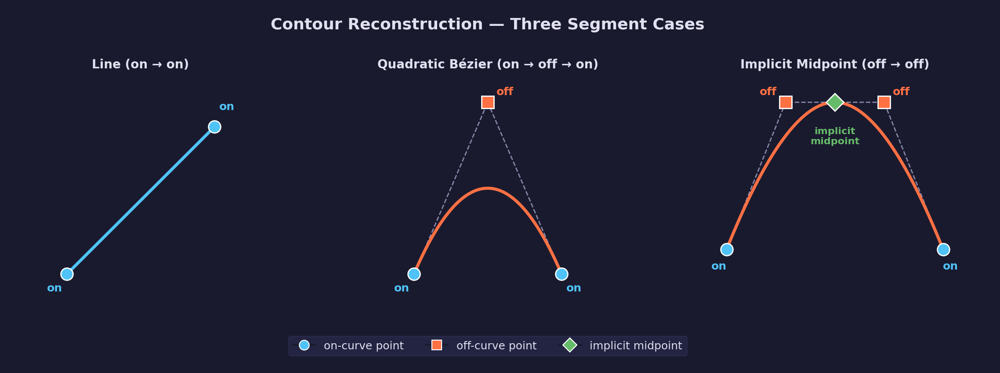
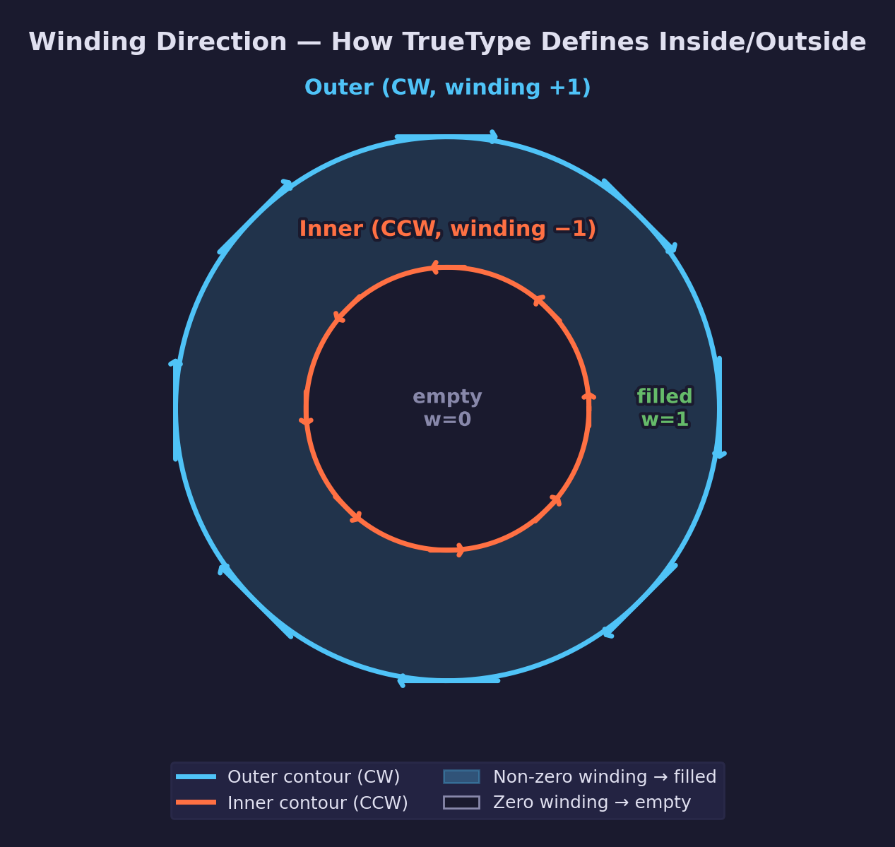
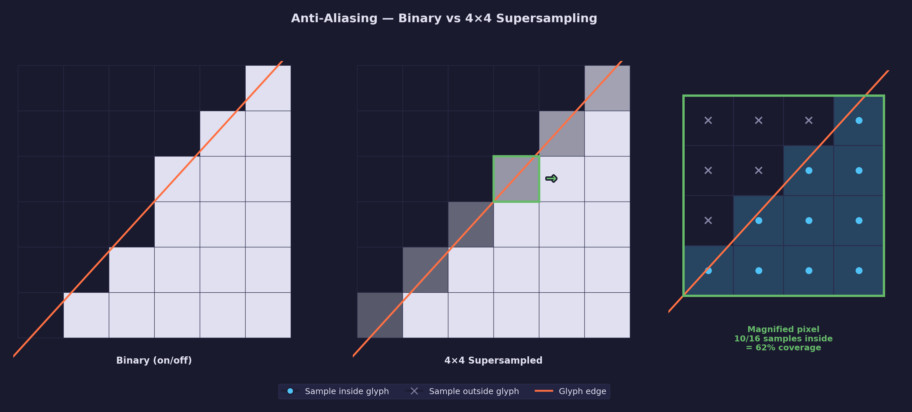
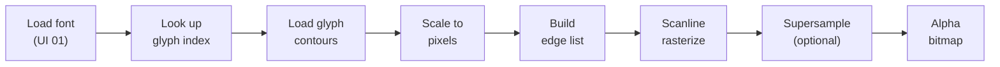

# UI Lesson 02 — Glyph Rasterization

Turn glyph outlines into pixels: scanline rasterization with quadratic Bézier
curves, the non-zero winding fill rule, and supersampled anti-aliasing.

## What you'll learn

- How to reconstruct curves from TrueType contour points (the three segment
  cases: lines, quadratic Béziers, and the implicit midpoint rule)
- Winding direction and the non-zero winding fill rule — how the rasterizer
  knows what's inside a glyph and what's a hole
- Scaling from font units to pixels (including the y-axis flip)
- Scanline rasterization — the core algorithm for converting vector outlines
  into a pixel grid
- Solving the quadratic equation to find where Bézier curves cross a scanline
- Anti-aliasing with supersampling — turning jagged binary pixels into smooth
  coverage values
- The complete pipeline from TTF file to single-channel alpha bitmap

## Why this matters

Every text rendering system — from web browsers to game engines — must solve
this problem: turning mathematical curve descriptions into pixels on a screen.
Understanding glyph rasterization connects two fundamental ideas:

1. **Vector graphics** — Glyph outlines are resolution-independent curves that
   can scale to any size without quality loss.
2. **Raster graphics** — Screens display discrete pixels, so we must convert
   those curves into a grid of coverage values.

The scanline rasterization algorithm you'll learn here is the same approach
used for triangle rasterization on the GPU — just applied to curves instead
of triangles. The anti-aliasing technique (supersampling) appears throughout
graphics: in multisample anti-aliasing (MSAA), in shadow mapping, and in
texture filtering.

## Prerequisites

This lesson builds on:

- [UI Lesson 01 — TTF Parsing](../01-ttf-parsing/) — `ForgeUiFont`,
  `forge_ui_ttf_load_glyph()`, contour points and flags
- [Math Lesson 15 — Bézier Curves](../../math/15-bezier-curves/) — quadratic
  Bézier evaluation, De Casteljau's algorithm

## Result

The example program loads Liberation Mono, rasterizes four glyphs at 64px
height, writes each as a BMP file, and shows the difference between binary
and anti-aliased rasterization.

**Example output:**

```text
INFO: UI Lesson 02 -- Glyph Rasterization
INFO: ============================================================
INFO: Loading font: assets/fonts/liberation_mono/LiberationMono-Regular.ttf
INFO:   unitsPerEm:    2048
INFO:   ascender:      1705
INFO:   descender:     -615
INFO: ============================================================
INFO: GLYPH: 'A' (two contours: outer shape + triangular hole)
INFO: ------------------------------------------------------------
INFO:   glyph index:   36
INFO:   contours:      2
INFO:   points:        21
INFO:   bbox (font):   (0, 0) to (1228, 1349)
INFO:   on-curve pts:  13
INFO:   off-curve pts: 8
INFO:   scale factor:  0.031250 (64px / 2048 unitsPerEm)
INFO:   bitmap size:   41 x 45 pixels
INFO:   bearing:       (-1, 44)
INFO:   anti-aliasing: 4x4 supersampling (16 samples/pixel)
INFO:   saved:         glyph_A.bmp
INFO: ============================================================
INFO: GLYPH: 'O' (two contours: outer + inner counter)
INFO: ------------------------------------------------------------
INFO:   glyph index:   50
INFO:   contours:      2
INFO:   points:        30
INFO:   bbox (font):   (102, -20) to (1126, 1370)
INFO:   on-curve pts:  8
INFO:   off-curve pts: 22
INFO:   scale factor:  0.031250 (64px / 2048 unitsPerEm)
INFO:   bitmap size:   34 x 46 pixels
INFO:   bearing:       (2, 44)
INFO:   anti-aliasing: 4x4 supersampling (16 samples/pixel)
INFO:   saved:         glyph_O.bmp
INFO: ============================================================
INFO: GLYPH: 'g' (has descender -- extends below baseline)
INFO: ------------------------------------------------------------
INFO:   glyph index:   74
INFO:   contours:      2
INFO:   points:        70
INFO:   bbox (font):   (143, -424) to (1054, 1099)
INFO:   on-curve pts:  20
INFO:   off-curve pts: 50
INFO:   scale factor:  0.031250 (64px / 2048 unitsPerEm)
INFO:   bitmap size:   31 x 50 pixels
INFO:   bearing:       (3, 36)
INFO:   anti-aliasing: 4x4 supersampling (16 samples/pixel)
INFO:   saved:         glyph_g.bmp
INFO: ============================================================
INFO: GLYPH: 'i' (two contours: stem + dot)
INFO: ------------------------------------------------------------
INFO:   glyph index:   76
INFO:   contours:      2
INFO:   points:        14
INFO:   bbox (font):   (143, 0) to (1125, 1484)
INFO:   on-curve pts:  14
INFO:   off-curve pts: 0
INFO:   scale factor:  0.031250 (64px / 2048 unitsPerEm)
INFO:   bitmap size:   33 x 49 pixels
INFO:   bearing:       (3, 48)
INFO:   anti-aliasing: 4x4 supersampling (16 samples/pixel)
INFO:   saved:         glyph_i.bmp
INFO: ============================================================
INFO: ANTI-ALIASING COMPARISON: 'A'
INFO: ------------------------------------------------------------
INFO: Without anti-aliasing (1x1, binary):
INFO:   glyph index:   36
INFO:   contours:      2
INFO:   points:        21
INFO:   bbox (font):   (0, 0) to (1228, 1349)
INFO:   on-curve pts:  13
INFO:   off-curve pts: 8
INFO:   scale factor:  0.031250 (64px / 2048 unitsPerEm)
INFO:   bitmap size:   41 x 45 pixels
INFO:   bearing:       (-1, 44)
INFO:   anti-aliasing: 1x1 supersampling (1 samples/pixel)
INFO:   saved:         glyph_A_noaa.bmp
INFO:
INFO: With anti-aliasing (4x4 supersampling):
INFO:   glyph index:   36
INFO:   contours:      2
INFO:   points:        21
INFO:   bbox (font):   (0, 0) to (1228, 1349)
INFO:   on-curve pts:  13
INFO:   off-curve pts: 8
INFO:   scale factor:  0.031250 (64px / 2048 unitsPerEm)
INFO:   bitmap size:   41 x 45 pixels
INFO:   bearing:       (-1, 44)
INFO:   anti-aliasing: 4x4 supersampling (16 samples/pixel)
INFO:   saved:         glyph_A_aa.bmp
INFO: ============================================================
INFO: PIPELINE SUMMARY
INFO: ------------------------------------------------------------
INFO:   1. Load font:     forge_ui_ttf_load()
INFO:   2. Look up glyph: forge_ui_ttf_glyph_index()
INFO:   3. Rasterize:     forge_ui_rasterize_glyph()
INFO:   4. Use bitmap:    width, height, pixels (alpha coverage)
INFO:   5. Free bitmap:   forge_ui_glyph_bitmap_free()
INFO:
INFO: Each bitmap is a single-channel alpha coverage map:
INFO:   0   = pixel is fully outside the glyph
INFO:   255 = pixel is fully inside the glyph
INFO:   1-254 = partial coverage (anti-aliased edge)
INFO:
INFO: The font atlas lesson (UI 03) will pack these bitmaps
INFO: into a single texture.  The GPU samples the alpha and
INFO: multiplies by a text color -- color is NOT in the bitmap.
INFO: ============================================================
INFO: Done. BMP files written to the current directory.
```

## Key concepts

- **Contour reconstruction** — Walking a TrueType point array to rebuild the
  actual line segments and quadratic Bézier curves
- **Implicit midpoint rule** — TrueType's compression technique where two
  consecutive off-curve points imply an on-curve midpoint between them
- **Non-zero winding rule** — The fill rule that determines which regions are
  inside a glyph by tracking contour crossing directions
- **Font unit to pixel scaling** — Converting coordinates using
  `scale = pixel_height / unitsPerEm` with a y-axis flip
- **Scanline rasterization** — Finding edge-scanline intersections, sorting
  by x, and filling inside regions
- **Quadratic root finding** — Solving the quadratic equation to find where
  a Bézier curve crosses a given y-coordinate
- **Supersampled anti-aliasing** — Rendering at higher resolution and
  averaging down to produce smooth coverage values

## The details

### The problem: curves to pixels

We have glyph outlines from [UI Lesson 01](../01-ttf-parsing/) — a set of
closed contours defined by points. Some segments are straight lines (on-curve
to on-curve), others are quadratic Bézier curves (on-curve to off-curve to
on-curve). We need to convert this mathematical description into a grid of
pixel values.

This process is called **rasterization** — the same word used for triangle
rasterization on the GPU, and for the same reason: converting continuous
geometry into discrete samples.

### Contour reconstruction

A TrueType glyph is made of one or more **contours** — closed loops of
points. Each point has a position (in font units) and an on-curve flag.
The flag determines what kind of curve segment the point belongs to.

There are three cases when walking consecutive points:



**Case 1: On-curve → On-curve = Line segment.** Two consecutive on-curve
points define a straight line between them. This is the simplest case.

**Case 2: On-curve → Off-curve → On-curve = Quadratic Bézier curve.** The
off-curve point is the control point that pulls the curve away from a
straight line. The curve starts at the first on-curve point, is attracted
toward the off-curve control point, and ends at the second on-curve point.
This is a standard quadratic Bézier as described in
[Math Lesson 15](../../math/15-bezier-curves/):

$$
B(t) = (1-t)^2 P_0 + 2(1-t)t P_1 + t^2 P_2
$$

**Case 3: Off-curve → Off-curve = Implicit midpoint.** When two consecutive
off-curve points appear, TrueType inserts an implicit on-curve point at their
midpoint. This is not a special type of curve — it just means the font stored
one fewer point because the on-curve point can be computed:

$$
P_{\text{mid}} = \frac{P_{\text{off1}} + P_{\text{off2}}}{2}
$$

This implicit midpoint rule is a compression technique. Most curves in letter
shapes are smooth connections where adjacent Bézier segments meet tangentially.
At such joins, the shared on-curve point is always the midpoint of the two
neighboring off-curve control points. By omitting these predictable points,
TrueType cuts glyph storage roughly in half for smooth curves.

#### Concrete example: the 'O' glyph

The letter 'O' in Liberation Mono has two contours:

- **Outer contour** — 16 points forming the outer oval shape. Most points are
  off-curve (control points), with on-curve points only at the four cardinal
  positions (top, bottom, left, right). The many off-curve pairs use the
  implicit midpoint rule to define a smooth ellipse.
- **Inner contour** — 14 points forming the inner hole (the "counter"). Same
  structure but smaller.

Look at the outer contour's output from UI Lesson 01: 8 on-curve points and
22 off-curve points across both contours. The large ratio of off-curve to
on-curve points is typical for curved glyphs — the implicit midpoint rule
lets TrueType represent smooth curves with very few explicit on-curve points.

### Winding direction and the fill rule

Contours have a **direction** — the order in which their points are stored
determines whether the contour winds clockwise or counter-clockwise.



In TrueType:

- **Outer contours** wind **clockwise** (CW)
- **Inner contours** (holes) wind **counter-clockwise** (CCW)

Direction matters because it determines what's "inside" the glyph. The
**non-zero winding rule** works like this:

1. Cast a horizontal ray from the point you're testing
2. For each contour edge the ray crosses:
   - If the edge goes **upward** (left to right when facing the ray's
     direction), add **+1** to the winding number
   - If the edge goes **downward** (right to left), add **-1**
3. If the final winding number is **non-zero**, the point is **inside** the
   glyph

For the letter 'O':

- **Outside everything:** The ray crosses no edges. Winding = 0. Empty.
- **Between outer and inner contour:** The ray crosses the outer contour
  once (winding goes to +1 or -1). Non-zero — this is the filled stroke of
  the letter.
- **Inside the hole:** The ray crosses the outer contour (+1) and then the
  inner contour (-1). Winding returns to 0. Empty — this is the counter
  (hole) in the 'O'.

The **even-odd rule** is a simpler alternative: just count total crossings,
and if the count is odd, the point is inside. It's easier to implement but
less flexible — it can't handle overlapping contours correctly. TrueType
specifies the non-zero winding rule.

### Scaling from font units to pixels

Glyph coordinates from the `glyf` table are in **font units** — an abstract
coordinate system defined by `unitsPerEm` in the `head` table. Liberation
Mono uses 2048 units per em (typical for TrueType fonts).

To render at a specific pixel size, you need a scale factor:

$$
\text{scale} = \frac{\text{pixel height}}{\text{unitsPerEm}}
$$

For rendering at 64px with unitsPerEm = 2048:

$$
\text{scale} = \frac{64}{2048} = 0.03125
$$

A coordinate of 1400 font units becomes $1400 \times 0.03125 = 43.75$ pixels.

#### The y-axis flip

Font coordinates use **y-up** — the ascender (top of tall letters) has
positive y values, and the descender (bottom of letters like 'g') has
negative y values. The baseline is at y = 0.

Bitmaps use **y-down** — row 0 is the top of the image. If you skip the
y-flip, every glyph renders upside down.

The fix: when converting a font-unit y-coordinate to bitmap coordinates,
subtract from the bitmap's top edge:

```c
float bitmap_y = y_offset - (font_y * scale);
```

where `y_offset` is the bitmap position corresponding to the glyph's maximum
y-coordinate (the top of the glyph in font units maps to the top of the
bitmap). This is one of the most common sources of bugs when implementing a
font rasterizer for the first time.

### The bitmap grid

Before rasterizing, we allocate a 2D grid of pixels sized to fit the glyph:

1. Take the glyph's bounding box from the `glyf` table (`x_min`, `y_min`,
   `x_max`, `y_max`)
2. Scale each coordinate by the scale factor
3. Add a small padding margin (1 pixel on each side) to prevent edge pixels
   from being clipped
4. The result is the bitmap dimensions in pixels

Each pixel holds a **coverage value** from 0 (fully empty) to 255 (fully
covered), stored as a `uint8`. This single-channel bitmap is what eventually
becomes the alpha channel in a font atlas texture. The actual text color
comes from the vertex color or a shader uniform — color is not stored in the
glyph bitmap.

### Scanline rasterization

This is the core algorithm. For each horizontal row of pixels (each
**scanline**):


1. **Find crossings** — For each contour edge (line segment or Bézier curve),
   determine whether it crosses this scanline's y-coordinate. If it does,
   compute the x-position of the crossing and record its winding direction
   (+1 or -1).

2. **Sort by x** — Arrange all crossings from left to right.

3. **Fill with winding rule** — Walk left to right, accumulating the winding
   number. When the winding number transitions from zero to non-zero, you've
   entered the glyph. When it returns to zero, you've exited. Fill all pixels
   between entry and exit points.

#### Line segment crossings

For a line from $(x_0, y_0)$ to $(x_1, y_1)$, finding where it crosses
scanline $y_s$ is simple linear interpolation:

$$
t = \frac{y_s - y_0}{y_1 - y_0}, \quad x_{\text{cross}} = x_0 + t(x_1 - x_0)
$$

The crossing exists only if $t$ falls within the edge's vertical range. We
use a half-open interval $[y_{\min}, y_{\max})$ to avoid double-counting at
shared vertices between consecutive edges.

#### Quadratic Bézier crossings

For a quadratic Bézier from $P_0$ through control point $P_1$ to $P_2$,
the y-coordinate as a function of parameter $t$ is:

$$
Y(t) = (1-t)^2 y_0 + 2(1-t)t\, y_1 + t^2 y_2
$$

Setting $Y(t) = y_s$ (the scanline) and rearranging gives a standard
quadratic equation:

$$
at^2 + bt + c = 0
$$

where:

$$
a = y_0 - 2y_1 + y_2, \quad b = 2(y_1 - y_0), \quad c = y_0 - y_s
$$

Solving with the quadratic formula:

$$
t = \frac{-b \pm \sqrt{b^2 - 4ac}}{2a}
$$

Each valid $t \in [0, 1)$ gives a crossing. We evaluate the x-coordinate at
that $t$ using the same Bézier formula:

$$
X(t) = (1-t)^2 x_0 + 2(1-t)t\, x_1 + t^2 x_2
$$

A single quadratic Bézier can cross a scanline at most twice (since the
y-component is a degree-2 polynomial). This is where learners see why they
needed the parametric evaluation and root finding from
[Math Lesson 15 — Bézier Curves](../../math/15-bezier-curves/).

**Edge cases to handle:**

- When $a \approx 0$, the curve is nearly linear in y — solve as a linear
  equation $bt + c = 0$ instead
- When the discriminant $b^2 - 4ac < 0$, the curve doesn't cross this
  scanline
- Horizontal edges ($y_0 = y_1 = y_2$) never produce crossings

### Anti-aliasing

Without anti-aliasing, each pixel is either fully on (255) or fully off (0).
This produces jagged, staircase-like edges — especially visible on diagonal
and curved boundaries.



**Supersampling** is the conceptually simplest approach to anti-aliasing:
instead of testing one point per pixel, sample multiple points within each
pixel and average the results.

With 4x4 supersampling, each pixel is subdivided into a 4x4 grid of 16
sub-pixels. We rasterize at 4x the resolution, then downsample. If 12 of
16 sub-pixel samples fall inside the contour, the pixel gets:

$$
\text{coverage} = \frac{12}{16} = 75\% \rightarrow 191 \text{ (out of 255)}
$$

The result: diagonal edges get intermediate gray values that produce smooth
transitions when rendered. The cost is doing $N^2$ more work (16x for 4x4
supersampling), but for offline glyph rasterization this is acceptable —
each glyph is rasterized once and cached.

**The anti-aliasing comparison** in the example program produces two BMP files
for the letter 'A':

- `glyph_A_noaa.bmp` — Binary rasterization: only values 0 and 255, jagged
  edges visible
- `glyph_A_aa.bmp` — 4x4 supersampling: 17 distinct coverage levels, smooth
  edges

More sophisticated approaches exist (analytical area coverage computes the
exact fraction of each pixel covered by the contour, signed distance fields
encode distance-to-edge for GPU-accelerated rendering), but supersampling is
the easiest to understand and implement correctly.

### Putting it all together

The complete pipeline from TTF file to bitmap:



Each step connects to a concept already explained:

1. **Load font** — `forge_ui_ttf_load()` parses the TTF file
   ([UI Lesson 01](../01-ttf-parsing/))
2. **Look up glyph index** — `forge_ui_ttf_glyph_index()` maps Unicode
   codepoint to glyph index via the cmap table
3. **Load glyph contours** — `forge_ui_ttf_load_glyph()` parses points,
   flags, and contour endpoints from the glyf table
4. **Scale to pixels** — Multiply coordinates by
   `pixel_height / unitsPerEm`, flip y-axis
5. **Build edge list** — Walk contour points, handling the three segment
   cases (line, Bézier, implicit midpoint)
6. **Scanline rasterize** — For each row: find crossings, sort by x, fill
   using non-zero winding rule
7. **Supersample** — Optionally rasterize at Nx resolution and average down
8. **Alpha bitmap** — Single-channel coverage values (0-255) ready for a
   font atlas

### The three hardest parts

Based on common implementation difficulties:

**1. The implicit midpoint rule (conceptual).** When walking contour points,
two consecutive off-curve points don't mean "skip ahead" — they mean "insert
a virtual on-curve point at their midpoint." Missing this produces garbled
curves. The key insight: this virtual point is always the natural joining
point where two smooth Bézier curves meet tangentially.

**2. Solving the quadratic for Bézier crossings (mathematical).** The
quadratic formula itself is straightforward, but edge cases trip people up:
near-zero $a$ (degenerate to linear), negative discriminant (no crossing),
and the half-open interval for avoiding double-counted endpoints. The
implementation in `forge_ui.h` handles all three.

**3. Getting the y-axis flip right (practical).** Font coordinates are y-up;
bitmaps are y-down. One missed negation or wrong offset produces upside-down
or vertically-shifted glyphs. The scale-and-flip happens in the edge builder:
`bitmap_y = y_offset - font_y * scale`.

## Data output

This lesson produces a **single-channel alpha bitmap** per glyph:

- **Format:** `ForgeUiGlyphBitmap` — width, height, pixel data (uint8 array),
  bearing offsets
- **Pixel values:** 0 = empty, 255 = fully covered, 1-254 = partial coverage
  (anti-aliased edges)
- **Bearing offsets:** How the bitmap positions relative to the pen position
  on the baseline
  - `bearing_x` — horizontal offset from pen to bitmap's left edge
  - `bearing_y` — vertical offset from baseline to bitmap's top edge

The font atlas lesson (UI 03, planned) will pack many of these
bitmaps into a single texture. The GPU will eventually sample this texture
and multiply the alpha by a text color — the color comes from the vertex
or a uniform, not from the glyph bitmap itself.

## Library API

The rasterization functions are added to `common/ui/forge_ui.h`:

```c
/* Rasterization options */
typedef struct ForgeUiRasterOpts {
    int supersample_level;  /* 1 = none, 4 = 4x4, 8 = 8x8 */
} ForgeUiRasterOpts;

/* Rasterized glyph bitmap */
typedef struct ForgeUiGlyphBitmap {
    int     width;       /* bitmap width in pixels */
    int     height;      /* bitmap height in pixels */
    Uint8  *pixels;      /* width * height coverage values */
    int     bearing_x;   /* pen-to-left-edge horizontal offset */
    int     bearing_y;   /* baseline-to-top-edge vertical offset */
} ForgeUiGlyphBitmap;

/* Rasterize a glyph to an alpha bitmap */
bool forge_ui_rasterize_glyph(const ForgeUiFont *font,
                               Uint16 glyph_index,
                               float pixel_height,
                               const ForgeUiRasterOpts *opts,
                               ForgeUiGlyphBitmap *out_bitmap);

/* Free bitmap pixel data */
void forge_ui_glyph_bitmap_free(ForgeUiGlyphBitmap *bitmap);
```

Pass `NULL` for `opts` to use the default (4x4 supersampling).

## Where it's used

In forge-gpu lessons:

- [UI Lesson 01 — TTF Parsing](../01-ttf-parsing/) provides `ForgeUiFont` and
  glyph outline loading — the input to this lesson's rasterizer
- [Math Lesson 15 — Bézier Curves](../../math/15-bezier-curves/) explains the
  parametric curve math used for scanline-Bézier intersection
- **UI Lesson 03 — Font Atlas** (planned) will pack these bitmaps into a
  single GPU texture
- A future **GPU lesson** will render text by sampling the atlas and
  multiplying alpha by a text color uniform

## Building

```bash
cmake -B build
cmake --build build --config Debug

# Windows
build\lessons\ui\02-glyph-rasterization\Debug\ui-02-glyph-rasterization.exe

# Linux / macOS
./build/lessons/ui/02-glyph-rasterization/ui-02-glyph-rasterization
```

The program writes BMP files to the current working directory. Run from the
repository root so it can find the bundled font at
`assets/fonts/liberation_mono/LiberationMono-Regular.ttf`.

## Exercises

1. **Render the full alphabet.** Modify the demo to rasterize all 26
   uppercase letters and write them as BMPs. Observe how different letter
   shapes use different ratios of on-curve to off-curve points.

2. **Try different pixel heights.** Rasterize 'A' at 16px, 32px, 64px, and
   128px. At small sizes, what happens to thin features like the crossbar?
   How does anti-aliasing quality change?

3. **Implement the even-odd fill rule.** Replace the non-zero winding check
   with a simple odd/even crossing count. Test with 'O' — does the hole
   still render correctly? Why might some complex glyphs behave differently?

4. **Measure the supersampling cost.** Time the rasterization of 'g' (a
   complex glyph) at 1x1, 2x2, 4x4, and 8x8 supersampling. How does
   rendering time scale? Is the quality improvement from 4x4 to 8x8 worth
   the cost?

5. **Visualize the scanline crossings.** For a single scanline through the
   middle of 'O', print the x-positions and winding directions of all
   crossings. Verify that the winding number reaches zero inside the hole.

## Further reading

- [UI Lesson 01 — TTF Parsing](../01-ttf-parsing/) — Where the glyph data
  comes from
- [Math Lesson 15 — Bézier Curves](../../math/15-bezier-curves/) — Quadratic
  and cubic Bézier math in depth
- [Apple TrueType Reference](https://developer.apple.com/fonts/TrueType-Reference-Manual/) —
  Official TrueType specification
- [stb_truetype.h](https://github.com/nothings/stb/blob/master/stb_truetype.h) —
  Sean Barrett's single-header TrueType rasterizer (production-quality
  reference implementation)
- [The Raster Tragedy at Low Resolution](http://rastertragedy.com/) — Why
  small-size text rendering is fundamentally difficult
