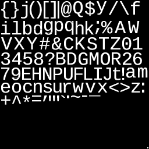
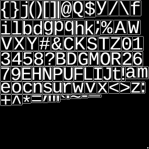
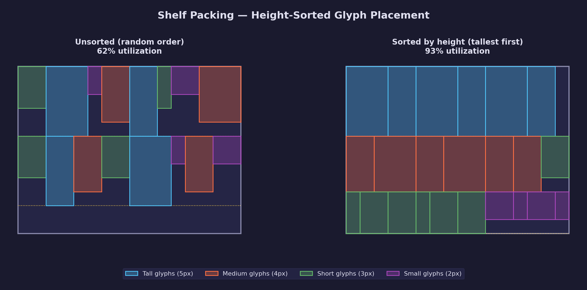
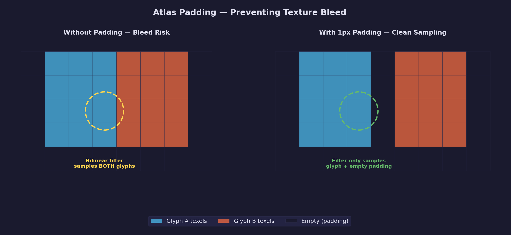
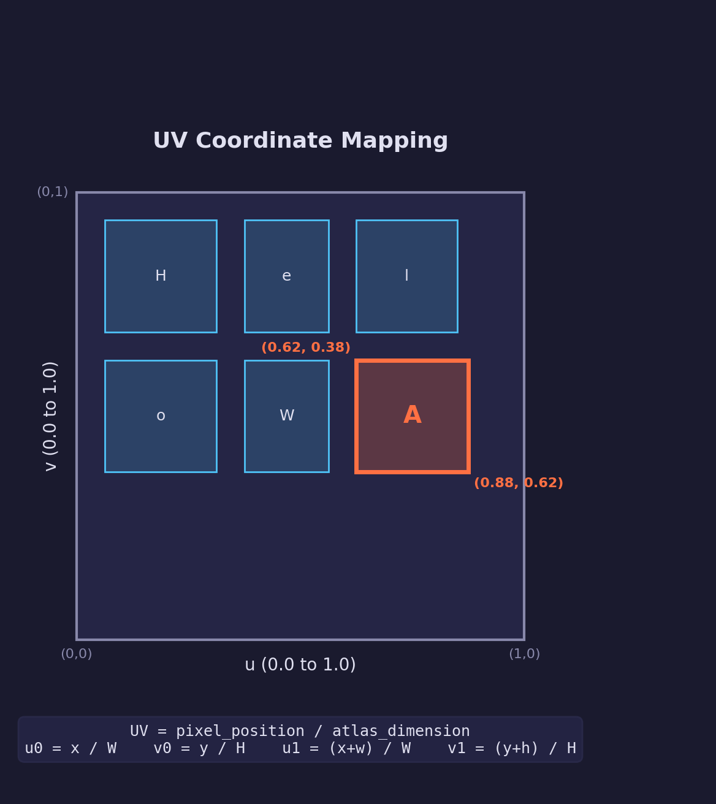

# UI Lesson 03 — Font Atlas Packing

Pack rasterized glyphs into a single texture, compute UV coordinates,
and build the metadata table that drives text rendering.

## What you'll learn

- Why a font atlas exists and what problem it solves (draw call batching)
- How to choose a character set for atlas packing
- The 2D rectangle packing problem and why shelf packing is a good starting point
- How sorting glyphs by height improves packing efficiency
- Row-based (shelf) packing — step-by-step algorithm
- Choosing power-of-two atlas dimensions with a sizing heuristic
- Why padding between glyphs prevents texture bleed during bilinear filtering
- How pixel positions in the atlas convert to normalized UV coordinates
- What per-glyph metadata a renderer and text layout system need
- The white pixel technique for drawing solid geometry without texture switching
- Why font atlases use single-channel textures instead of RGBA
- How to verify atlas correctness by extracting glyphs via UV round-trip

## Prerequisites

- [UI Lesson 01 — TTF Parsing](../01-ttf-parsing/) — font loading, cmap
  glyph lookup
- [UI Lesson 02 — Glyph Rasterization](../02-glyph-rasterization/) —
  produces the bitmaps being packed
- [GPU Lesson 04 — Textures & Samplers](../../gpu/04-textures-and-samplers/) —
  UV coordinates and texture sampling concepts

## Why this matters

UI Lesson 02 produces one bitmap per glyph. If you rendered a line of text
by binding a different texture for every character, the GPU would need a
separate draw call per character — and texture switches are one of the most
expensive state changes in a graphics pipeline. A 20-character word would
need 20 draw calls.

The solution is the same one used throughout game development for sprite
sheets, terrain tiles, particle textures, and decals: pack everything into
a single large texture called an **atlas**, and use UV coordinates to select
the right rectangle within it. With all glyphs in one texture, the entire
line of text (or even an entire screen of UI) can render in a single draw
call.

This lesson builds a complete atlas pipeline: rasterize, pack, record UVs.
The output — a single-channel texture and a per-glyph metadata table — is
everything a renderer needs to draw text.

## Result

The demo program loads Liberation Mono, rasterizes printable ASCII
(codepoints 32–126) at 32px height, packs them into a 256×256 atlas, and
writes three BMP files:

**Full atlas** — every printable ASCII character packed into rows:



**Debug atlas** — same image with 1px outlines around each glyph rectangle,
making the shelf rows and padding gaps visible:



**Extracted glyph** — the letter 'A' extracted from the atlas using its UV
coordinates, proving the UV round-trip is correct:


## Key concepts

- **Atlas** — a single large texture containing many smaller images arranged
  in a packed layout, used to avoid texture switching between draw calls
- **Shelf packing** — a row-based rectangle packing algorithm where glyphs
  are placed left-to-right in rows, with each row's height set by its
  tallest glyph
- **UV coordinates** — normalized (0.0–1.0) coordinates that tell the GPU
  which region of a texture to sample; each glyph gets its own UV rectangle
- **Padding** — empty pixels between glyphs in the atlas that prevent
  texture bleed when bilinear filtering samples near glyph edges
- **Per-glyph metadata** — UV rect, bitmap size, bearing offsets, and
  advance width — the data that connects the atlas texture to text layout
- **White pixel region** — a small fully-white area in the atlas used to
  draw solid-colored geometry without switching textures

## The details

### The problem — one texture per glyph doesn't scale

UI Lesson 02 rasterizes individual glyphs into separate bitmaps. A font
covering printable ASCII alone is 95 glyphs. If you uploaded each one as
its own GPU texture and rendered text by binding a different texture for
every character, you'd break **batching** — each character would require
a separate draw call, and switching textures is one of the most expensive
state changes on a GPU.

The solution is the same one used for sprite sheets, terrain tiles, and
decals throughout game development: pack everything into a single texture
called an **atlas**, and use UV coordinates to select the right rectangle
within it.

An atlas is a single large texture containing many smaller images arranged
in a grid-like packing. Instead of "bind texture A, draw quad, bind texture
B, draw quad, ..." you do "bind atlas, draw all quads" — one texture bind,
one draw call, regardless of how many different glyphs appear on screen.

### What we're building

The atlas pipeline takes four inputs:

1. A loaded font (from UI Lesson 01)
2. A character set (which codepoints to include)
3. A pixel height (rendering size)
4. A padding value (spacing between packed glyphs)

And produces two outputs:

1. **Atlas texture** — a single-channel `uint8` bitmap (the packed image)
2. **Glyph table** — an array of `ForgeUiPackedGlyph` structs, one per
   character, containing UV coordinates, bitmap dimensions, bearing offsets,
   and advance widths

Together these are everything a renderer needs to draw text. The text layout
lesson (UI 04) will use the glyph table to position quads, and a GPU lesson
will upload the atlas texture and render those quads.

### Choosing what to pack

You don't atlas an entire font. Fonts can contain thousands of glyphs
(Liberation Mono has 670), but most applications need a subset. The concept
of a **character set** defines which codepoints to include.

The most common starting point is **printable ASCII** — codepoints 32
(space) through 126 (tilde), which covers:

- Uppercase and lowercase Latin letters (A–Z, a–z)
- Digits (0–9)
- Punctuation and symbols (!, @, #, etc.)
- Space

That's 95 glyphs — enough for English text, code editors, and most UI
labels. For international text, you'd extend the set with Latin Extended,
Cyrillic, CJK, or whatever Unicode ranges your application needs.

**Dynamic atlas** approaches exist where glyphs are rasterized on demand
and added to the atlas as they're first used. This handles arbitrary
Unicode without pre-rasterizing thousands of glyphs. But a static
pre-built atlas is simpler, predictable, and sufficient for many games.
This lesson builds a static atlas.

### The packing problem

You have N rectangles of varying sizes (each glyph's bitmap) and a
fixed-size square to fit them in. This is a variant of the **2D bin
packing problem**, which is NP-hard in the general case — meaning no
known algorithm can find the optimal arrangement in time that scales
reasonably with the number of rectangles. But good heuristics get close
enough.

Why does packing quality matter? Wasted atlas space means a larger texture
than necessary, which wastes GPU memory and reduces texture cache
efficiency. If poor packing forces you to use a 1024×1024 atlas instead
of a 512×512 one, that's 4× the memory for the same content.

But for font atlases specifically, perfect packing isn't critical. Glyph
bitmaps are small (typically 10–40 pixels wide at common text sizes), and
the atlas is modest — usually 256×256 to 1024×1024 depending on the font
size and character count. A reasonable heuristic that's fast and simple is
better than a complex algorithm that squeezes out an extra 5%.

### Sorting by height

The simplest packing improvement is a preprocessing step: **sort glyphs
by height, tallest first**, before placing any rectangles.

This is not a packing algorithm itself — it's a step that improves any
row-based packing. The intuition: tall glyphs placed first establish
efficient row heights. If the tallest glyph is 30px and you place it
first, the first row is 30px tall. Shorter glyphs (20px, 15px) fit in
subsequent rows without creating excessive vertical waste.

Without sorting, you might place a 10px glyph first (creating a 10px row),
then encounter a 30px glyph that forces a new row anyway — the first row
is mostly wasted space.



### Row-based (shelf) packing

Shelf packing is the simplest practical atlas packing algorithm. The name
comes from the analogy: each row is a **shelf**, and glyphs sit on it like
books.

The algorithm, step by step:

1. Start with an empty atlas and a cursor at the top-left corner
2. Place the next glyph at the cursor position
3. Advance the cursor to the right by the glyph's width plus padding
4. If the next glyph doesn't fit horizontally (cursor + glyph width >
   atlas width), start a **new row** below the current one — the row
   height equals the tallest glyph placed in it
5. If a new row doesn't fit vertically (cursor Y + row height > atlas
   height), the atlas is too small — increase its dimensions and retry

The wasted space is the gap above short glyphs in a row, since the row
height equals the tallest glyph. With height-sorted input, this waste is
minimized because each successive row is shorter than the previous one.

```text
+--atlas-width------------------------------+
|[tallglyph][tallglyph][tall][tall][tall]    |  <- row 0 (height = tallest)
|[medium][medium][medium][medium][med][med]  |  <- row 1 (height = medium)
|[short][short][short][short][short][short]  |  <- row 2 (height = short)
|                                            |
|                    (empty)                 |
+--------------------------------------------+
```

More sophisticated algorithms exist — **Skyline** tracks the actual top
edge of placed rectangles rather than uniform row heights, **MaxRects**
maintains a list of free rectangles and picks the best fit, and
**Guillotine** recursively splits free space. These improve utilization
by a few percent, but shelf packing is fast, deterministic, easy to
understand, and good enough for most font atlases. It's the right
starting point.

### Choosing the atlas dimensions

The atlas dimensions should be **powers of two** (256, 512, 1024).
While modern GPUs handle non-power-of-two textures fine, power-of-two
is a convention that avoids surprises across all graphics APIs — some
older hardware handles them more efficiently for mipmap generation,
memory alignment, and tiling.

The sizing heuristic:

1. **Estimate total area**: sum up every glyph's bitmap area (width ×
   height) plus padding
2. **Find initial size**: pick the smallest power-of-two square whose
   area exceeds the estimate
3. **Try packing**: run the shelf packer on that size
4. **If it fails**: double the smaller dimension and try again
5. **Repeat** until packing succeeds or we exceed the maximum size

For our demo (95 ASCII glyphs at 32px), the total glyph area is about
35,000 pixels. A 256×256 atlas (65,536 pixels) is the smallest
power-of-two square that fits, and packing succeeds on the first try
at 54% utilization.

### Padding between glyphs

Without padding, adjacent glyphs in the atlas bleed into each other
during rendering. This happens because GPU texture sampling uses
**bilinear filtering** — when the GPU reads a pixel near the edge of
one glyph's UV rectangle, it interpolates between the target texel and
its neighbors. If the neighbor belongs to a different glyph, fragments
of that glyph leak into the rendered character.



The fix is to add 1–2 pixels of empty space around each glyph when
packing. This padding creates a buffer zone — even when bilinear
filtering samples at the very edge of a glyph's UV rect, the
neighboring texels are empty (zero), so nothing bleeds through.

Padding affects the packing: each glyph's effective size is its bitmap
dimensions plus padding on each side, which means the atlas needs to be
slightly larger to accommodate the same number of glyphs. The
`forge_ui_atlas_build` function takes a `padding` parameter (we use 1
pixel in the demo).

For more on bilinear filtering and how the GPU interpolates between
texels, see
[GPU Lesson 04 — Textures & Samplers](../../gpu/04-textures-and-samplers/).

### UV coordinate calculation

Once a glyph is placed at pixel position (x, y) in the atlas with
bitmap size (w, h), its **UV coordinates** are:

$$
u_0 = \frac{x}{W} \qquad v_0 = \frac{y}{H} \qquad u_1 = \frac{x + w}{W} \qquad v_1 = \frac{y + h}{H}
$$

where W and H are the atlas dimensions.

UV coordinates are **normalized coordinates** in the range 0.0 to 1.0
that tell the GPU which region of the texture to sample. (0, 0) is the
top-left of the texture, (1, 1) is the bottom-right. Every glyph gets
its own UV rectangle within the atlas.



**Concrete example**: if glyph 'A' is placed at pixel (196, 35) in a
256×256 atlas and its bitmap is 22×24 pixels:

$$
u_0 = \frac{196}{256} = 0.7656 \qquad v_0 = \frac{35}{256} = 0.1367
$$

$$
u_1 = \frac{196 + 22}{256} = 0.8516 \qquad v_1 = \frac{35 + 24}{256} = 0.2305
$$

To render this glyph, the text renderer creates a quad (two triangles)
sized to the glyph's pixel dimensions and maps these UV coordinates to
the quad's corners. The GPU samples the atlas texture within this UV
rectangle, extracting just the 'A' bitmap.

For the mathematical foundation of UV coordinates and texture mapping,
see [Math Lesson 01 — Vectors](../../math/01-vectors/) (vec2) and
[GPU Lesson 04 — Textures & Samplers](../../gpu/04-textures-and-samplers/).

### Per-glyph metadata

The atlas isn't just a texture. For each packed glyph, you need a
metadata record containing everything the text layout system and
renderer need:

```c
typedef struct ForgeUiPackedGlyph {
    Uint32      codepoint;      /* Unicode codepoint (for lookup) */
    Uint16      glyph_index;    /* index within the font */
    ForgeUiUVRect uv;           /* UV rectangle in the atlas */
    int         bitmap_w;       /* glyph bitmap width in pixels */
    int         bitmap_h;       /* glyph bitmap height in pixels */
    int         bearing_x;      /* horizontal offset from pen to left edge */
    int         bearing_y;      /* vertical offset from baseline to top */
    Uint16      advance_width;  /* how far to move the pen (font units) */
} ForgeUiPackedGlyph;
```

Why each field exists:

- **codepoint** — the Unicode codepoint this glyph represents, used for
  lookup when the text layout system asks "where is the letter 'A'?"
- **glyph_index** — the font-internal index, needed if you want to access
  other per-glyph data from the font (kerning pairs, for example)
- **uv** — the UV rectangle in the atlas, used by the renderer to sample
  the correct region of the texture
- **bitmap_w / bitmap_h** — the glyph's pixel dimensions, used to size
  the rendering quad
- **bearing_x / bearing_y** — offsets from the pen position to where the
  bitmap should be placed (see
  [UI Lesson 02](../02-glyph-rasterization/) for how bearings work)
- **advance_width** — how far the pen moves horizontally after this glyph,
  in font units. The text layout system (UI 04) uses this to space
  characters. This comes from the font's hmtx table — an array of
  (advance_width, left_side_bearing) pairs with one entry per glyph

The glyph table is what connects the atlas texture to text rendering.
Without it, the atlas is just an image — the table tells you where each
character lives and how to position it.

### The white pixel

A useful technique is to reserve a small region in the atlas — a 2×2
block of fully white (255) pixels — for drawing solid-colored geometry
without switching textures.

Why? If your UI renderer uses the font atlas as its only texture, it can
draw **everything** — text and solid shapes (lines, rectangles,
backgrounds) — in a single draw call. Solid geometry points its UVs at
the white pixel region, and the fragment shader multiplies the sampled
value (1.0) by the vertex color, producing the desired solid color.

This is the same approach Dear ImGui uses. The atlas stores both font
glyphs and a tiny white region, and the renderer never needs to switch
textures. It's optional — you could use a separate white texture or a
shader branch — but it simplifies the rendering pipeline and is worth
understanding.

The demo atlas places the white pixel block at the bottom-right corner
and records its UV rectangle in `atlas.white_uv`.

### Single-channel vs RGBA

Font atlases are typically **single-channel** — one byte per pixel,
representing the alpha/coverage value from the rasterizer. There's no
color information to store because glyph bitmaps are grayscale coverage
maps.

The memory savings are significant:

| Format | 512×512 atlas |
|--------|---------------|
| Single-channel (R8) | 256 KB |
| RGBA (R8G8B8A8) | 1 MB |

4× the memory for the same information. Since the rasterizer already
produces single-channel output, there's no reason to waste three
channels.

At render time, the GPU shader reads the single coverage value from the
atlas and multiplies it by the desired text color:

```text
final_color = text_color * atlas_sample
```

A white 'A' on a dark background? The shader multiplies (1, 1, 1, 1)
by the coverage value. Red text? Multiply (1, 0, 0, 1) instead. The
color is a per-vertex or per-uniform choice, not stored in the atlas.

The atlas will be uploaded to the GPU as an `R8_UNORM` or similar
single-channel format. The GPU lesson that renders text will handle
the texture format details — this lesson produces the CPU-side data.

### Verifying the atlas

How do you validate that packing is correct? The demo program performs
two verification steps:

1. **Visual inspection**: write the atlas to `atlas.bmp` and open it.
   Check for overlapping glyphs (glyphs drawn on top of each other),
   cut-off glyphs (bitmaps extending past the atlas boundary), and
   correct padding (visible gaps between adjacent glyphs). The debug
   BMP `atlas_debug.bmp` draws outlines around each glyph rectangle
   to make the shelf structure visible.

2. **UV round-trip**: extract glyph 'A' from the atlas using its UV
   coordinates and write it as a separate BMP (`glyph_A_from_atlas.bmp`).
   If the extracted image matches the original rasterized 'A', the UV
   coordinates are correct. This proves the full pipeline works:
   rasterize → pack → compute UVs → extract via UVs.

### hmtx — per-glyph advance widths

This lesson adds hmtx table parsing to the UI library. The hmtx
(horizontal metrics) table stores two values per glyph:

- **advance width** — the horizontal distance the pen moves after
  rendering this glyph, in font units
- **left side bearing** — the horizontal offset from the pen position to
  the glyph's left edge, in font units

The table has `numberOfHMetrics` entries (from the hhea table). Each entry
is 4 bytes: a `uint16` advance width followed by an `int16` left side
bearing. Glyphs beyond `numberOfHMetrics` share the last advance width —
this is common in monospaced fonts where all glyphs have the same width
(Liberation Mono uses 4 entries for 670 glyphs because nearly all share
the same 1229-unit advance).

The advance width is stored in `ForgeUiPackedGlyph.advance_width` and
will be used by the text layout system (UI 04) to space characters
correctly.

## Data output

This lesson produces three pieces of data for the renderer:

- **Atlas texture**: single-channel `uint8` bitmap, power-of-two
  dimensions (e.g., 256×256), row-major top-down layout. Upload to the
  GPU as `R8_UNORM` format. One byte per pixel — coverage values where
  0 = empty and 255 = fully covered.

- **Glyph table**: array of `ForgeUiPackedGlyph` structs, one per packed
  codepoint. Each contains the UV rectangle, bitmap dimensions, bearing
  offsets, and advance width — everything needed to position and render
  each character.

- **White pixel region**: a `ForgeUiUVRect` pointing to a 2×2 block of
  white pixels in the atlas. Use this for solid-colored UI geometry
  (lines, rectangles, backgrounds) to avoid texture switching.

The text layout lesson (UI 04) will use the glyph table to build
positioned vertex data (quads with UV coordinates), and a GPU lesson
will upload the atlas texture and render those quads.

## Where it's used

In forge-gpu lessons:

- [UI Lesson 01 — TTF Parsing](../01-ttf-parsing/) — loads the font
  and provides cmap glyph lookup used by the atlas builder
- [UI Lesson 02 — Glyph Rasterization](../02-glyph-rasterization/) —
  produces the bitmap data that gets packed into the atlas
- [Math Lesson 01 — Vectors](../../math/01-vectors/) — vec2 for UV
  coordinates and position math
- [GPU Lesson 04 — Textures & Samplers](../../gpu/04-textures-and-samplers/)
  — UV coordinates, texture sampling, bilinear filtering
- **UI Lesson 04** (upcoming) — text layout using the glyph table to
  build vertex data
- A future **GPU lesson** will upload the atlas texture and render text
  quads sampling from it

## Building

```bash
cmake -B build
cmake --build build --config Debug

# Windows
build\lessons\ui\03-font-atlas\Debug\ui-03-font-atlas.exe

# Linux / macOS
./build/lessons/ui/03-font-atlas/ui-03-font-atlas
```

Run from the repository root so the program finds the default font at
`assets/fonts/liberation_mono/LiberationMono-Regular.ttf`. You can also
pass a custom font path as the first argument:

```bash
./build/lessons/ui/03-font-atlas/ui-03-font-atlas path/to/font.ttf
```

## Exercises

1. **Larger character set**: Extend the codepoint array to include Latin
   Extended-A (U+0100–U+017F) and observe how the atlas dimensions change.
   Does the sizing heuristic still pick the right size on the first try?

2. **Variable font sizes**: Build two atlases at different pixel heights
   (16px and 64px) from the same font and compare their dimensions and
   utilization percentages. How does glyph size affect packing efficiency?

3. **Padding experiment**: Build the atlas with 0 padding, then with 2
   padding. Save both as BMPs and compare — can you see where glyphs
   touch without padding? (The bleed effect becomes visible when a GPU
   renders with bilinear filtering enabled.)

4. **Skyline packer**: Replace the shelf packing algorithm with a skyline
   packer that tracks the actual top edge of placed rectangles rather
   than uniform row heights. Compare the utilization percentage against
   shelf packing for the same glyph set.

5. **Atlas metadata export**: Write the glyph table to a text file (one
   line per glyph: codepoint, UV rect, bitmap size, bearings, advance).
   This is the kind of sidecar file that a game engine would load
   alongside the atlas texture.

## Further reading

- [UI Lesson 04](../04-text-layout/) (upcoming) — text layout and
  shaping using the glyph table from this lesson
- [GPU Lesson 04 — Textures & Samplers](../../gpu/04-textures-and-samplers/)
  — how the GPU samples textures with UV coordinates
- [A Thousand Ways to Pack the Bin](http://clb.confined.space/files/RectangleBinPack.pdf)
  — Jukka Jylänki's survey of 2D bin packing algorithms (covers shelf,
  Skyline, MaxRects, and Guillotine)
- [stb_truetype.h](https://github.com/nothings/stb/blob/master/stb_truetype.h)
  — Sean Barrett's single-header font library, which includes atlas packing
- [Dear ImGui](https://github.com/ocornut/imgui) — uses the white pixel
  technique and single-channel font atlases
- [OpenType spec — hmtx table](https://learn.microsoft.com/en-us/typography/opentype/spec/hmtx)
  — the horizontal metrics table specification
