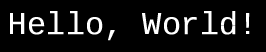
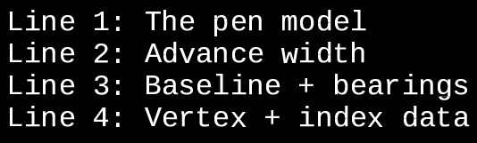
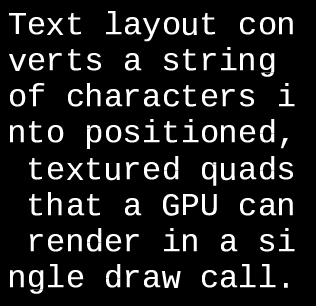
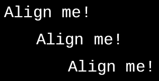
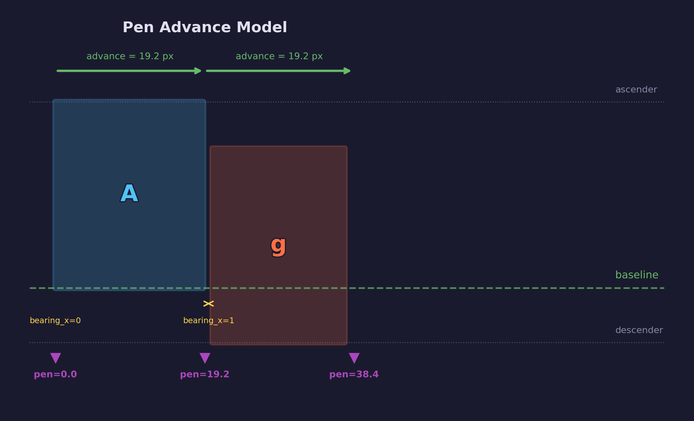
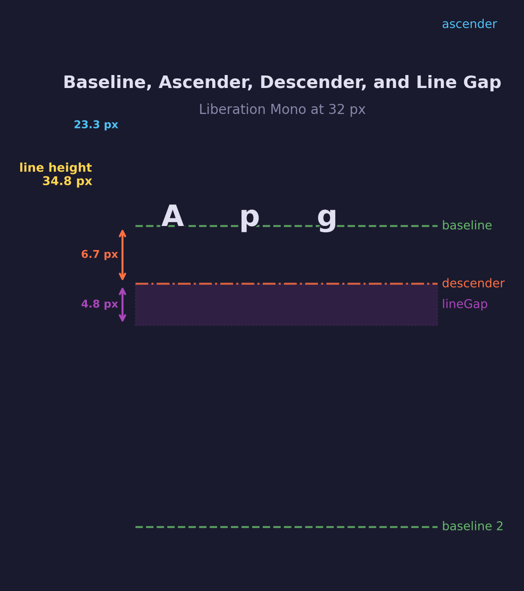
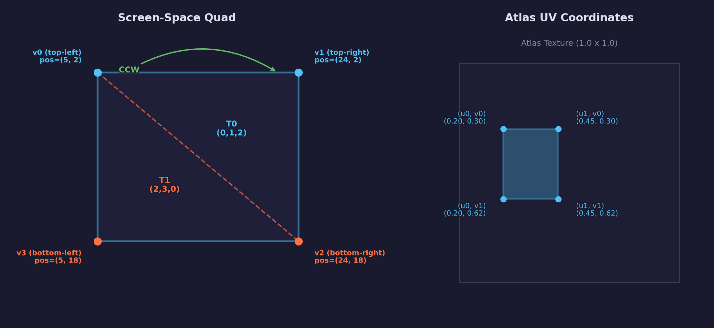
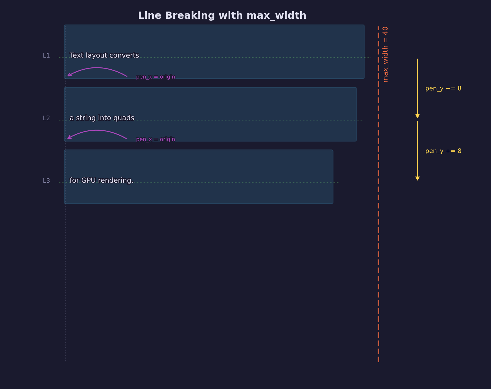

# UI Lesson 04 — Text Layout

Turn a string of characters and a font atlas into positioned, textured quads
that a GPU can render in a single draw call.

## What you'll learn

- The **pen/cursor model** — how text renderers advance a position across the
  page character by character
- **Horizontal metrics** (advance width, left side bearing, right side bearing)
  and how they create proper inter-character spacing
- **Baseline positioning** — where text sits vertically, and how ascenders and
  descenders define the line's vertical extent
- **Building a quad per character** — computing screen-space vertex positions
  from pen position + glyph bearings, and mapping atlas UV coordinates
- **Index buffers and winding order** — why four vertices plus six indices per
  quad beats six vertices, and why CCW winding matters
- **Whitespace handling** — spaces advance the pen without emitting geometry
- **Line breaking** — newlines, character-level wrapping at a maximum width,
  and how line height derives from font metrics
- **Text alignment** — left, center, and right as a post-processing step on
  vertex positions
- **Coordinate system conventions** — screen-space pixel coordinates with
  origin at top-left, ready for an orthographic projection
- The **ForgeUiVertex format** — the universal vertex layout (position, UV,
  color) that bridges the UI system and the GPU renderer

## Why this matters

Every game, tool, and UI framework needs to draw text. Whether it is a debug
overlay showing frame times, a dialogue box in an RPG, or a code editor, the
fundamental operation is the same: convert a string of characters into geometry
the GPU can rasterize.

[UI Lesson 03](../03-font-atlas/) gave us a font atlas — a single texture
containing every glyph we need, with per-glyph metadata (UV rectangles,
bearings, advance widths). But an atlas alone cannot render text. You still
need to figure out *where* each character goes on screen, how much space it
occupies, and where the next character starts.

Text layout is that bridge. It takes a string, walks through it character by
character, and produces two arrays — vertices and indices — that describe
exactly where each glyph's textured quad sits in screen space. Upload those
arrays to a GPU vertex buffer and index buffer, bind the atlas texture, and
you can render an entire paragraph in one draw call.

This lesson builds the layout system step by step. The output is pure data —
no GPU code — but every vertex and index it produces is designed to go
directly into a GPU draw call. A future GPU lesson will do exactly that.

## Result

The example program lays out four test strings and writes each as a BMP image.

**"Hello, World!" — single-line layout:**



The first time readable text appears from the learner's own code — 13
characters, 12 visible quads (the space has no geometry), 48 vertices, 72
indices.

**Multi-line text with explicit newlines:**



Four lines demonstrating baseline spacing. Each line drops by the full line
height (ascender − descender + lineGap, scaled to pixels).

**Wrapped text with max\_width:**



A long sentence wrapped at 300 pixels wide. The layout system breaks
characters to the next line when the pen would exceed the boundary.

**Alignment comparison — left, center, right:**



The same string rendered three times within a 300-pixel-wide region. Alignment
is a post-processing step — shift all vertices on a line by
`(max_width − line_width) / 2` for center, or `(max_width − line_width)` for
right.

## Key concepts

- **Pen model** — A position that starts at the left edge of the text and
  advances rightward by each glyph's advance width
- **Advance width** — The typographic spacing distance (not the visible bitmap
  width) that the pen moves after each character
- **Bearings** — Horizontal and vertical offsets from the pen/baseline to the
  glyph bitmap's edges
- **Baseline** — The invisible horizontal line that text sits on; ascenders
  rise above it, descenders drop below it
- **Quad** — Four vertices forming a textured rectangle; two CCW triangles per
  quad via six indices
- **ForgeUiVertex** — Position (vec2), UV (vec2), color (vec4) — 32 bytes per
  vertex
- **Line height** — `(ascender − descender + lineGap) × scale` — the vertical
  distance between consecutive baselines
- **Alignment** — A post-pass that shifts vertex positions horizontally;
  layout itself always starts left-aligned

## The details

### The problem

[UI Lesson 03](../03-font-atlas/) produced a single-channel atlas texture and
a table of per-glyph metadata — UV rectangles, bitmap dimensions, bearing
offsets, and advance widths (the `ForgeUiPackedGlyph` struct). But an atlas
alone cannot render text. You need to figure out *where each character goes on
screen*.

Text layout is the process of converting a string of characters into
positioned, textured quads that a GPU can draw in a single batch. This lesson
produces the vertex and index data. No GPU code yet, but the output is
directly uploadable to a vertex buffer.

### The pen model

Text renderers use a concept called the **pen** (or **cursor**). It is a
position that starts at the left edge of the text and advances rightward as
each character is placed.

After placing a character, the pen moves right by that glyph's **advance
width** — not the glyph's visible width, but the typographic spacing distance.
Advance width includes the glyph's visible pixels plus empty space on either
side (the *side bearings*) that create proper inter-character spacing.

This is why a monospaced font like Liberation Mono looks evenly spaced — every
glyph has the same advance width (19.2 px at 32 px height) regardless of its
visual width. A narrow character like `i` and a wide character like `W` both
advance the pen by the same amount.

Proportional fonts (like Roboto) have different advance widths per glyph. An
`i` takes less horizontal space than an `M`, which is why proportional text
looks more natural for reading but is harder to align in columns.

### Horizontal metrics (hmtx)

Each glyph has two horizontal metrics stored in the font's `hmtx` table:

- **Advance width** — total pen movement after this character (in font units)
- **Left side bearing** (`bearing_x`) — horizontal distance from the pen
  position to the glyph bitmap's left edge

Walk through a concrete example. When placing the character `A`:

1. The pen is at `x = 100`
2. The left side bearing is 1 pixel, so the bitmap starts at `x = 101`
3. The bitmap is 17 pixels wide, so it ends at `x = 118`
4. The advance width is 19.2 pixels, so the pen moves to `x = 119.2`
5. The gap between the bitmap's right edge (118) and the next pen position
   (119.2) is the **right side bearing** — it is implicit, not stored in the
   font



The right side bearing equals `advance_width − left_side_bearing − bitmap_width`.
You never need to compute it explicitly — the advance width already accounts
for it.

> **Unit conversion:** The `advance_width` stored in `ForgeUiPackedGlyph` is in
> font units (the font's internal coordinate system). To convert to pixels,
> multiply by the scale factor: `scale = pixel_height / units_per_em`. At
> 32 px with Liberation Mono (2048 units per em), the scale is
> `32 / 2048 = 0.015625`. An advance width of 1229 font units becomes
> `1229 × 0.015625 ≈ 19.2` pixels.

### The baseline

Text does not sit on the top or bottom of a line — it sits on an invisible
horizontal line called the **baseline**.

- Uppercase letters like `A` and `H` sit on the baseline. Their tops extend
  upward by `bearing_y` pixels.
- Letters with descenders like `g`, `p`, `y` extend *below* the baseline. The
  `g` bitmap starts above the baseline (at `baseline_y − bearing_y`) but
  extends below it.

The **ascender** (from the font's `hhea` table) is the distance from the
baseline to the top of the tallest typical glyph. The **descender** (negative
in `hhea`) is the distance from the baseline to the bottom of the lowest
descender.

When you say "render text at position (x, y)", the y coordinate typically
refers to the **baseline** — not the top of the text.

Walk through vertical positioning with concrete numbers from Liberation Mono
at 32 px:

- Baseline is at `y = 50` (screen-space, y-down)
- Glyph `A` has `bearing_y = 23`. The bitmap's top edge is at
  `y = 50 − 23 = 27`. The bitmap is 24 pixels tall, so its bottom edge is at
  `y = 51` — just below the baseline.
- Glyph `g` has `bearing_y = 18` and bitmap height 25. The bitmap's top edge
  is at `y = 50 − 18 = 32`. Its bottom edge extends to `y = 57` — well below
  the baseline.



For Liberation Mono at 32 px:

| Metric | Font units | Pixels |
|--------|-----------|--------|
| ascender | 1705 | 26.6 |
| descender | −615 | −9.6 |
| lineGap | 0 | 0.0 |
| **line height** | **2320** | **36.2** |

Line height = ascender − descender + lineGap = 1705 − (−615) + 0 = 2320
font units = 36.2 pixels.

### Building a quad per character

For each character in the string:

1. **Look up** its `ForgeUiPackedGlyph` from the atlas
2. **Compute** the quad's screen-space position using the pen position plus
   the glyph's bearing offsets
3. **Use** the glyph's UV rectangle from the atlas to texture the quad
4. **Emit** four vertices and six indices

Each vertex has three attributes:

| Attribute | Type | Bytes | Description |
|-----------|------|-------|-------------|
| position | vec2 (2 floats) | 8 | Screen-space x, y in pixels |
| uv | vec2 (2 floats) | 8 | Atlas texture coordinate |
| color | vec4 (4 floats) | 16 | RGBA per-vertex color |
| **total** | | **32** | **ForgeUiVertex stride** |

This vertex format is the **data contract** between the UI system and the GPU
renderer. Different text blocks or characters can have different colors without
switching pipeline state — the color comes from the vertex, not from a uniform.

The quad's four vertex positions are:

```text
screen_x = pen_x + bearing_x
screen_y = pen_y - bearing_y        (y-down coordinates)

top-left:     (screen_x,              screen_y)
top-right:    (screen_x + bitmap_w,   screen_y)
bottom-right: (screen_x + bitmap_w,   screen_y + bitmap_h)
bottom-left:  (screen_x,              screen_y + bitmap_h)
```

### Index buffer and winding order

Instead of six vertices per quad (two triangles with duplicated corners), use
four vertices and six indices:



The four vertices form the quad corners. The six indices form two
**counter-clockwise (CCW)** triangles:

```text
Vertices:     0 (top-left), 1 (top-right), 2 (bottom-right), 3 (bottom-left)
Triangle 0:   indices 0, 1, 2    (CCW)
Triangle 1:   indices 2, 3, 0    (CCW)
```

CCW winding is the standard front-face convention used by GPU back-face
culling. If you use CW winding, the GPU will cull your text as back-facing
geometry.

Indexed drawing saves memory. For 100 characters:

| Approach | Vertices | Indices | Total data |
|----------|----------|---------|------------|
| Non-indexed | 600 | 0 | 600 × 32 = 19,200 bytes |
| Indexed | 400 | 600 | 400 × 32 + 600 × 4 = 15,200 bytes |
| **Savings** | | | **21%** |

The savings grow with vertex size. For UI vertices at 32 bytes each, indexed
drawing saves about 4 KB per 100 characters.

### Whitespace handling

The space character (codepoint 32) has an advance width but no visible bitmap
(or a fully transparent one). The layout system still advances the pen by the
space's advance width — it just does not emit a quad. No vertices, no indices,
no texture sampling.

Tab characters (`\t`) advance the pen to the next multiple of some tab width
(the default is 4 × the space advance). This is useful for aligning columns
in debug output.

Whitespace is *layout*, not *rendering*. It affects the pen position but
produces no geometry.

### Line breaking

When the pen's x position would exceed a maximum line width, or when a newline
character `\n` is encountered, the layout system starts a new line:

1. Reset pen x to the left edge (the original starting x)
2. Advance pen y downward by the **line height**



**Line height** is derived from the font's `hhea` metrics:

$$
\text{line\_height} = (\text{ascender} - \text{descender} + \text{lineGap}) \times \text{scale}
$$

For Liberation Mono at 32 px: `(1705 − (−615) + 0) × 0.015625 = 36.25 px`.

This lesson implements the simplest form of line breaking — break at explicit
newlines or when a *character* would exceed the width. Real text layout engines
break at word boundaries (and handle hyphenation, bidirectional text, and
more), but character-level breaking is correct for a first implementation and
sufficient for debug UI and game HUD text.

### Text alignment

Once a line's quads are generated, you can adjust horizontal positioning for
different alignments:

- **Left-aligned** (default) — no adjustment needed
- **Center-aligned** — offset all quads on the line by
  `(max_width − line_width) / 2`
- **Right-aligned** — offset all quads on the line by
  `(max_width − line_width)`

Alignment is a **post-processing step** on the generated vertex positions. You
do not need to know the alignment during the per-character loop — lay out
left-aligned first, then shift. This separation keeps the core layout loop
simple and makes alignment a one-line addition per line of text.

### Coordinate system conventions

The vertex positions produced by text layout are in **screen-space pixel
coordinates** with:

- **Origin at top-left** of the screen (or text region)
- **x increases rightward**
- **y increases downward**

This matches bitmap coordinates and how UI systems think about layout. It is
the same coordinate space that the atlas bearings use (y-down: bitmap top at
`pen_y − bearing_y`).

The GPU lesson that renders this data will need an **orthographic projection
matrix** to map these pixel coordinates to clip space (the `[−1, +1]` range
the GPU expects). But that is the GPU lesson's concern — this lesson outputs
pixel positions only.

### Putting it all together

The complete pipeline from string to vertex data:

```text
input string
    |
    v
for each character:
    1. Look up glyph in atlas  (forge_ui_atlas_lookup)
    2. Check for newline/tab/space  (handle whitespace)
    3. Check for line wrapping  (pen_x + advance > max_width?)
    4. Compute quad position  (pen + bearings)
    5. Emit 4 vertices  (pos, UV, color)
    6. Emit 6 indices  (0,1,2  2,3,0)
    7. Advance pen  (pen_x += advance_width * scale)
    |
    v
apply alignment  (shift vertex positions per line)
    |
    v
output: vertices[], indices[], atlas reference
    |
    v
(future: GPU upload + orthographic projection + draw)
```

The output is three things that go straight into a GPU draw call:

1. **Vertex array** — `ForgeUiVertex` structs (position, UV, color)
2. **Index array** — `uint32` indices, six per visible character
3. **Atlas texture** — the `ForgeUiFontAtlas` from
   [UI Lesson 03](../03-font-atlas/)

## Data output

This lesson produces the following data structures, defined in
`common/ui/forge_ui.h`:

### ForgeUiVertex (32 bytes)

```c
typedef struct ForgeUiVertex {
    float pos_x, pos_y;   /* position — screen-space pixels (offset 0)  */
    float uv_u,  uv_v;    /* UV — atlas texture coordinate  (offset 8)  */
    float r, g, b, a;     /* color — per-vertex RGBA         (offset 16) */
} ForgeUiVertex;
```

### ForgeUiTextLayout

```c
typedef struct ForgeUiTextLayout {
    ForgeUiVertex *vertices;     /* 4 per visible character           */
    int            vertex_count;
    Uint32        *indices;      /* 6 per visible character (CCW)     */
    int            index_count;
    float          total_width;  /* bounding box width in pixels      */
    float          total_height; /* bounding box height in pixels     */
    int            line_count;
} ForgeUiTextLayout;
```

### ForgeUiTextOpts

```c
typedef struct ForgeUiTextOpts {
    float             max_width;  /* 0 = no wrapping                  */
    ForgeUiTextAlign  alignment;  /* LEFT, CENTER, or RIGHT           */
    float             r, g, b, a; /* default text color               */
} ForgeUiTextOpts;
```

### ForgeUiTextMetrics

```c
typedef struct ForgeUiTextMetrics {
    float  width;       /* bounding box width in pixels  */
    float  height;      /* bounding box height in pixels */
    int    line_count;
} ForgeUiTextMetrics;
```

### API functions

| Function | Purpose |
|----------|---------|
| `forge_ui_text_layout()` | Lay out a string into vertex + index arrays |
| `forge_ui_text_layout_free()` | Free the vertex and index arrays |
| `forge_ui_text_measure()` | Measure text dimensions without generating vertices |

A GPU lesson will upload the vertex buffer, index buffer, and atlas texture,
bind an orthographic projection, and draw everything in one call.

## Where it's used

In forge-gpu lessons:

- [UI Lesson 01](../01-ttf-parsing/) — font loading, `hhea` metrics
  (ascender, descender, lineGap), `units_per_em`
- [UI Lesson 02](../02-glyph-rasterization/) — glyph rasterization, bearing
  offsets, bitmap coordinates
- [UI Lesson 03](../03-font-atlas/) — font atlas, UV rectangles,
  `ForgeUiPackedGlyph`, advance widths
- [Math Lesson 01](../../math/01-vectors/) — `vec2` for positions and UVs
- A future **GPU text rendering lesson** will upload this data and draw it
  with an orthographic projection, texture sampling, and a single draw call
- **UI Lesson 05** (immediate-mode basics) will use text layout as a building
  block for UI controls — buttons, labels, and input fields all need to
  measure and position text

## Building

```bash
cmake -B build
cmake --build build --config Debug

# Windows
build\lessons\ui\04-text-layout\Debug\ui-04-text-layout.exe

# Linux / macOS
./build/lessons/ui/04-text-layout/ui-04-text-layout
```

The program writes BMP files to the current directory:

- `layout_hello.bmp` — "Hello, World!" on a single line
- `layout_multiline.bmp` — four lines with explicit `\n` breaks
- `layout_wrapped.bmp` — long text wrapped at 300 px
- `layout_alignment.bmp` — left, center, and right alignment side by side

## Exercises

1. **Word-level wrapping** — Modify the layout loop to break lines at the last
   space before `max_width` instead of mid-character. Track the position of
   the last space and rewind the pen when a word would overflow.

2. **Per-character color** — Extend the demo to assign different colors to
   each word (e.g., cycle through red, green, blue). The vertex format already
   supports per-vertex color — you just need to pass different RGBA values
   when emitting each quad.

3. **Cursor rendering** — Add a blinking cursor (a thin vertical line) at a
   given character index. Use `forge_ui_text_measure()` on the substring up to
   the cursor position to find the x offset, then emit a single quad using
   the atlas's white pixel UV region.

4. **Text metrics visualization** — Render the bounding box, baseline, and
   ascender/descender lines as colored rectangles overlaid on the text. Use
   the white pixel UV region for solid-colored quads.

## Further reading

- **UI Lesson 05** (immediate-mode basics) — Will use text layout as a
  building block for buttons, labels, and interactive controls (coming soon)
- [FreeType Glyph Conventions](https://freetype.org/freetype2/docs/glyphs/glyphs-3.html) —
  In-depth explanation of glyph metrics, advance widths, and bearing offsets
- [OpenType spec: hmtx table](https://learn.microsoft.com/en-us/typography/opentype/spec/hmtx) —
  The horizontal metrics table format that stores advance widths and LSBs
- [Slug Library](http://sluglibrary.com/) — A production GPU text renderer
  that renders glyph outlines directly on the GPU (advanced)

## Limitations

This lesson intentionally does not implement:

- **UTF-8 multi-byte decoding** — Input is treated as ASCII (codepoints
  0–127). A future lesson could add full UTF-8 support.
- **Kerning** (GPOS/kern table) — No pair-wise spacing adjustments between
  specific character combinations like "AV" or "To".
- **Bidirectional text** — No right-to-left layout for Arabic, Hebrew, etc.
- **Complex text shaping** — No ligatures, no Arabic/Devanagari joining forms,
  no contextual alternates.
- **Vertical text layout** — No top-to-bottom rendering for CJK vertical text.
- **Rich text** — No mixed fonts, sizes, or inline images within a single
  layout. Per-character *color* is supported via the vertex color attribute.
