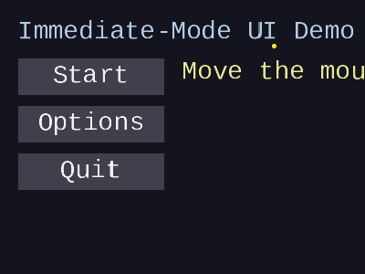
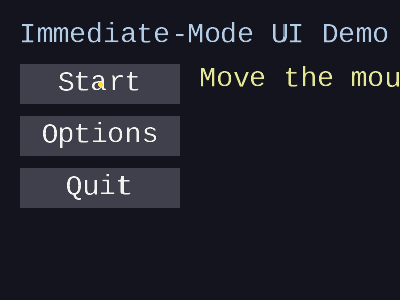
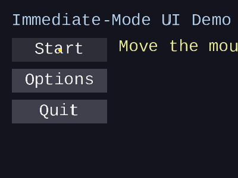
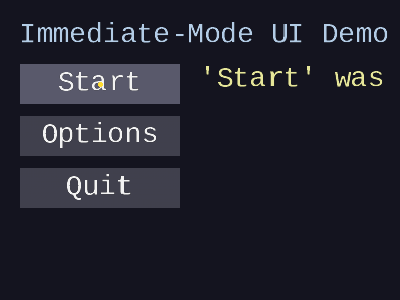
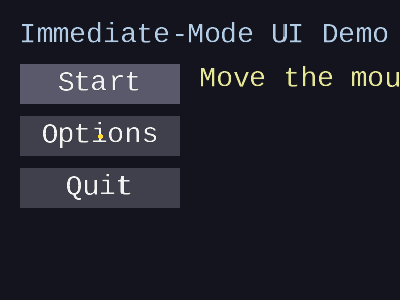
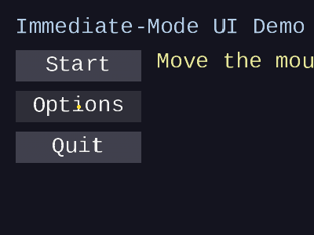
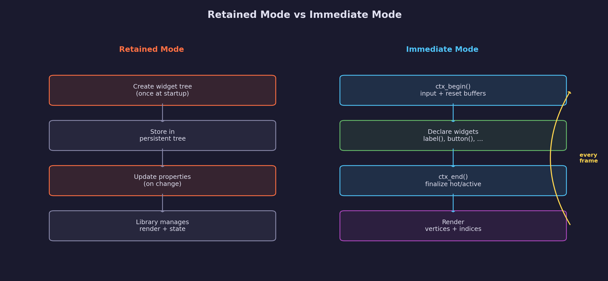
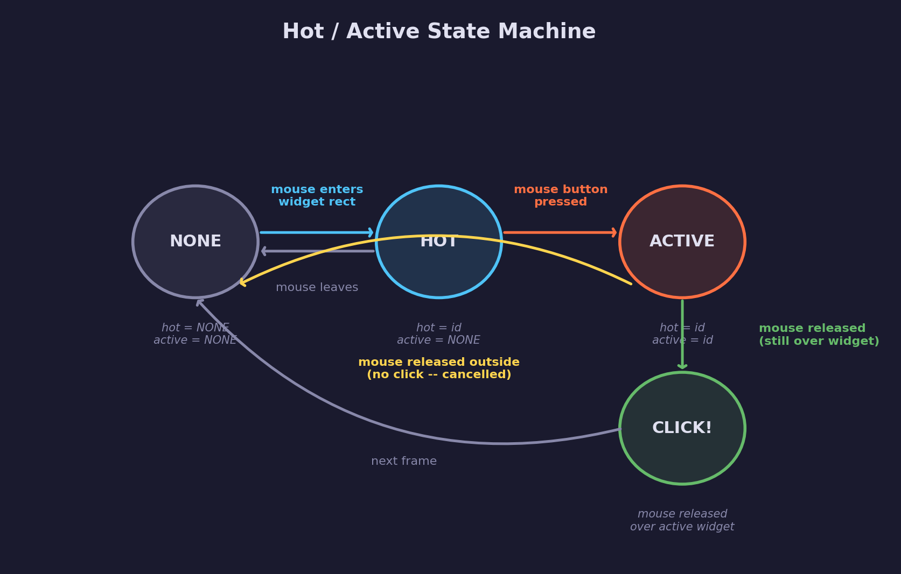
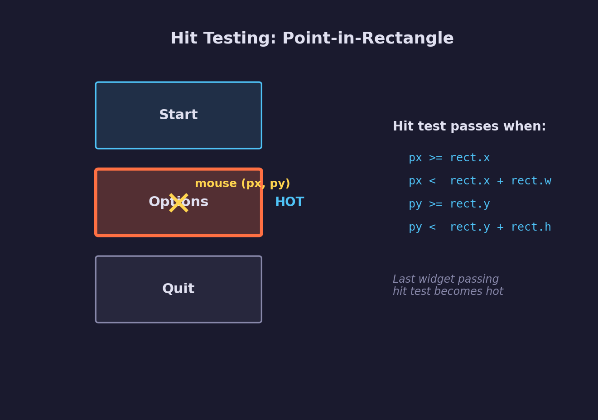
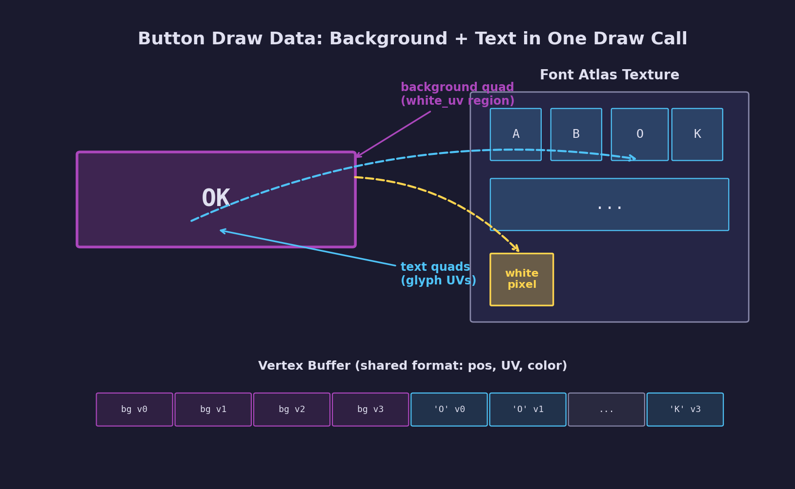

# UI Lesson 05 — Immediate-Mode Basics

The declare-then-draw loop: build your entire UI every frame from application
state, generating vertices and indices ready for a single GPU draw call.

## What you'll learn

- **Retained vs immediate-mode UI** — two fundamentally different approaches
  to building user interfaces, and why games often choose immediate mode
- **The declare-then-draw loop** — the per-frame pattern where the application
  declares widgets, and the library generates draw data
- **ForgeUiContext** — a minimal context struct holding mouse input state and
  dynamically growing vertex/index buffers
- **The hot/active state machine** — Casey Muratori's two-ID model for
  tracking which widget the mouse is over (hot) and which is being pressed
  (active)
- **Hit testing** — point-in-rectangle tests that determine which widget the
  cursor is interacting with
- **Labels** — text positioned via `forge_ui_text_layout`, emitting textured
  quads with per-glyph atlas UVs
- **Buttons** — a solid-colored background rectangle (using the atlas white
  pixel UV region) plus centered text, returning true on click
- **Draw data generation** — how both solid rectangles and text glyphs share
  the same `ForgeUiVertex` format and atlas texture, enabling a single draw
  call to render the entire UI

## Why this matters

Every game and tool needs a user interface. There are two broad approaches:

**Retained-mode UI** libraries (Qt, GTK, HTML DOM) maintain a persistent
widget tree. You create widgets once, store them in a tree structure, and
update individual properties when state changes. The library manages
rendering, layout, and event routing internally.

**Immediate-mode UI** libraries (Dear ImGui, Nuklear, microui) take a
different approach: the application describes its entire UI every frame.
There is no persistent widget tree — the library generates draw data on the
fly and discards it at the end of the frame. Widget state like "is this
button hovered?" is computed from the current mouse position, not stored in
a widget object.

Immediate mode is popular in games and real-time tools because:

- **No synchronization** — UI state is always consistent with application
  state because widgets are rebuilt from it every frame
- **Simple API** — `if (button("Save")) { save(); }` — the widget declaration
  and the response to interaction live in the same place
- **No widget lifetime management** — widgets exist only for the frame they
  are declared, so there is nothing to create, destroy, or leak
- **Easy conditional UI** — showing or hiding elements is just an `if`
  statement around the widget call

This lesson builds the foundation: a context that tracks input and
interaction state, labels for displaying text, and buttons that respond to
mouse clicks — all generating the same `ForgeUiVertex` and index data from
[UI Lesson 04](../04-text-layout/).

## Result

The demo program simulates 6 frames of mouse input and renders each frame
to a BMP image using the software rasterizer. A yellow dot shows the cursor
position. The three buttons change appearance based on interaction state:

| Frame 0: All normal | Frame 1: Start is hot |
|---|---|
|  |  |

| Frame 2: Start is active | Frame 3: Click detected |
|---|---|
|  |  |

| Frame 4: Options is hot | Frame 5: Options is active |
|---|---|
|  |  |

## Key concepts

- **Immediate mode** — declare all widgets every frame; no persistent widget
  tree
- **Hot** — the widget currently under the mouse cursor (eligible for click)
- **Active** — the widget currently being pressed (mouse button held down)
- **Click** — mouse released while still over the active widget
- **Hit testing** — point-in-rectangle check against each widget's bounds
- **White pixel technique** — solid-colored rectangles sample the atlas white
  pixel region, so vertex color alone determines the output color
- **Single draw call** — background rectangles and text glyphs share the same
  vertex format and atlas texture

## The details

### Retained mode vs immediate mode



In **retained mode**, you build a widget tree once at startup:

```c
/* Retained mode (pseudo-code) */
Button *btn = ui_create_button(panel, "Save");
btn->on_click = save_callback;
/* ... later, if visibility changes: */
btn->visible = show_save;
```

The library owns the widget objects. You communicate through callbacks and
property setters. If your application state changes, you must update every
affected widget to stay in sync.

In **immediate mode**, you describe the UI every frame:

```c
/* Immediate mode */
forge_ui_ctx_begin(&ctx, mouse_x, mouse_y, mouse_down);

if (show_save) {
    if (forge_ui_ctx_button(&ctx, SAVE_BTN_ID, "Save", save_rect)) {
        save_file();
    }
}

forge_ui_ctx_end(&ctx);
/* Render ctx.vertices / ctx.indices */
```

The UI is always a direct reflection of application state. If `show_save` is
false, the button simply is not declared, and it disappears. No widget
objects to hide, no callbacks to deregister.

### The declare-then-draw loop

Every frame follows four steps:

1. **`forge_ui_ctx_begin()`** — feed in the current mouse position and button
   state; reset the vertex and index buffers to empty
2. **Declare widgets** — call `forge_ui_ctx_label()`, `forge_ui_ctx_button()`,
   etc. Each call performs hit testing, updates hot/active state, and appends
   vertices and indices to the context's draw buffers
3. **`forge_ui_ctx_end()`** — finalize hot/active state transitions for the
   frame
4. **Render** — submit `ctx.vertices` and `ctx.indices` with the font atlas
   texture to the GPU (or the software rasterizer)

### ForgeUiContext

The context struct holds everything the immediate-mode system needs:

```c
typedef struct ForgeUiContext {
    /* Font atlas (not owned -- must outlive the context) */
    const ForgeUiFontAtlas *atlas;

    /* Per-frame input state (set by forge_ui_ctx_begin) */
    float mouse_x, mouse_y;   /* cursor position in screen pixels */
    bool  mouse_down;          /* true while the primary button is held */

    /* Persistent widget state (survives across frames) */
    Uint32 hot;      /* widget under the cursor (FORGE_UI_ID_NONE if empty) */
    Uint32 active;   /* widget being pressed (FORGE_UI_ID_NONE if empty) */

    /* Draw data (reset each frame) */
    ForgeUiVertex *vertices;   /* dynamically growing vertex buffer */
    int vertex_count;
    Uint32 *indices;           /* dynamically growing index buffer */
    int index_count;
} ForgeUiContext;
```

Key design decisions:

- **The atlas is not owned** — the context holds a pointer to an externally
  managed atlas. This avoids lifetime coupling and lets multiple contexts
  share the same atlas.
- **Hot and active are `Uint32` IDs** — not pointers. This avoids dangling
  references when widgets are not declared in a given frame. The reserved
  value `FORGE_UI_ID_NONE` (0) means "no widget."
- **Draw buffers grow dynamically** — starting at 256 vertices and 384
  indices, doubling when full. Most frames reuse the same allocation.

### The hot/active state machine



This is the core insight from Casey Muratori's 2005 IMGUI talk. Two IDs are
enough to handle all mouse interaction:

- **`hot`** — the widget that the cursor is hovering over. Updated every
  frame based on hit testing. When a widget is hot, it typically draws with
  a highlighted color to indicate interactivity.

- **`active`** — the widget that the user is currently pressing. Set when the
  mouse button goes down while a widget is hot. Cleared when the mouse
  button is released.

The state transitions work as follows:

1. **Frame start**: `next_hot` is cleared to `FORGE_UI_ID_NONE`
2. **During widget processing**: each widget that passes the hit test sets
   `next_hot` to its own ID (last writer wins)
3. **Active acquisition**: if `mouse_down` and `hot == id` and
   `active == NONE`, then `active = id`
4. **Click detection**: if `active == id` and `!mouse_down`, the button was
   clicked (if the cursor is still over the widget)
5. **Frame end**: `hot = next_hot` (unless a widget is currently active, in
   which case hot is frozen to prevent visual jitter)

The "last writer wins" rule for hot means that **draw order determines
priority**. Widgets drawn later (on top) take precedence for hover, which
matches the visual expectation that the topmost element receives input.

### Hit testing



Hit testing determines whether the mouse cursor is inside a widget's
bounding rectangle. The test is a simple point-in-rectangle check:

```c
static inline bool forge_ui__rect_contains(ForgeUiRect rect,
                                           float px, float py)
{
    return px >= rect.x && px < rect.x + rect.w &&
           py >= rect.y && py < rect.y + rect.h;
}
```

The half-open interval (`>=` on the left/top, `<` on the right/bottom)
ensures that adjacent rectangles share no pixels — a point on the boundary
belongs to exactly one rectangle.

### Widget IDs

Each interactive widget needs a unique ID so the context can track hot and
active state across frames. In this lesson, IDs are simple integers chosen
by the application:

```c
const Uint32 SAVE_BTN_ID = 1;
const Uint32 LOAD_BTN_ID = 2;
const Uint32 QUIT_BTN_ID = 3;
```

The reserved value `FORGE_UI_ID_NONE` (0) means "no widget" and must never
be used as a widget ID. In production immediate-mode libraries like Dear
ImGui, IDs are typically hashed from the widget label string plus a stack of
parent IDs — but for this lesson, manual integer IDs make the mechanism
visible and explicit.

### Labels

A label is the simplest widget: it emits textured quads for each character
with no hit testing or state tracking. The implementation delegates entirely
to the text layout system from [UI Lesson 04](../04-text-layout/):

```c
static inline void forge_ui_ctx_label(ForgeUiContext *ctx,
                                      const char *text,
                                      float x, float y,
                                      float r, float g, float b, float a)
{
    ForgeUiTextOpts opts = { 0, FORGE_UI_TEXT_ALIGN_LEFT, r, g, b, a };
    ForgeUiTextLayout layout;
    if (forge_ui_text_layout(ctx->atlas, text, x, y, &opts, &layout)) {
        forge_ui__emit_text_layout(ctx, &layout);
        forge_ui_text_layout_free(&layout);
    }
}
```

The generated vertices use per-glyph UV coordinates from the atlas, so each
character samples its own glyph bitmap. The vertex color tints the text.

### Buttons

A button combines two draw elements:

1. **Background rectangle** — a solid-colored quad using the atlas white
   pixel UV region
2. **Centered text** — character quads laid out at the button's center



The background color varies with interaction state:

| State | Condition | Color |
|-------|-----------|-------|
| Normal | `hot != id && active != id` | Dark gray (0.25, 0.25, 0.30) |
| Hot (hovered) | `hot == id` | Lighter gray (0.35, 0.35, 0.42) |
| Active (pressed) | `active == id` | Darker gray (0.18, 0.18, 0.22) |

The button function returns `true` on the frame the click is detected —
when the mouse button is released while the cursor is still over the widget
and it was the active widget. This enables the idiomatic pattern:

```c
if (forge_ui_ctx_button(&ctx, SAVE_ID, "Save", save_rect)) {
    save_file();  /* Runs exactly once per click */
}
```

### The white pixel technique

Both text glyphs and solid rectangles use the same `ForgeUiVertex` format
and the same atlas texture. How does a rectangle get a solid color when the
atlas contains glyph bitmaps?

The atlas contains a small (2x2 pixel) region filled with value 255 (fully
opaque white). When a rectangle's vertices use the UV coordinates of this
white region, every texel they sample returns 1.0. The final pixel color is:

$$
\text{color} = \text{vertex\_color} \times \text{texel}
$$

For text glyphs, the texel is the glyph's alpha coverage (0.0 to 1.0), so
the vertex color is modulated by the glyph shape. For rectangles, the texel
is always 1.0, so the vertex color passes through unchanged. This is the
same approach used by Dear ImGui — one texture, one vertex format, one draw
call.

### Draw data generation

Each widget appends vertices and indices to the context's buffers:

- **Rectangles**: 4 vertices (corners) + 6 indices (two CCW triangles)
- **Text characters**: 4 vertices + 6 indices per visible character

The vertex format is `ForgeUiVertex` from [UI Lesson 04](../04-text-layout/):

```c
typedef struct ForgeUiVertex {
    float pos_x, pos_y;     /* screen-space pixels, origin top-left */
    float uv_u, uv_v;       /* atlas texture coordinates [0, 1] */
    float r, g, b, a;       /* per-vertex RGBA color */
} ForgeUiVertex;             /* 32 bytes */
```

A button with label "OK" generates:

| Element | Vertices | Indices | UV source |
|---------|----------|---------|-----------|
| Background rect | 4 | 6 | Atlas white_uv |
| Glyph 'O' | 4 | 6 | Atlas glyph UV |
| Glyph 'K' | 4 | 6 | Atlas glyph UV |
| **Total** | **12** | **18** | |

All elements share the same vertex buffer, index buffer, and texture. A GPU
renderer submits them in a single indexed draw call with alpha blending
enabled.

## Data output

This lesson produces the same data format as
[UI Lesson 04](../04-text-layout/), extended with rectangle quads:

- **Vertices**: `ForgeUiVertex` — position (vec2), UV (vec2), color (vec4),
  32 bytes per vertex, screen-space pixel coordinates with top-left origin
- **Indices**: `uint32` triangle list, CCW winding, 6 indices per quad
  (two triangles per character or rectangle)
- **Texture**: single-channel grayscale font atlas — glyph regions provide
  alpha coverage for text; the white pixel region provides solid coverage
  for rectangles

## Where it's used

In forge-gpu lessons:

- [UI Lesson 04 — Text Layout](../04-text-layout/) provides the text layout
  system (`forge_ui_text_layout`) that labels and button text use internally
- [UI Lesson 03 — Font Atlas](../03-font-atlas/) provides the atlas with
  per-glyph UV coordinates and the white pixel region
- [Engine Lesson 10 — CPU Rasterization](../../engine/10-cpu-rasterization/)
  provides the software rasterizer used to visualize the output
- A future GPU lesson will render UI data with the SDL GPU API

## Building

```bash
cmake -B build
cmake --build build --config Debug

# Windows
build\lessons\ui\05-immediate-mode-basics\Debug\05-immediate-mode-basics.exe

# Linux / macOS
./build/lessons/ui/05-immediate-mode-basics/05-immediate-mode-basics
```

The program writes BMP files to the current directory. Run from the
repository root so it can find the font file at
`assets/fonts/liberation_mono/LiberationMono-Regular.ttf`.

## Exercises

1. **Add a third state color**: modify the button to show a distinct
   "clicked" flash color on the frame the click is detected, before
   returning to the normal state on the next frame

2. **Implement a toggle button**: create a `forge_ui_ctx_toggle()` function
   that takes a `bool *value` and flips it on click, drawing differently
   when the value is true vs false

3. **Keyboard focus**: extend `ForgeUiContext` with a `focused` ID field
   and cycle focus through widgets with the Tab key — draw a visible
   outline around the focused widget

4. **Draw order priority**: add overlapping buttons and verify that the
   last-drawn button receives hover priority — then experiment with
   reversing the draw order to see how it affects input routing

## Further reading

- [Casey Muratori — Immediate-Mode Graphical User Interfaces (2005)](https://caseymuratori.com/blog_0001)
  — the foundational talk on immediate-mode UI
- [Omar Cornut — Dear ImGui](https://github.com/ocornut/imgui) — the most
  widely used immediate-mode UI library, which uses the same hot/active
  pattern and white pixel technique
- [rxi — microui](https://github.com/rxi/microui) — a minimal
  immediate-mode UI in ~1000 lines of C
