# UI Lesson 06 — Checkboxes and Sliders

External mutable state and drag interaction: widgets that write back into
your application's variables using the same hot/active state machine from
[lesson 05](../05-immediate-mode-basics/).

## What you'll learn

- **External mutable state** — how immediate-mode widgets modify
  caller-owned variables through pointers (`bool *value`, `float *value`)
  rather than returning one-shot events
- **Checkbox interaction** — reusing the hot/active state machine to toggle
  a boolean on click, with draw code that renders an outer box, a filled
  inner square when checked, and a text label
- **Slider drag interaction** — a new interaction pattern where active
  persists while the mouse button is held, allowing the cursor to move
  freely outside the widget bounds during a drag
- **Value mapping** — the bidirectional conversion between pixel position,
  normalized parameter t in [0, 1], and user-facing value in [min, max]
- **Active persistence outside bounds** — why sliders (and other drag
  widgets) must continue responding to mouse movement even when the cursor
  leaves the widget rectangle
- **Slider draw elements** — track (thin horizontal rect), thumb (small
  rect positioned by the current value), and an optional value label
  (text quads showing the formatted number)
- **Widget comparison** — how buttons, checkboxes, and sliders share the
  same state machine but differ in their outcome (one-shot event vs toggle
  vs continuous value)

## Why this matters

Real applications need more than buttons. Game settings screens have
checkboxes for "Enable Audio" or "Show FPS", and sliders for volume,
brightness, or mouse sensitivity. Developer tools use sliders to tweak
parameters in real time and checkboxes to toggle debug overlays.

Both controls build directly on the hot/active state machine from
[lesson 05](../05-immediate-mode-basics/). The checkbox uses the exact
same activation and click-detection logic as a button — the only
difference is what happens on click (toggle a boolean instead of returning
true). The slider introduces a genuinely new interaction: **drag**, where
the widget holds active state across multiple frames while the mouse
button is held, continuously updating a value.

Understanding drag interaction is essential because it appears everywhere
in UI development: scroll bars, color pickers, resize handles, timeline
scrubbing, and any control where the user holds and moves. The key insight
is that active must persist even when the cursor moves outside the widget
bounds — otherwise the slider "drops" the drag whenever the user moves
too fast or overshoots the track.

## Result

The demo program simulates 9 frames of mouse input and renders each frame
to a BMP image. A yellow dot shows the cursor position. The first four
frames demonstrate checkbox interaction (hover, press, toggle), and the
remaining five demonstrate slider drag (hover, snap, drag, edge clamping,
release).

| Frame 0: All normal | Frame 1: Checkbox hot |
|---|---|
| 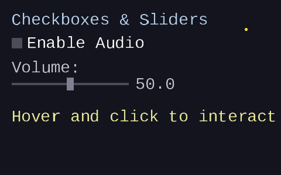 | 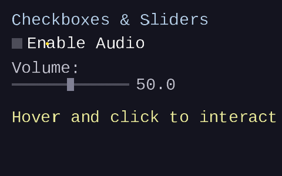 |

| Frame 2: Checkbox active | Frame 3: Checkbox toggled |
|---|---|
|  | 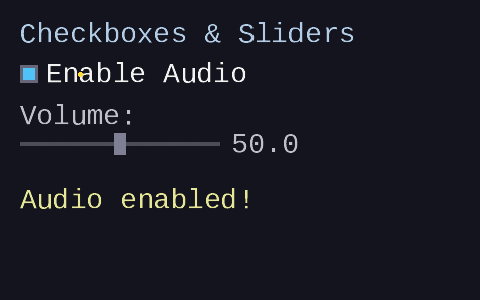 |

| Frame 4: Slider hot | Frame 5: Slider snaps to 25% |
|---|---|
| 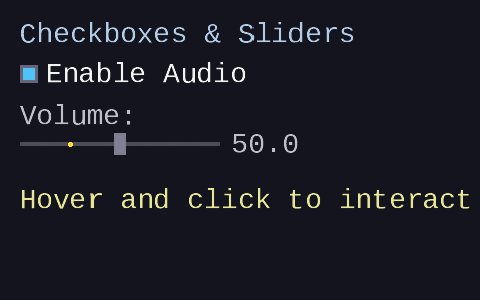 | 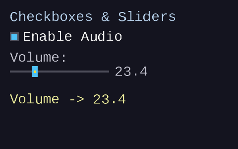 |

| Frame 6: Drag to 75% | Frame 7: Past right edge (clamped) |
|---|---|
| 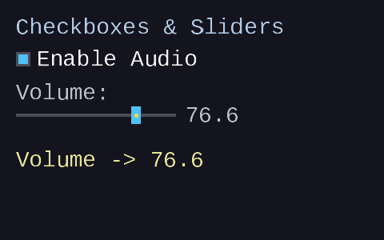 | 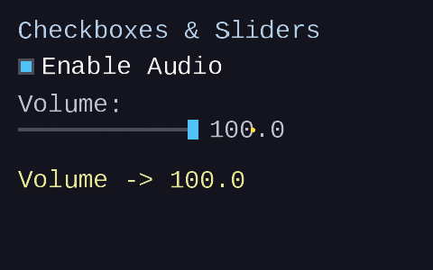 |

| Frame 8: Released |
|---|
| 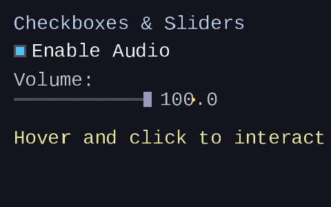 |

## Key concepts

- **External mutable state** — widgets take pointers to the application's
  variables and modify them directly on interaction
- **Checkbox** — same state machine as a button, but toggles `*value` on
  click instead of returning a one-shot bool
- **Slider drag** — active persists across frames while the mouse is held;
  value tracks mouse position continuously
- **Value mapping** — pixel position to normalized t to user value, and
  the inverse for thumb positioning
- **Clamping** — t is clamped to [0, 1] so dragging past the track edges
  pins the value to min or max
- **Click-to-snap** — clicking anywhere on the slider track (not just the
  thumb) immediately sets the value and begins dragging

## The details

### External mutable state

In [lesson 05](../05-immediate-mode-basics/), the button function returns
a boolean: `true` on the frame the button is clicked, `false` otherwise.
The application checks the return value and acts:

```c
if (forge_ui_ctx_button(&ctx, ID, "Save", rect)) {
    save_file();  /* one-shot action */
}
```

Checkboxes and sliders work differently. They modify the application's
own variables through pointers. The `&` operator produces the memory
address of a variable, and the widget function receives that address as a
pointer parameter (e.g. `bool *value`). Inside the function, `*value`
dereferences the pointer to read or write the caller's original variable
(see [Engine Lesson 01 — Intro to C](../../engine/01-intro-to-c/) for
more on pointers):

```c
bool audio_enabled = false;
float volume = 50.0f;

/* Each frame: */
forge_ui_ctx_checkbox(&ctx, CB_ID, "Audio", &audio_enabled, cb_rect);
forge_ui_ctx_slider(&ctx, SL_ID, &volume, 0.0f, 100.0f, sl_rect);

/* audio_enabled and volume are updated by the widgets */
```

The widget writes directly into the caller's data. This is the
fundamental pattern of external mutable state in immediate-mode UI: the
library does not own the state — it borrows it through a pointer, reads
the current value for rendering, and writes back a new value on
interaction.

Both functions return `true` on frames where the value changed, so the
application can respond to changes if needed:

```c
if (forge_ui_ctx_slider(&ctx, SL_ID, &volume, 0.0f, 100.0f, rect)) {
    apply_volume(volume);  /* runs each frame the slider moves */
}
```

### Checkbox interaction

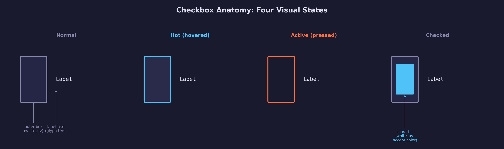

A checkbox is structurally similar to a button. It uses the same
hot/active state machine with the same edge-triggered activation:

1. **Hit test** — check if the mouse is inside the widget rect (which
   covers both the box and the label, giving users a generous click
   target)
2. **Activate** — on the press edge (up→down transition), if the widget
   is hot, it becomes active
3. **Toggle** — on release, if the cursor is still over the widget and
   it was the active widget, flip `*value`

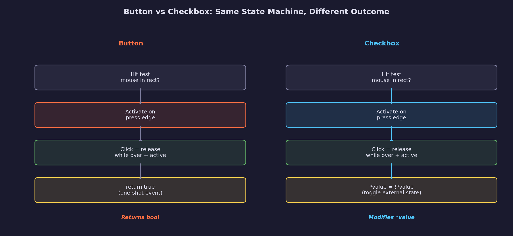

The only difference from a button is step 3: instead of returning `true`
(a one-shot event), the checkbox writes `*value = !*value` (a persistent
state change).

The draw code produces three elements:

| Element | Type | UV source | Purpose |
|---------|------|-----------|---------|
| Outer box | Rectangle quad | Atlas white_uv | Visual boundary, color varies by state |
| Inner fill | Rectangle quad | Atlas white_uv | Indicates checked state (accent color) |
| Label text | Character quads | Per-glyph atlas UVs | Descriptive text next to the box |

The box is a fixed-size square (18×18 pixels by default), vertically
centered within the widget rect. The inner fill appears only when
`*value` is true, inset by 3 pixels from the box edges. The label is
drawn to the right of the box with an 8-pixel gap.

```c
static inline bool forge_ui_ctx_checkbox(ForgeUiContext *ctx,
                                          Uint32 id,
                                          const char *label,
                                          bool *value,
                                          ForgeUiRect rect)
{
    /* Hit test, activation, and click detection are identical to button */
    bool mouse_over = forge_ui__rect_contains(rect, ctx->mouse_x, ctx->mouse_y);
    /* ... same state machine logic ... */

    /* Toggle on click instead of returning true */
    if (ctx->active == id && !ctx->mouse_down) {
        if (mouse_over) {
            *value = !(*value);
            toggled = true;
        }
        ctx->active = FORGE_UI_ID_NONE;
    }

    /* Draw: outer box + inner fill (if checked) + label */
    forge_ui__emit_rect(ctx, box_rect, ...);
    if (*value) forge_ui__emit_rect(ctx, inner_rect, ...);
    forge_ui_ctx_label(ctx, label, label_x, label_y, ...);

    return toggled;
}
```

### Slider interaction

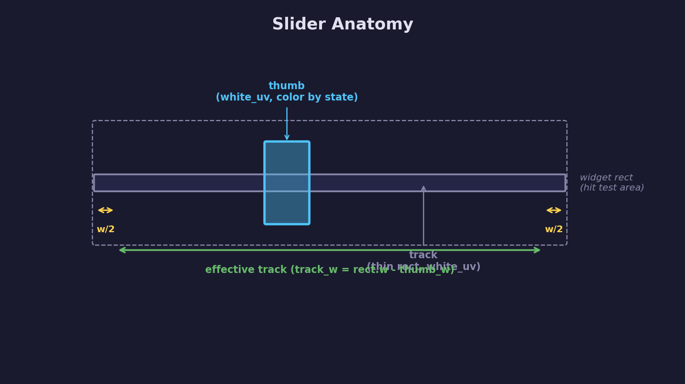

The slider introduces **drag interaction** — a pattern where the active
state persists across multiple frames while the mouse button is held. This
is fundamentally different from button and checkbox clicks, which are
instantaneous events detected on the release frame.

#### Activation and snap

When the user clicks anywhere on the slider's widget rect, two things
happen on the same frame:

1. The slider becomes **active** (same edge-triggered logic as buttons)
2. The value **snaps** to the click position (the thumb jumps to the cursor)

This "click-to-snap" behavior means the user does not need to find and
grab the thumb — clicking on any part of the track immediately positions
the value and begins a drag.

#### Continuous value update

While the slider is active and the mouse button is held, the value is
updated every frame based on the current mouse x position:

```c
if (ctx->active == id && ctx->mouse_down) {
    float t = (ctx->mouse_x - track_x) / track_w;
    if (t < 0.0f) t = 0.0f;
    if (t > 1.0f) t = 1.0f;
    float new_val = min_val + t * (max_val - min_val);
    if (new_val != *value) {
        *value = new_val;
        changed = true;
    }
}
```

This update runs regardless of whether the cursor is inside the widget
rect. That is the defining property of drag interaction: **active persists
outside the widget bounds**.

#### Release

When the mouse button is released, active is cleared and the slider
returns to normal state. Unlike a button, there is no "click" event to
detect — the slider's purpose is the continuous value update during drag.
The value stays wherever the user left it.

### Value mapping

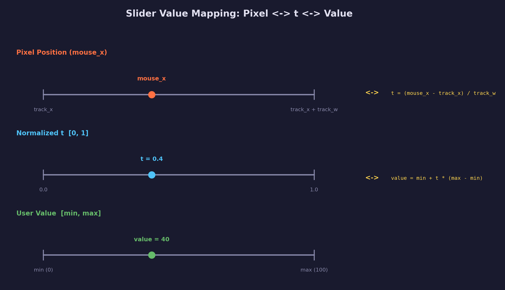

The slider needs two conversions: from pixel position to user value
(when the user drags), and from user value to pixel position (when
drawing the thumb).

**Pixel to value (forward mapping):**

The "effective track" is the range of pixel positions the thumb center can
occupy. It is inset by half the thumb width on each side so the thumb
never overhangs the widget rect:

$$
\text{track}\_\text{x} = \text{rect}.x + \frac{\text{thumb}\_\text{w}}{2}
$$

$$
\text{track}\_\text{w} = \text{rect}.w - \text{thumb}\_\text{w}
$$

The normalized parameter t maps the mouse position to [0, 1]:

$$
t = \text{clamp}\left(\frac{\text{mouse}\_\text{x} - \text{track}\_\text{x}}{\text{track}\_\text{w}},\; 0,\; 1\right)
$$

Then t maps linearly to the user value:

$$
\text{value} = \text{min} + t \times (\text{max} - \text{min})
$$

**Value to pixel (inverse mapping):**

To draw the thumb, compute t from the current value and map back to a
pixel position:

$$
t = \frac{\text{value} - \text{min}}{\text{max} - \text{min}}
$$

$$
\text{thumb}\_\text{x} = \text{track}\_\text{x} + t \times \text{track}\_\text{w}
$$

These are inverse operations: forward mapping converts mouse position to
value, inverse mapping converts value to thumb position. Together they
keep the thumb visually synchronized with the value at all times.

### Active persistence outside bounds

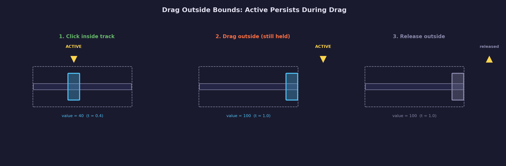

When you drag a slider and move the mouse above, below, or past the edges
of the track, the value should keep updating. If the slider dropped the
drag whenever the cursor left the widget rect, fast mouse movements would
constantly "lose" the slider.

The hot/active state machine already supports this naturally:

1. **Hot is frozen while active** — in `forge_ui_ctx_end()`, if a widget
   is active, hot is not updated from `next_hot`. This prevents other
   widgets from stealing hover during a drag.
2. **Active only clears on release** — the slider clears active when
   `!mouse_down`, not when the cursor leaves the rect.
3. **Value update ignores cursor position** — the `if (active == id)`
   check does not include a `mouse_over` test. The only thing that
   matters is whether the slider owns active and the mouse is held.

The clamping ensures sensible behavior at the edges: dragging past the
left edge pins the value to min, and past the right edge pins it to max.

### Slider draw elements

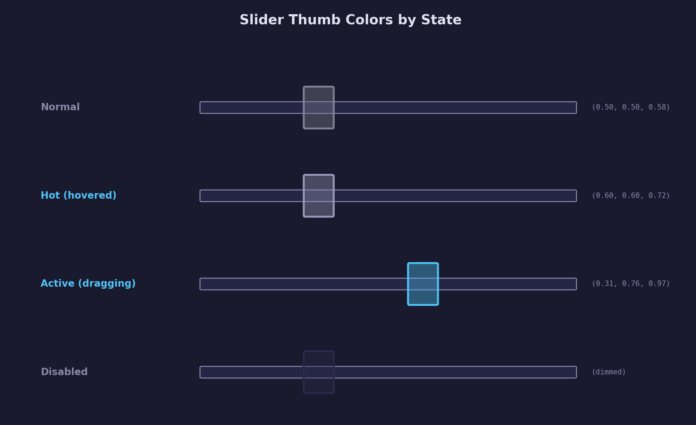

The slider produces two required draw elements (and the demo adds a
third):

| Element | Type | UV source | Purpose |
|---------|------|-----------|---------|
| Track | Rectangle quad | Atlas white_uv | Thin horizontal bar showing the slider's range |
| Thumb | Rectangle quad | Atlas white_uv | Movable indicator, color varies by state |
| Value label | Character quads | Per-glyph atlas UVs | Formatted number showing the current value |

The track is a 4-pixel-tall rectangle spanning the full widget width.
The thumb is a 12×22 pixel rectangle centered vertically, positioned
along the track by the inverse value mapping.

Thumb colors by interaction state:

| State | Condition | Color (R, G, B) |
|-------|-----------|-----------------|
| Normal | `hot != id && active != id` | (0.50, 0.50, 0.58) — medium gray |
| Hot | `hot == id` | (0.60, 0.60, 0.72) — lighter gray |
| Active | `active == id` | (0.31, 0.76, 0.97) — accent cyan |

The active color is visually distinct (bright cyan) to give clear
feedback that the slider is being dragged.

The value label is not part of the `forge_ui_ctx_slider()` function
itself — the demo formats the value with `SDL_snprintf` and draws it
using `forge_ui_ctx_label()`. This keeps the slider function focused on
the track and thumb, while giving the caller full control over value
formatting and label placement.

### Comparing button, checkbox, and slider

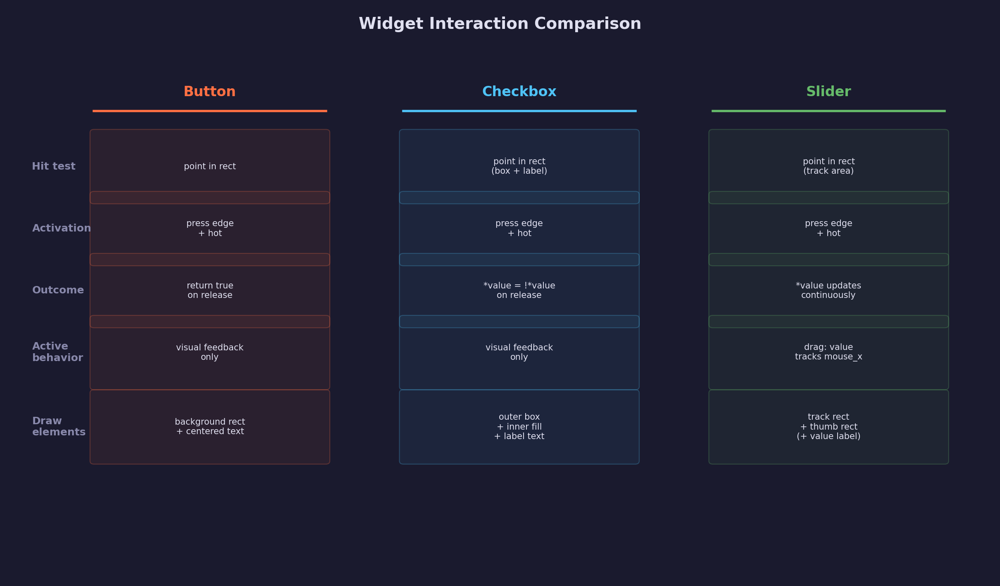

All three widgets share the same foundation: point-in-rectangle hit
testing, edge-triggered activation, and the hot/active two-ID state
machine. They differ in what happens with the active state:

- **Button** — active provides visual feedback only; the outcome is a
  one-shot `return true` on the release frame
- **Checkbox** — active provides visual feedback; the outcome is toggling
  `*value` on the release frame
- **Slider** — active drives continuous value updates every frame while
  the mouse is held; there is no release event

This progression — from instantaneous events to continuous drag — is the
natural evolution of the state machine. Future widgets like scroll bars,
color pickers, and resize handles will all use the same drag pattern
introduced by the slider.

## Data output

This lesson produces the same data format as
[UI Lesson 05](../05-immediate-mode-basics/) and
[UI Lesson 04](../04-text-layout/):

- **Vertices**: `ForgeUiVertex` — position (vec2), UV (vec2), color
  (vec4), 32 bytes per vertex, screen-space pixel coordinates with
  top-left origin
- **Indices**: `uint32` triangle list, CCW winding, 6 indices per quad
  (two triangles per rectangle or character)
- **Texture**: single-channel grayscale font atlas — glyph regions
  provide alpha coverage for text; the white pixel region provides solid
  coverage for rectangles (checkbox boxes, slider tracks, slider thumbs)

A frame with one checkbox and one slider generates approximately:

| Element | Vertices | Indices |
|---------|----------|---------|
| Checkbox outer box | 4 | 6 |
| Checkbox inner fill (if checked) | 4 | 6 |
| Checkbox label (~12 chars) | 48 | 72 |
| Slider track | 4 | 6 |
| Slider thumb | 4 | 6 |
| Value label (~4 chars) | 16 | 24 |
| Title + status labels | ~100 | ~150 |

All elements share the same vertex buffer, index buffer, and atlas
texture — one draw call renders the entire UI.

## Where it's used

In forge-gpu lessons:

- [UI Lesson 05 — Immediate-Mode Basics](../05-immediate-mode-basics/)
  introduces the hot/active state machine and button widget that
  checkboxes and sliders build upon
- [UI Lesson 04 — Text Layout](../04-text-layout/) provides the text
  layout system used by labels and the checkbox label
- [UI Lesson 03 — Font Atlas](../03-font-atlas/) provides the atlas with
  per-glyph UV coordinates and the white pixel region
- [Engine Lesson 10 — CPU Rasterization](../../engine/10-cpu-rasterization/)
  provides the software rasterizer used to visualize the output
- A future GPU lesson will render UI data with the SDL GPU API

## Building

```bash
cmake -B build
cmake --build build --config Debug

# Windows
build\lessons\ui\06-checkboxes-and-sliders\Debug\06-checkboxes-and-sliders.exe

# Linux / macOS
./build/lessons/ui/06-checkboxes-and-sliders/06-checkboxes-and-sliders
```

The program writes BMP files to the current directory. Run from the
repository root so it can find the font file at
`assets/fonts/liberation_mono/LiberationMono-Regular.ttf`.

## AI skill

This lesson has a matching Claude Code skill:
[`ui-lesson`](../../../.claude/skills/ui-lesson/SKILL.md) — invoke it to
scaffold new UI lessons covering font parsing, rasterization, atlas
packing, text layout, and interactive controls.

## What's next

The next UI lesson covers text input fields with cursor positioning,
character insertion and deletion, and selection highlighting — adding
keyboard interaction to the immediate-mode system alongside the mouse
interaction from this lesson.

## Exercises

1. **Add a disabled state**: modify the checkbox and slider to accept an
   `enabled` parameter. When disabled, draw with dimmed colors and skip
   hit testing so the widget cannot be interacted with.

2. **Vertical slider**: create a `forge_ui_ctx_slider_v()` function that
   maps mouse_y (instead of mouse_x) to the value range. Adjust the
   track and thumb orientation to be vertical.

3. **Range slider**: implement a slider with two thumbs (min and max)
   that define a sub-range within [min, max]. The user can drag either
   thumb independently. Hint: use two widget IDs and check which thumb
   is closer to the click position.

4. **Slider with step**: modify the slider to snap to discrete steps
   (e.g., increments of 10). After computing the continuous value,
   round to the nearest step: `value = round(value / step) * step`.

## Further reading

- [Casey Muratori — Immediate-Mode Graphical User Interfaces (2005)](https://caseymuratori.com/blog_0001)
  — the foundational talk on immediate-mode UI, covering the hot/active
  state machine used by all widgets in this lesson
- [Omar Cornut — Dear ImGui](https://github.com/ocornut/imgui) — see
  `ImGui::Checkbox()` and `ImGui::SliderFloat()` for production
  implementations of the same patterns
- [rxi — microui](https://github.com/rxi/microui) — a minimal
  immediate-mode UI in ~1000 lines of C, with checkbox and slider
  implementations
