# UI Lesson 07 — Text Input

Single-line text input with keyboard focus and cursor — the first widget
that receives keyboard input, introducing the **focused ID** to
`ForgeUiContext`.

## What you'll learn

- **Focused ID** — how `ForgeUiContext` tracks which widget receives
  keyboard input (only one at a time)
- **Focus acquisition** — click-to-focus using the same press-release-over
  pattern as button click
- **Focus loss** — clicking outside any text input or pressing Escape
- **ForgeUiTextInputState** — application-owned struct holding a char
  buffer, capacity, length, and cursor (byte index)
- **Character insertion** — splicing typed characters into the buffer at
  the cursor, shifting trailing bytes right
- **Character deletion** — Backspace removes the byte before cursor,
  Delete removes the byte at cursor, both shift trailing bytes left
- **Cursor movement** — Left/Right move one byte, Home/End jump to
  start/end
- **Cursor bar positioning** — computing the cursor's x position by
  measuring the substring `buffer[0..cursor]`
- **Draw elements** — background rect, focused border, text quads, and
  cursor bar

## Why this matters

Text input is fundamental to any interactive application — login forms,
search boxes, chat messages, console commands, property editors. Unlike
buttons and sliders that respond to mouse clicks and drags, text input
requires a **keyboard focus system**: only one widget should receive
keyboard input at a time.

This lesson introduces the focused ID, which extends the hot/active state
machine from [Lesson 05](../05-immediate-mode-basics/) with a third
persistence slot. The focused ID survives across frames (like active during
a drag) but lives longer — it persists until the user explicitly clicks
elsewhere or presses Escape. This pattern is how every immediate-mode UI
handles keyboard routing.

The text editing operations (insertion, deletion, cursor movement) work
directly on a byte buffer owned by the application. Understanding these
byte-level splice and shift operations is essential for building any text
editor, and the same patterns appear in gap buffers, rope data structures,
and command-line interfaces.

## Result

The demo program simulates 10 frames of interaction with two text input
fields. The first field is clicked, focused, and edited; the second remains
unfocused to show the visual contrast.

| Frame 0 — Unfocused | Frame 2 — Focused (empty) | Frame 3 — Typed "Hi" |
|---|---|---|
| 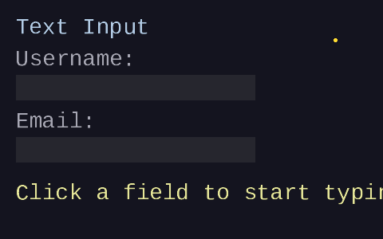 | 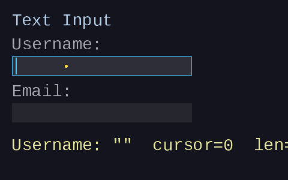 |  |

| Frame 5 — Inserted "e" | Frame 6 — Backspace | Frame 8 — "Hi!" |
|---|---|---|
| 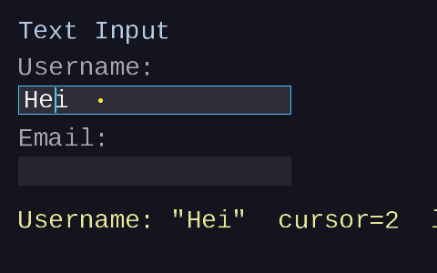 | 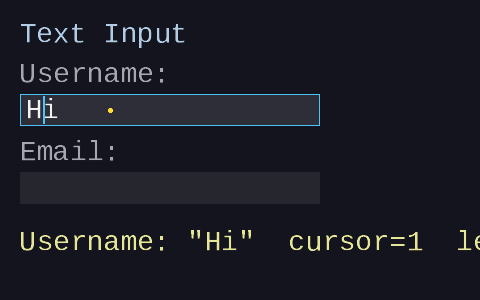 | 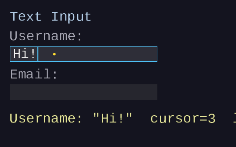 |

| Frame 9 — Unfocused |
|---|
| 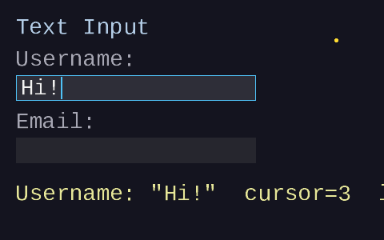 |

## Key concepts

- **Focused ID** — a `Uint32` in `ForgeUiContext` that tracks which widget
  receives keyboard input, analogous to hot (mouse hover) and active (mouse
  press) but for keyboard routing
- **Click-to-focus** — same press-release-over pattern as buttons; the text
  input becomes focused when the user completes a click on it
- **Click-outside-to-unfocus** — on a press edge where no text input is
  under the cursor, the focused widget is cleared
- **ForgeUiTextInputState** — application-owned struct with `buffer`,
  `capacity`, `length`, and `cursor` fields; the widget modifies these when
  it has focus
- **Splice insertion** — `SDL_memmove` trailing bytes right, then
  `SDL_memcpy` new characters at the cursor position
- **Shift deletion** — `SDL_memmove` trailing bytes left to overwrite the
  removed byte(s)
- **Mutual exclusion** — editing operations (backspace, delete, insert) and
  cursor movement are mutually exclusive within a single frame via a
  `did_edit` flag; deletion takes priority over insertion
- **State validation** — the widget rejects invalid state at entry
  (`capacity > 0`, `0 <= length < capacity`, `0 <= cursor <= length`)
- **Cursor bar positioning** — run `forge_ui_text_measure` on the substring
  `buffer[0..cursor]` and use the resulting width as the cursor's x offset

## The details

### The focus state machine

The hot/active state machine from
[Lesson 05](../05-immediate-mode-basics/) handles mouse interaction: hot
tracks which widget the cursor is over, active tracks which widget is being
pressed. But neither hot nor active is suitable for keyboard input — hot
changes every time the mouse moves, and active only lasts while the mouse
button is held.

The **focused ID** is a third persistence slot that lives longer than both:

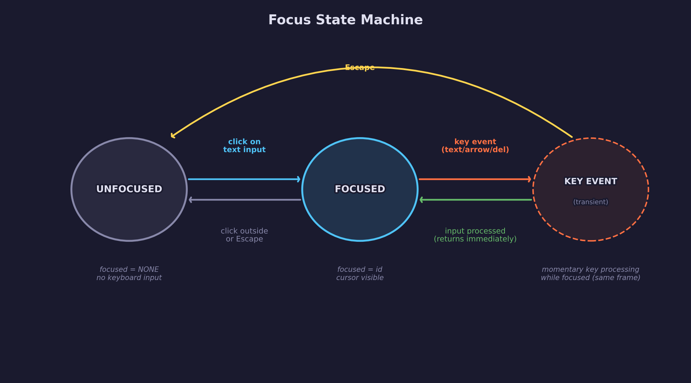

- **Unfocused** — `focused = FORGE_UI_ID_NONE`. No widget receives
  keyboard input. This is the initial state.
- **Focused** — `focused = id`. The widget with this ID receives keyboard
  input. The cursor bar is visible and the border changes to accent color.
- **Typing** — keyboard events are processed by the focused widget within
  the same frame. After processing, the widget returns to the focused
  (waiting) state.

**Transitions:**

- **Click on text input** — uses the same press-release-over pattern as
  buttons. When the user presses on a text input and releases while still
  over it, `focused` is set to that widget's ID.
- **Click outside** — when a mouse press edge occurs and no text input
  widget is under the cursor, `focused` is cleared to `FORGE_UI_ID_NONE`.
  This is tracked with an internal `_ti_press_claimed` flag.
- **Escape** — `key_escape` in the keyboard input clears both `focused`
  and `active` regardless of mouse state. Clearing `active` prevents a
  pending click from re-acquiring focus on the same frame.

### Keyboard input routing

The keyboard input is passed to the context via `forge_ui_ctx_set_keyboard`
after calling `forge_ui_ctx_begin`:

```c
forge_ui_ctx_begin(&ctx, mouse_x, mouse_y, mouse_down);
forge_ui_ctx_set_keyboard(&ctx, text_input, key_backspace, key_delete,
                          key_left, key_right, key_home, key_end,
                          key_escape);
```

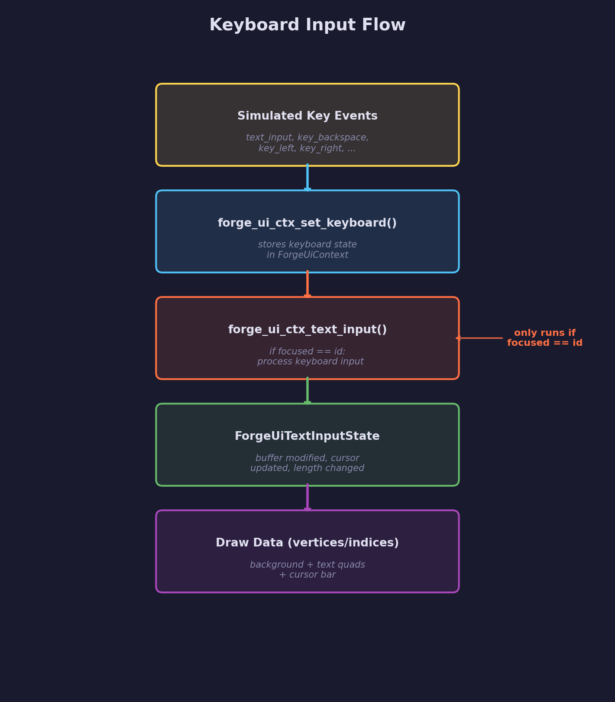

The context stores these values and resets them at the start of each frame.
Only the widget whose ID matches `ctx->focused` processes the keyboard
input — all other text input widgets ignore it.

### ForgeUiTextInputState

The text input widget operates on an **application-owned** struct:

```c
typedef struct ForgeUiTextInputState {
    char *buffer;    /* text buffer (null-terminated) */
    int   capacity;  /* total size including '\0'; must be > 0 */
    int   length;    /* current text length in bytes; 0 <= length < capacity */
    int   cursor;    /* byte index for insertion point; 0 <= cursor <= length */
} ForgeUiTextInputState;
```

The application allocates the buffer and sets the capacity. The widget
validates the invariants at entry (`capacity > 0`, `0 <= length < capacity`,
`0 <= cursor <= length`) and modifies `buffer`, `length`, and `cursor` when
it has focus. This follows
the same external-mutable-state pattern as checkboxes (`bool*`) and sliders
(`float*`) from [Lesson 06](../06-checkboxes-and-sliders/) — the library
writes back into your data.

### Text input anatomy

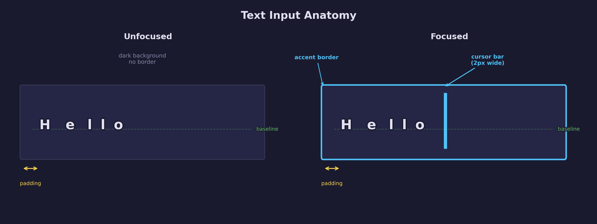

The text input widget draws these elements:

1. **Background rect** — uses `white_uv` for a solid-colored rectangle.
   Color varies by state:
   - Unfocused: dark (`0.15, 0.15, 0.18`)
   - Hot (hovered, unfocused): slightly brighter (`0.20, 0.20, 0.24`)
   - Focused: medium (`0.18, 0.18, 0.22`)

2. **Focused border** — four thin edge rects (1px wide) in accent cyan,
   drawn on top of the background when the widget has focus. This is the
   primary visual indicator of keyboard focus.

3. **Text quads** — glyph UVs positioned from the left edge with padding
   (`FORGE_UI_TI_PADDING = 6px`). Uses `forge_ui_ctx_label` internally.

4. **Cursor bar** — a thin 2px-wide rect (`FORGE_UI_TI_CURSOR_WIDTH`)
   using `white_uv` in accent cyan. Only drawn when the widget is focused
   and `cursor_visible` is true.

### Cursor positioning

The cursor bar's x position must align exactly with the gap between
characters at the cursor index. This is computed by measuring the substring
from the start of the buffer to the cursor position:

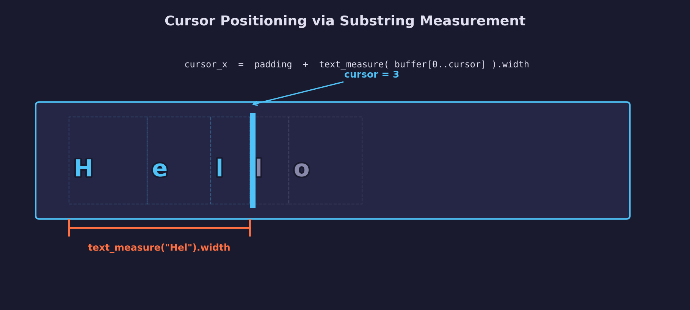

```c
float cursor_x = rect.x + FORGE_UI_TI_PADDING;
if (state->cursor > 0 && state->length > 0) {
    char saved = state->buffer[state->cursor];
    state->buffer[state->cursor] = '\0';
    ForgeUiTextMetrics m = forge_ui_text_measure(ctx->atlas,
                                                  state->buffer, NULL);
    state->buffer[state->cursor] = saved;
    cursor_x += m.width;
}
```

The technique: temporarily null-terminate the buffer at the cursor
position, measure the resulting substring, then restore the original byte.
The measured width gives the exact pen advance — the same value that
`forge_ui_text_layout` from [Lesson 04](../04-text-layout/) would compute
for those characters.

### Character insertion

When the user types characters, they are **spliced** into the buffer at
the cursor position. Insertion only runs if no deletion (backspace/delete)
already occurred this frame — the `did_edit` flag enforces mutual exclusion:

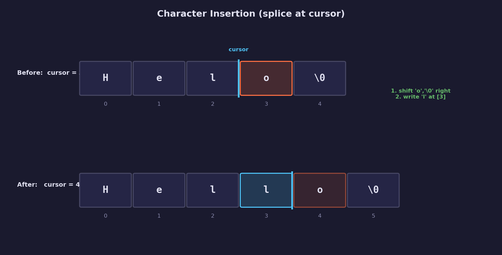

1. Check that there is room: `insert_len < capacity - length` (subtraction
   form avoids signed overflow)
2. **Shift trailing bytes right** — `SDL_memmove(buffer + cursor + insert_len,
   buffer + cursor, (size_t)(length - cursor))` makes room at the cursor
3. **Write new characters** — `SDL_memcpy(buffer + cursor, text_input,
   (size_t)insert_len)` copies the typed characters into the gap
4. **Advance cursor** — `cursor += insert_len` so the cursor sits after
   the newly inserted text
5. **Update length** — `length += insert_len` and null-terminate

The `SDL_memmove` is essential because the source and destination regions
can overlap (they share the same buffer). Using `SDL_memcpy` for the shift
would produce undefined behavior.

### Character deletion

Deletion is the reverse of insertion — remove a byte and shift trailing
bytes left to close the gap. Editing operations are **mutually exclusive**
within a single frame: if SDL delivers both a text input event and a key
event together, applying both would operate on inconsistent state (e.g.,
backspace would delete the just-inserted character). A `did_edit` flag
ensures deletion takes priority over insertion, and any edit blocks cursor
movement:

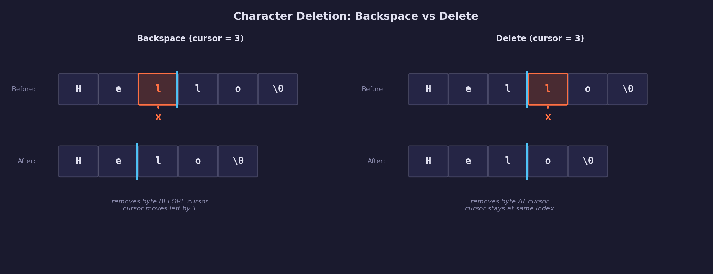

**Backspace** (removes byte *before* cursor):

```c
if (!did_edit && key_backspace && cursor > 0) {
    SDL_memmove(buffer + cursor - 1, buffer + cursor,
                (size_t)(length - cursor));
    cursor--;
    length--;
    buffer[length] = '\0';
    did_edit = true;
}
```

**Delete** (removes byte *at* cursor):

```c
if (!did_edit && key_delete && cursor < length) {
    SDL_memmove(buffer + cursor, buffer + cursor + 1,
                (size_t)(length - cursor - 1));
    length--;
    buffer[length] = '\0';
    did_edit = true;
}
```

The key difference: Backspace moves the cursor left by one after removing,
while Delete keeps the cursor at the same index. In both cases,
`SDL_memmove` shifts the remaining bytes left to fill the gap. The
`!did_edit` guard ensures only one editing operation runs per frame.

### Cursor movement

Cursor movement only runs when no editing operation (backspace, delete,
insert) occurred this frame — the `did_edit` flag prevents
double-shifting the cursor after an edit that already moved it:

- **Left** — `if (cursor > 0) cursor--`
- **Right** — `if (cursor < length) cursor++`
- **Home** — `cursor = 0`
- **End** — `cursor = length`

The bounds checks prevent the cursor from going below 0 or past the end
of the text. In this lesson, cursor movement is byte-based (one byte per
step). For multi-byte UTF-8 characters, you would need to decode code point
boundaries — left as an exercise.

### Cursor blink

In a real application, the cursor blinks on and off to indicate the active
insertion point:

```c
int blink_counter = 0;
bool cursor_visible = (blink_counter % BLINK_PERIOD) < BLINK_ON_FRAMES;
blink_counter++;
```

The `cursor_visible` flag is passed to `forge_ui_ctx_text_input`, which
skips drawing the cursor bar when it is false. A typical blink period is
60 frames (~1 second at 60 fps), with the cursor visible for the first 30
frames and hidden for the next 30.

In this demo, all 10 frames fall within the first blink-on period, so the
cursor is always visible when the field is focused.

## Data output

The text input widget produces the same draw data format as all other
`ForgeUiContext` widgets:

- **Vertices** — `ForgeUiVertex` (32 bytes): position `(x, y)`, UV
  `(u, v)`, color `(r, g, b, a)`. Background and border rects sample the
  atlas white pixel region; text quads sample glyph UVs; the cursor bar
  samples white pixel with accent color.
- **Indices** — `uint32` triangle list, CCW winding, 6 indices per quad
- **Texture** — single-channel grayscale font atlas (shared with all
  widgets)

A focused text input with 3 characters emits approximately:

- 1 background quad (4 vertices, 6 indices)
- 4 border quads (16 vertices, 24 indices) — only when focused
- 3 glyph quads (12 vertices, 18 indices)
- 1 cursor bar quad (4 vertices, 6 indices) — only when focused + visible
- **Total**: ~36 vertices, ~54 indices

## Where it's used

In forge-gpu lessons:

- [UI Lesson 04 — Text Layout](../04-text-layout/) provides
  `forge_ui_text_layout` and `forge_ui_text_measure` used for cursor
  positioning
- [UI Lesson 05 — Immediate-Mode Basics](../05-immediate-mode-basics/)
  introduces the hot/active state machine extended here with the focused ID
- [UI Lesson 06 — Checkboxes and Sliders](../06-checkboxes-and-sliders/)
  establishes the external mutable state pattern used by
  `ForgeUiTextInputState`
- [Engine Lesson 10 — CPU Rasterization](../../engine/10-cpu-rasterization/)
  provides the software rasterizer used to render the demo output

## Building

```bash
cmake -B build
cmake --build build --config Debug

# Windows
build\lessons\ui\07-text-input\Debug\07-text-input.exe

# Linux / macOS
./build/lessons/ui/07-text-input/07-text-input
```

## Fuzz testing

The text input buffer manipulation is a high-risk surface for memory
safety bugs (off-by-one writes, negative memmove sizes, cursor
out-of-bounds). A dedicated fuzz harness exercises the insertion,
deletion, and cursor movement paths with random data and random
operation sequences:

```bash
cmake -B build -DFORGE_FUZZ_ITERATIONS=100000
cmake --build build --target fuzz_text_input

# Run with default seed and iteration count
./build/tests/ui/fuzz_text_input

# Run with a specific seed and iteration count
./build/tests/ui/fuzz_text_input 0xCAFE 1000000
```

The fuzzer uses a deterministic xorshift32 PRNG seeded from the command
line (or a fixed default). Each iteration allocates a small buffer with
8 canary sentinel bytes past the end, runs 1--200 random operations, and
asserts invariants after every single operation:

- `0 <= cursor <= length`
- `0 <= length < capacity`
- `buffer[length] == '\0'`
- Canary bytes untouched (detects off-by-one writes without
  AddressSanitizer)

On failure, the harness prints the seed and iteration number so the
failure can be reproduced exactly.

Override the default iteration count at configure time:

```bash
cmake -DFORGE_FUZZ_ITERATIONS=1000000 -B build
```

## Exercises

1. **Text selection** — Track a `selection_start` index alongside `cursor`.
   When Shift+Left/Right is pressed, extend the selection range. Draw the
   selected region as a highlighted rectangle behind the text. Backspace
   and Delete should remove the entire selection.

2. **Clipboard (copy/paste)** — Use `SDL_SetClipboardText` and
   `SDL_GetClipboardText` to implement Ctrl+C (copy selection) and Ctrl+V
   (paste at cursor). Pasted text follows the same splice insertion logic.

3. **UTF-8 cursor movement** — The current implementation moves the cursor
   one byte at a time. Modify Left/Right to skip over multi-byte UTF-8
   sequences so that a 2-byte or 3-byte character is treated as one cursor
   step. Hint: check the leading byte pattern (`0xxxxxxx` = 1 byte,
   `110xxxxx` = 2 bytes, `1110xxxx` = 3 bytes, `11110xxx` = 4 bytes).

4. **Tab focus cycling** — Add Tab key support to cycle focus between
   multiple text input fields. Track the widget IDs in an array and advance
   to the next one when Tab is pressed (Shift+Tab for reverse).

## Further reading

- [UI Lesson 05 — Immediate-Mode Basics](../05-immediate-mode-basics/) —
  the hot/active state machine extended here
- [UI Lesson 06 — Checkboxes and Sliders](../06-checkboxes-and-sliders/) —
  external mutable state pattern
- [Casey Muratori — Immediate-Mode Graphical User
  Interfaces](https://caseymuratori.com/blog_0001) — the IMGUI talk that
  inspired this architecture
- [Dear ImGui — InputText](https://github.com/ocornut/imgui) — production
  immediate-mode text input for reference
