# UI Lesson 08 — Layout

Automatic widget layout — stop passing explicit rects and let a layout cursor
position widgets.

## What you'll learn

- **ForgeUiLayout** — a stack-based layout system that replaces manual rect
  calculations with a cursor model
- **Vertical and horizontal directions** — how the cursor advances along the
  primary axis while the cross axis fills available space
- **Padding and spacing** — padding insets the layout region from all four
  edges; spacing inserts gaps between consecutive widgets
- **The layout stack** — nested layouts (push/pop) enable complex arrangements
  like a vertical panel containing a horizontal button row
- **`layout_next()`** — the core function that returns the next widget rect
  and advances the cursor
- **Layout-aware widget variants** — `_layout()` overloads that call
  `layout_next()` internally so callers pass content and size, not rects

## Why this matters

Manual rect calculations become unmanageable fast. Adding a widget in the
middle of a panel means recalculating every widget below it. Changing padding
means updating every coordinate. A layout system solves this by tracking a
*cursor* that advances automatically — each widget asks "where do I go?" and
the layout answers with the next available rect.

This is the same idea behind CSS flexbox, Qt's `QVBoxLayout`/`QHBoxLayout`,
and Dear ImGui's layout system. The approach here is simpler: a layout is a
rect, a direction, padding, spacing, and a cursor. Push a layout to begin a
region, call `layout_next()` to place widgets, pop to return to the parent.
Nesting enables any arrangement you need.

## Result

The program renders a settings panel two ways — first with manual rect
calculations, then with the layout system — and verifies they produce
identical draw data.

| Manual layout | Automatic layout |
|---|---|
| 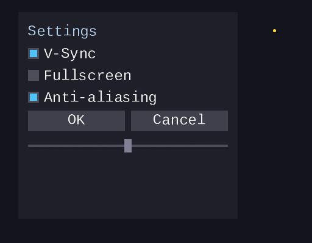 |  |

Both produce **220 vertices and 330 indices** — the layout system computes
exactly the same positions as hand-written code.

The program then simulates 8 frames of the settings panel responding to mouse
interaction:

| Frame 0 — idle | Frame 1 — hover checkbox | Frame 2 — press checkbox | Frame 3 — toggled off |
|---|---|---|---|
| 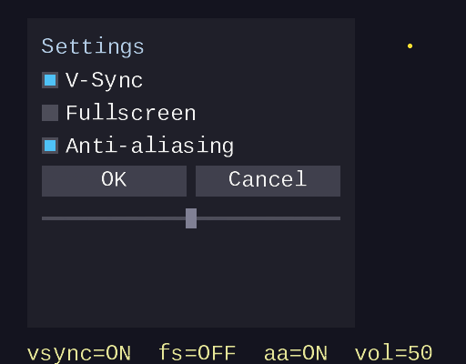 |  |  | 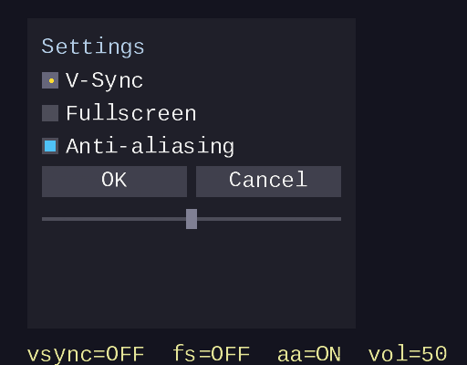 |

| Frame 4 — hover OK | Frame 5 — press OK | Frame 6 — click OK | Frame 7 — drag slider |
|---|---|---|---|
|  | 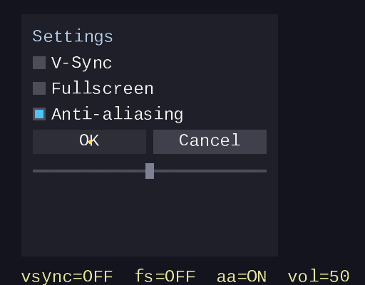 | 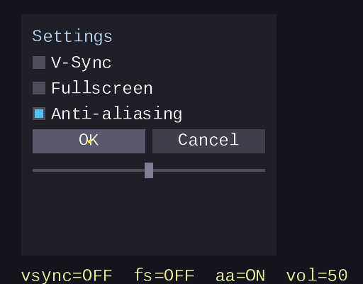 | 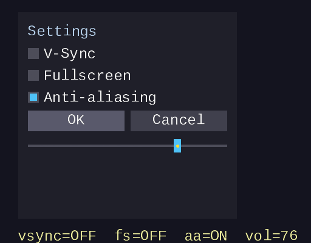 |

## Key concepts

- **Layout cursor** — a position (x, y) that starts at the top-left content
  area (after padding) and advances after each widget
- **Direction** — vertical layouts advance the cursor downward; horizontal
  layouts advance rightward
- **Padding** — uniform inset from all four edges of the layout rect, creating
  a content region smaller than the layout rect
- **Spacing** — gap between consecutive widgets, added before each widget
  (except the first) by `layout_next()`
- **Remaining space** — the layout tracks how much width/height is left for
  additional widgets
- **Layout stack** — an array of `ForgeUiLayout` structs with a depth counter,
  supporting up to 8 levels of nesting

## The details

### The layout cursor model

Every layout region has a **cursor** — the point where the next widget will
be placed. When you call `layout_next(size)`, the layout returns a rect at
the cursor position and advances the cursor by `size + spacing`.

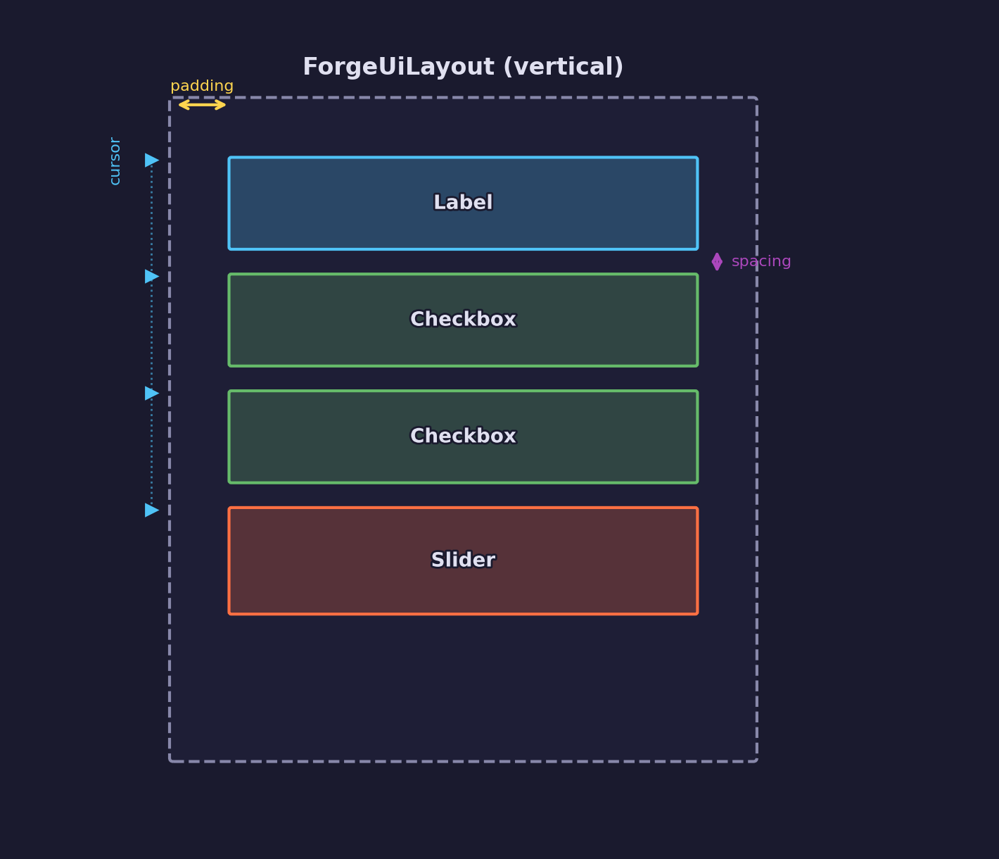

In a **vertical** layout, the cursor moves downward:

- Widget x = `cursor_x` (left edge of content area)
- Widget y = `cursor_y`
- Widget width = `remaining_w` (full content width)
- Widget height = `size` (caller-specified)
- Before placement (except the first widget): `cursor_y += spacing`
- After placement: `cursor_y += size`

In a **horizontal** layout, the cursor moves rightward:

- Widget x = `cursor_x`
- Widget y = `cursor_y` (top edge of content area)
- Widget width = `size` (caller-specified)
- Widget height = `remaining_h` (full content height)
- Before placement (except the first widget): `cursor_x += spacing`
- After placement: `cursor_x += size`

### Vertical vs horizontal directions

The same four widgets look different depending on the layout direction.
Vertical layouts stack widgets top-to-bottom with full width. Horizontal
layouts place them left-to-right with full height.

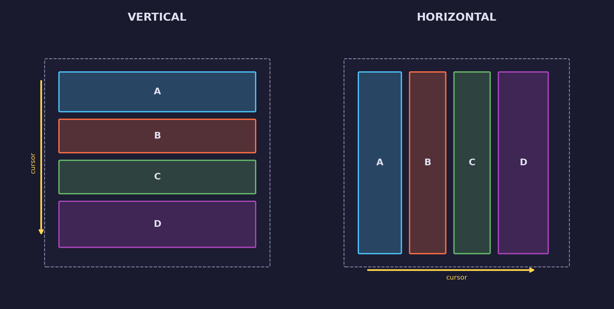

The `ForgeUiLayoutDirection` enum selects the behavior:

```c
typedef enum ForgeUiLayoutDirection {
    FORGE_UI_LAYOUT_VERTICAL,    /* cursor moves downward */
    FORGE_UI_LAYOUT_HORIZONTAL   /* cursor moves rightward */
} ForgeUiLayoutDirection;
```

### Padding and spacing

**Padding** insets the content area from the layout rect edges. A layout with
rect `(x, y, w, h)` and `padding = p` has a content area starting at
`(x + p, y + p)` with size `(w - 2p, h - 2p)`.

**Spacing** is the gap inserted between consecutive widgets. Before each
widget (except the first), the cursor advances by `spacing`. After the widget,
it advances by `size`. This spacing-before-item model avoids a phantom gap
after the last widget, keeping `remaining_h` accurate.

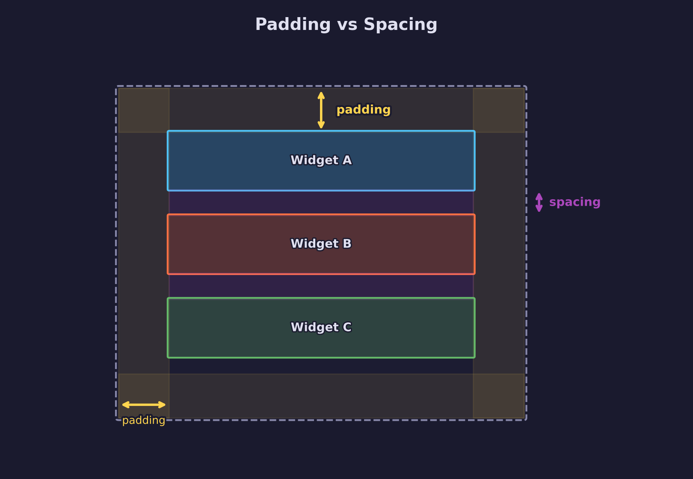

### The ForgeUiLayout struct

The layout struct holds everything needed to position widgets:

```c
typedef struct ForgeUiLayout {
    ForgeUiRect              rect;         /* total layout region */
    ForgeUiLayoutDirection   direction;    /* vertical or horizontal */
    float                    padding;      /* inset from all four edges */
    float                    spacing;      /* gap between consecutive widgets */
    float                    cursor_x;     /* current placement x position */
    float                    cursor_y;     /* current placement y position */
    float                    remaining_w;  /* width left for more widgets */
    float                    remaining_h;  /* height left for more widgets */
    int                      item_count;   /* widgets placed so far (for spacing) */
} ForgeUiLayout;
```

When a layout is pushed, the cursor starts at the top-left of the content area
and the remaining dimensions match the content area size:

```c
layout->cursor_x   = rect.x + padding;
layout->cursor_y   = rect.y + padding;
layout->item_count = 0;

float inner_w = rect.w - 2.0f * padding;
float inner_h = rect.h - 2.0f * padding;
layout->remaining_w = (inner_w > 0.0f) ? inner_w : 0.0f;
layout->remaining_h = (inner_h > 0.0f) ? inner_h : 0.0f;
```

### The layout stack

The layout stack is an array inside `ForgeUiContext`:

```c
ForgeUiLayout layout_stack[FORGE_UI_LAYOUT_MAX_DEPTH];  /* max 8 */
int           layout_depth;  /* number of active layouts */
```

**Push** increments depth and initializes the new layout. **Pop** decrements
depth and returns to the parent. `layout_next()` always reads from
`layout_stack[layout_depth - 1]` — the top of the stack.

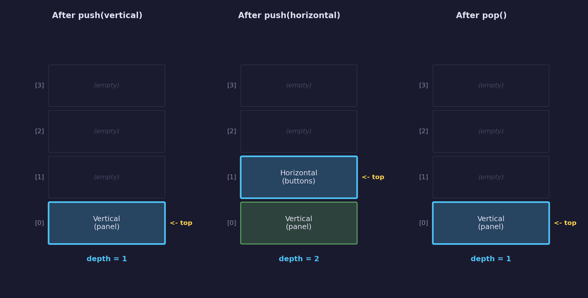

This design supports nested layouts. A vertical panel can contain a
horizontal row of buttons: push the vertical layout, place widgets, push a
horizontal sub-layout for the button row, place buttons, pop back to the
vertical layout, continue placing widgets.

### Nested layouts

The settings panel demonstrates nesting: a vertical outer layout contains
labels, checkboxes, a horizontal button row, and a slider.

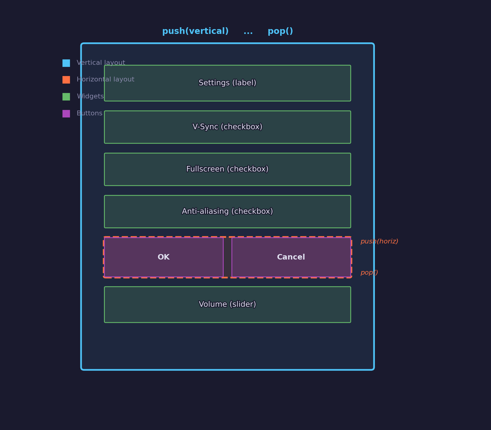

The key technique is using `layout_next()` to reserve a rect from the outer
layout, then pushing a new layout *inside* that rect:

```c
/* Outer vertical layout */
if (!forge_ui_ctx_layout_push(ctx, panel,
                              FORGE_UI_LAYOUT_VERTICAL,
                              PANEL_PADDING, WIDGET_SPACING)) {
    return;
}

/* Widgets placed by the outer layout */
forge_ui_ctx_label_layout(ctx, "Settings", ...);
forge_ui_ctx_checkbox_layout(ctx, ...);

/* Reserve a rect for the button row */
ForgeUiRect button_row = forge_ui_ctx_layout_next(ctx, BUTTON_ROW_H);

/* Push horizontal layout inside that rect */
if (!forge_ui_ctx_layout_push(ctx, button_row,
                              FORGE_UI_LAYOUT_HORIZONTAL,
                              0.0f, BUTTON_SPACING)) {
    forge_ui_ctx_layout_pop(ctx);  /* pop outer before returning */
    return;
}

(void)forge_ui_ctx_button_layout(ctx, ID_BTN_OK, "OK", btn_w);
(void)forge_ui_ctx_button_layout(ctx, ID_BTN_CANCEL, "Cancel", btn_w);

forge_ui_ctx_layout_pop(ctx);  /* end horizontal */

/* Continue in the outer vertical layout */
forge_ui_ctx_slider_layout(ctx, ...);

forge_ui_ctx_layout_pop(ctx);  /* end vertical */
```

### The layout_next() sequence

Each call to `layout_next()` returns a rect and advances the cursor. Here is
a four-step sequence in a vertical layout:

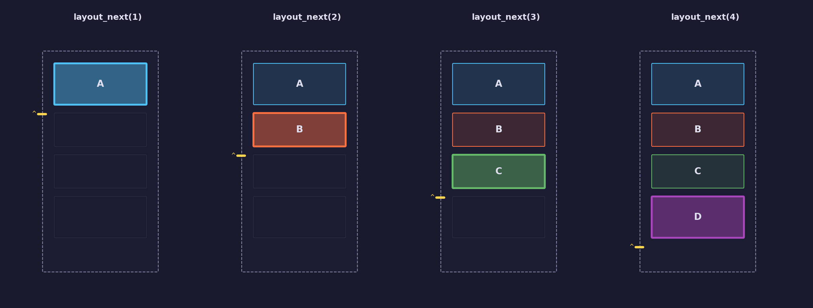

Before each call (except the first), the cursor advances by the spacing gap.
The returned rect has full content width and the caller-specified height, and
the cursor then advances by the widget height.

### Layout-aware widget variants

To avoid the two-step pattern of `layout_next()` then widget call, every
widget has a `_layout()` variant that calls `layout_next()` internally:

| Standard API | Layout API |
|---|---|
| `forge_ui_ctx_button(ctx, id, text, rect)` | `forge_ui_ctx_button_layout(ctx, id, text, size)` |
| `forge_ui_ctx_checkbox(ctx, id, label, val, rect)` | `forge_ui_ctx_checkbox_layout(ctx, id, label, val, size)` |
| `forge_ui_ctx_slider(ctx, id, val, min, max, rect)` | `forge_ui_ctx_slider_layout(ctx, id, val, min, max, size)` |
| `forge_ui_ctx_label(ctx, text, x, y, r, g, b, a)` | `forge_ui_ctx_label_layout(ctx, text, size, r, g, b, a)` |

The `size` parameter is the widget's height in a vertical layout or width in
a horizontal layout — the other dimension is provided by the layout. This
keeps the API minimal while still allowing fine control over individual widget
sizes.

### Comparing manual and automatic layout

The demo program renders the same settings panel both ways. The manual
version computes every rect by hand:

```c
float cy = PANEL_Y + PANEL_PADDING;
ForgeUiRect r = { cx, cy, inner_w, CHECKBOX_HEIGHT };
(void)forge_ui_ctx_checkbox(ctx, ID_CB_VSYNC, "V-Sync", vsync, r);
cy += CHECKBOX_HEIGHT + WIDGET_SPACING;
/* ... repeat for every widget ... */
```

The layout version replaces all of that with:

```c
if (!forge_ui_ctx_layout_push(ctx, panel, FORGE_UI_LAYOUT_VERTICAL,
                              PANEL_PADDING, WIDGET_SPACING)) {
    return;
}
(void)forge_ui_ctx_checkbox_layout(ctx, ID_CB_VSYNC, "V-Sync",
                                   vsync, CHECKBOX_HEIGHT);
/* ... just call widgets, no rect math ... */
forge_ui_ctx_layout_pop(ctx);
```

Both produce identical vertex and index counts, confirming the layout cursor
model computes the same positions.

## Data output

The layout system does not change the draw data format — it only changes how
widget rects are computed. The output is the same as previous lessons:

- **Vertices**: `ForgeUiVertex` — 32 bytes per vertex (pos_x, pos_y, uv_u,
  uv_v, r, g, b, a)
- **Indices**: `uint32_t` — triangle list, CCW winding order
- **Textures**: single-channel font atlas (the white pixel region provides
  solid colors for backgrounds)

## Where it's used

In forge-gpu lessons:

- [UI Lesson 05](../05-immediate-mode-basics/) introduces the `ForgeUiContext`
  that the layout system extends
- [UI Lesson 06](../06-checkboxes-and-sliders/) defines checkboxes and
  sliders that now have `_layout()` variants
- [UI Lesson 07](../07-text-input/) adds text input with keyboard focus
- UI Lesson 09 (upcoming) will add panels and clipping on top of the layout
  system

## Building

```bash
cmake -B build
cmake --build build --config Debug

# Windows
build\lessons\ui\08-layout\Debug\08-layout.exe

# Linux / macOS
./build/lessons/ui/08-layout/08-layout
```

## AI skill

The **[auto-widget-layout](../../../.claude/skills/auto-widget-layout/SKILL.md)**
skill (`/auto-widget-layout`) teaches Claude the layout pattern from this
lesson. Use it in your own projects to add automatic widget positioning with
vertical/horizontal stacking, padding, spacing, and nesting.

## What's next

- **[UI Lesson 09 — Panels and Clipping](../09-panels-and-clipping/)** —
  static containers with scroll regions, scissor rect output for the renderer,
  scroll offset and content bounds

## Exercises

1. **Add a second horizontal row** — add a row of three buttons (Save, Load,
   Reset) below the slider using a nested horizontal layout.

2. **Right-aligned button row** — modify the button row so the buttons are
   right-aligned instead of left-aligned. One approach: use `layout_next()`
   to consume empty space before the first button.

3. **Dynamic widget sizes** — instead of fixed heights, compute checkbox
   height from the font's pixel height plus a margin, so the layout adapts
   to different font sizes.

4. **Layout debug overlay** — after declaring all widgets, draw wireframe
   rectangles showing each layout region's bounds and cursor position.
   This helps visualize how nested layouts divide space.

## Further reading

- [UI Lesson 05 — Immediate-Mode Basics](../05-immediate-mode-basics/) —
  the `ForgeUiContext` and hot/active state machine
- [Dear ImGui layout](https://github.com/ocornut/imgui) — a production
  immediate-mode UI with `SameLine()`, `BeginGroup()`, and auto-layout
- [CSS Flexbox](https://developer.mozilla.org/en-US/docs/Web/CSS/CSS_flexible_box_layout) —
  the web's approach to directional layout with padding and gap
