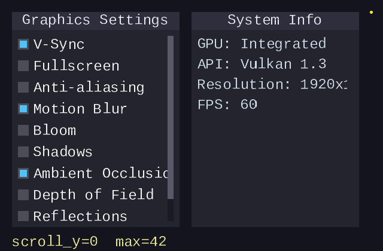
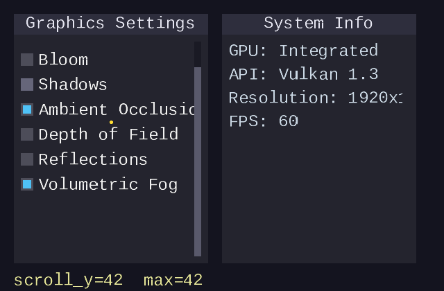
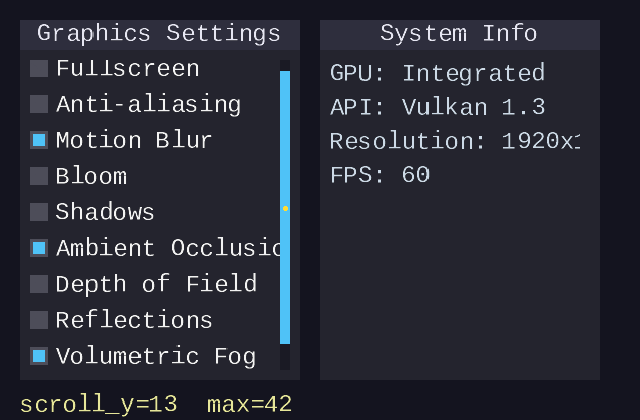
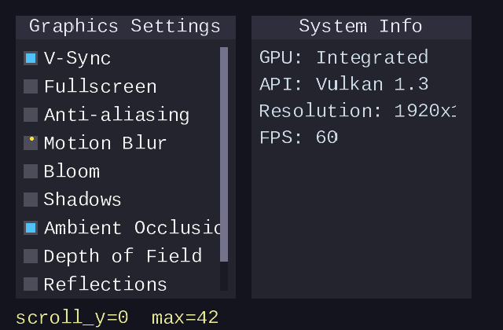
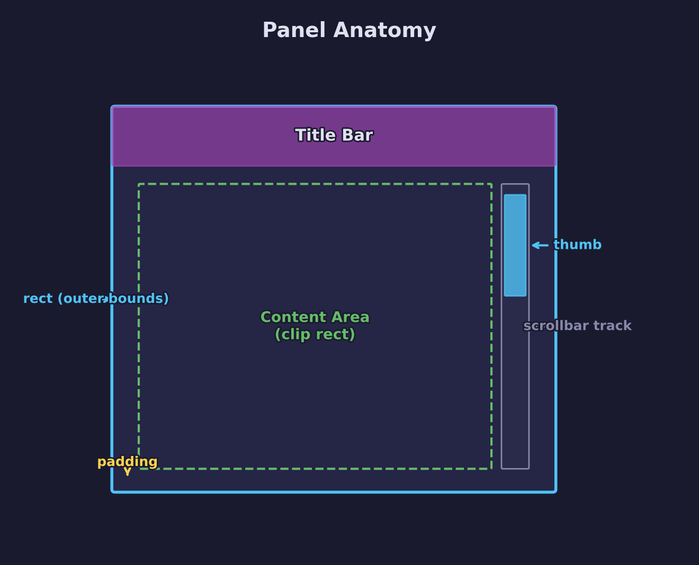
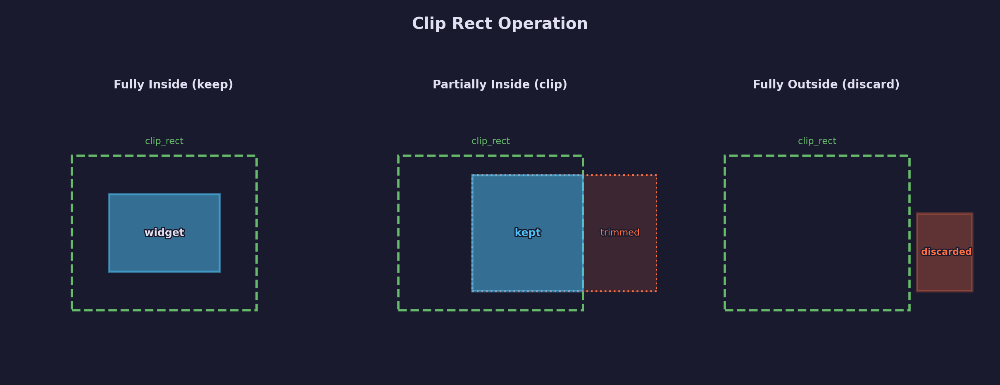
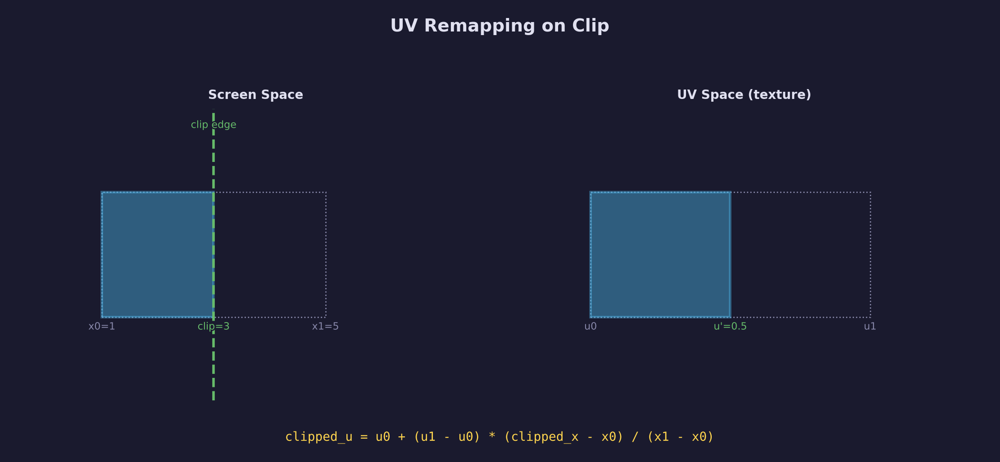
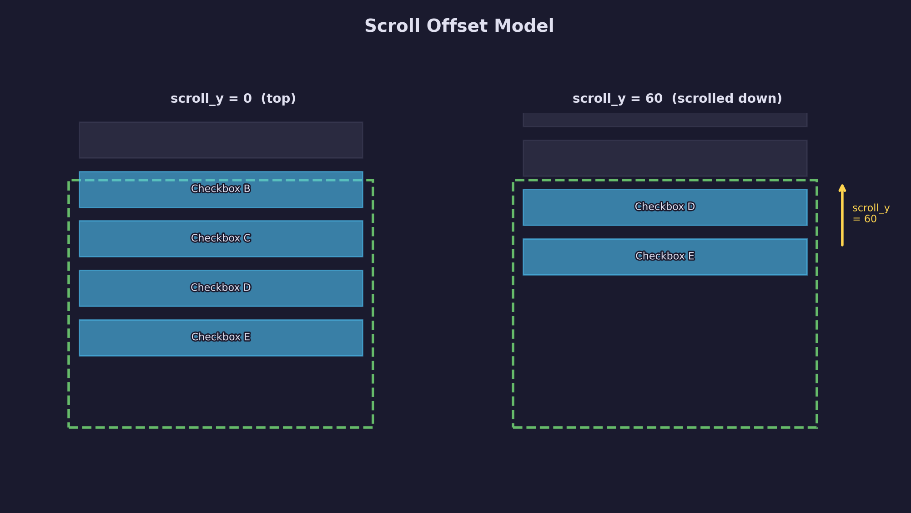
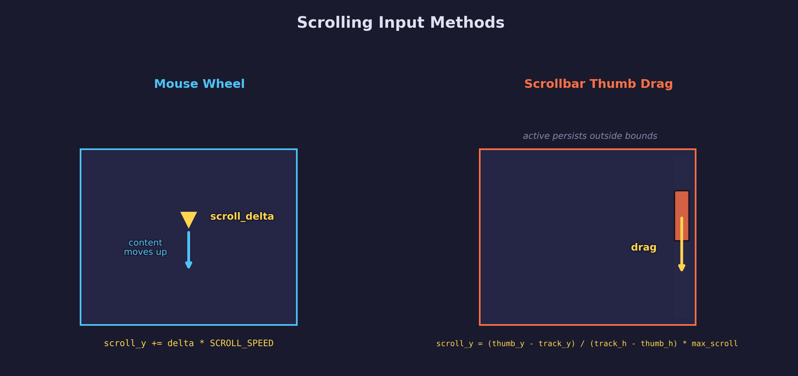
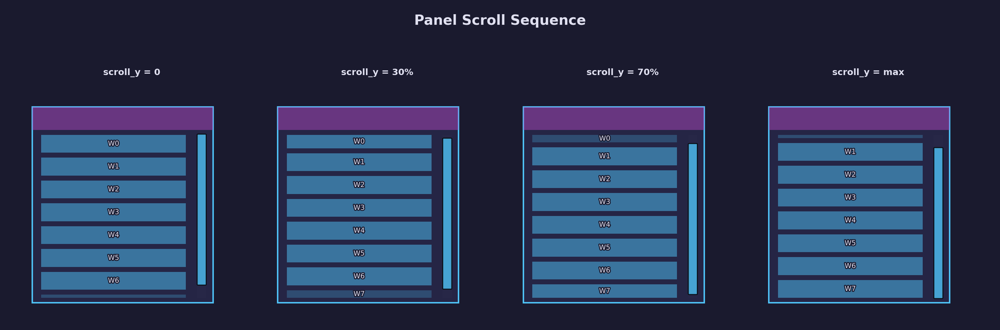

# UI Lesson 09 -- Panels and Scrolling

Fixed-position containers with clipping and vertical scroll.

## What you'll learn

- How to define a **panel** -- a titled, clipped container that holds child
  widgets
- How **axis-aligned rect clipping** discards or trims quads that fall outside
  the visible area, including **UV remapping** for partially clipped glyph quads
- How a **scroll offset** applied in the layout system shifts widget positions
  so that content taller than the panel scrolls into view
- How to build an **interactive scrollbar** with a proportionally sized thumb
  and drag interaction (the same active-persists-outside-bounds pattern from
  the slider in Lesson 06)
- How **mouse wheel input** feeds into the scroll system via a `scroll_delta`
  field on the UI context

## Why this matters

Real applications need scrollable regions. A settings panel with 20 options
does not fit on screen all at once; an inventory list grows as the player picks
up items; a log window continuously appends new lines. All of these require the
same core mechanism: a fixed viewport that clips its children, a scroll offset
that shifts content, and an input method (wheel or scrollbar drag) that
controls that offset.

Building this on top of the immediate-mode system from earlier lessons shows
how a small amount of per-frame state (one `float scroll_y` per panel) is
enough to implement scrolling without retained widget trees or complex layout
engines.

## Result

The demo program renders two side-by-side panels. The left panel contains 10
checkboxes (more than fit in the visible area, so a scrollbar appears). The
right panel contains a short list of labels (no scrollbar needed). Ten frames
simulate scrolling, scrollbar drag, and checkbox interaction.

| Initial view | Scrolled down | Scrollbar drag | Checkbox click |
|:---:|:---:|:---:|:---:|
|  |  |  |  |

A yellow dot shows the simulated cursor position. The status label below the
panels displays the current `scroll_y` and maximum scroll values.

## Key concepts

- **ForgeUiPanel** -- struct holding the panel's outer rect, content_rect
  (inner bounds after title bar and padding), a pointer to the caller's
  `scroll_y`, the computed `content_height`, and the widget ID
- **Panel begin/end** -- `forge_ui_ctx_panel_begin()` draws background and
  title bar, sets the clip rect, and pushes a vertical layout for child
  widgets; `forge_ui_ctx_panel_end()` computes content overflow, draws the
  scrollbar, and clears the clip rect
- **Clip rect** -- `ForgeUiContext` gains a `clip_rect` and `has_clip` flag;
  every vertex-emitting function (solid rects and text quads) clips against
  this rect before writing vertices
- **UV remapping** -- when a textured glyph quad is partially clipped, the UV
  coordinates are remapped proportionally so the visible portion samples the
  correct region of the font atlas
- **Scroll offset** -- `forge_ui_ctx_layout_next()` subtracts `scroll_y` from
  widget y positions when a panel is active; combined with the clip rect,
  widgets above or below the visible area are discarded
- **Mouse wheel** -- a `scroll_delta` field on the context, set by the caller
  after `forge_ui_ctx_begin()`; `panel_begin` applies
  `delta * FORGE_UI_SCROLL_SPEED` when the cursor is inside the content area
- **Scrollbar thumb** -- height proportional to `visible_h / content_h`; drag
  interaction maps the thumb y position to `scroll_y` using the same
  active-persists-outside-bounds pattern as the slider

## The details

### Panel anatomy

A panel is a rectangular region with four parts: an outer background fill, a
title bar at the top, an inner content area where child widgets are placed, and
an optional scrollbar track on the right edge.



The `ForgeUiPanel` struct stores the geometry and scroll state:

```c
typedef struct ForgeUiPanel {
    ForgeUiRect  rect;           /* outer bounds (background fill) */
    ForgeUiRect  content_rect;   /* inner bounds after title + padding */
    float       *scroll_y;       /* pointer to caller's scroll offset */
    float        content_height; /* computed total height of child widgets */
    Uint32       id;             /* widget ID for the panel (scrollbar = id+1) */
} ForgeUiPanel;
```

### Clipping

Every vertex-emitting function checks `ctx->has_clip` before writing
vertices. If clipping is active, the function computes the intersection of the
quad with `ctx->clip_rect`:



- **Fully inside** -- emit the quad unchanged
- **Partially inside** -- trim the quad to the intersection and remap UVs
- **Fully outside** -- discard the quad entirely (emit nothing)

For solid-colored rects (buttons, backgrounds, scrollbar), clipping only
adjusts positions because the UV is a single point in the white pixel region.
For textured glyph quads, clipping also remaps UV coordinates.

### UV remapping on clip

When a glyph quad extends past the clip edge, the visible portion must sample
the correct subset of the glyph texture. The proportional formula:

$$
\text{clipped}\_u = u_0 + (u_1 - u_0) \times \frac{\text{clipped}\_x - x_0}{x_1 - x_0}
$$



The same formula applies to all four edges (left, right, top, bottom) and to
both the U and V axes. Each glyph quad is processed individually -- the text
layout emitter iterates per-quad (groups of 4 vertices) when clipping is
active, rather than bulk-copying all vertices.

### Scroll offset in the layout system

The scroll offset is applied in `forge_ui_ctx_layout_next()`. After computing
the widget's rect from the layout cursor, the function subtracts `scroll_y`:

```c
if (ctx->_panel_active && ctx->_panel.scroll_y) {
    result.y -= *ctx->_panel.scroll_y;
}
```

This means widgets are declared at their logical positions (as if no scrolling
existed), and the layout system silently shifts them. Combined with the clip
rect, widgets that scroll above or below the visible area produce no vertices.



### Widget hit testing with clip rect

A widget that has been scrolled out of view must not respond to mouse clicks.
The helper `forge_ui__widget_mouse_over()` checks both the widget rect and the
clip rect:

```c
static inline bool forge_ui__widget_mouse_over(const ForgeUiContext *ctx,
                                                ForgeUiRect rect)
{
    if (!forge_ui__rect_contains(rect, ctx->mouse_x, ctx->mouse_y))
        return false;
    if (ctx->has_clip &&
        !forge_ui__rect_contains(ctx->clip_rect, ctx->mouse_x, ctx->mouse_y))
        return false;
    return true;
}
```

All widgets (buttons, checkboxes, sliders, text inputs) use this helper instead
of a raw `rect_contains` check.

### Scrollbar proportions

The scrollbar thumb height is proportional to how much of the content is
visible at once:

$$
\text{thumb}\_h = \text{track}\_h \times \frac{\text{visible}\_h}{\text{content}\_h}
$$

$$
\text{thumb}\_y = \text{track}\_y + \frac{\text{scroll}\_y}{\text{max}\_\text{scroll}} \times (\text{track}\_h - \text{thumb}\_h)
$$

$$
\text{max}\_\text{scroll} = \text{content}\_h - \text{visible}\_h
$$


When `content_h <= visible_h`, there is nothing to scroll and no scrollbar is
drawn. The minimum thumb height is clamped to `FORGE_UI_SCROLLBAR_MIN_THUMB`
(20 px) so the thumb remains clickable even with very long content.

### Mouse wheel and scrollbar drag

Two input methods control `scroll_y`:



**Mouse wheel** -- the caller sets `ctx->scroll_delta` after
`forge_ui_ctx_begin()`. When the cursor is inside the panel's content rect,
`panel_begin` applies `scroll_y += delta * FORGE_UI_SCROLL_SPEED`.

**Scrollbar thumb drag** -- uses the same interaction pattern as the slider
from [Lesson 06](../06-checkboxes-and-sliders/): on mouse press over the
thumb, the scrollbar becomes active. While active, the thumb tracks the mouse y
position even outside the widget bounds. On release, active is cleared.

### Panel begin/end flow

The full sequence across a frame:



1. **`panel_begin`**: draw background, draw title bar with centered text,
   compute `content_rect`, apply mouse wheel scroll, set `clip_rect`, push a
   vertical layout inside the content area
2. **Child widgets**: the caller declares checkboxes, labels, sliders, etc.
   inside the panel. Each widget calls `layout_next()` which subtracts
   `scroll_y`. Each vertex-emitting call clips against `clip_rect`
3. **`panel_end`**: compute `content_height` from how far the layout cursor
   advanced, pop the layout, clear the clip rect, clamp `scroll_y` to
   `[0, max_scroll]`, draw the scrollbar track and interactive thumb

## Data output

The panel system produces the same vertex/index format as all other UI
widgets:

- **Vertices**: `ForgeUiVertex` -- position (x, y), UV (u, v), color
  (r, g, b, a) -- 32 bytes per vertex
- **Indices**: `Uint32` triangle list with CCW winding -- 6 indices per quad
- **Texture**: single-channel alpha font atlas with a white pixel region for
  solid shapes

Panel backgrounds, title bars, scrollbar tracks, and scrollbar thumbs use the
white pixel UV (solid color). Child widget text uses glyph UVs from the atlas.
Clipped quads have their positions and UVs adjusted before being written to the
buffers.

## Where it's used

- **[UI Lesson 05](../05-immediate-mode-basics/)** -- hot/active state machine
  that panels and scrollbar rely on
- **[UI Lesson 06](../06-checkboxes-and-sliders/)** -- slider drag pattern
  reused for the scrollbar thumb
- **[UI Lesson 08](../08-layout/)** -- layout system that panels use internally
  (push/pop layout, layout_next)
- **[common/ui/forge_ui_ctx.h](../../../common/ui/forge_ui_ctx.h)** -- the
  header-only library where `ForgeUiPanel`, `panel_begin`, and `panel_end` live

## Building

```bash
cmake -B build -DFORGE_USE_SHIM=ON
cmake --build build --target 09-panels-and-scrolling
./build/lessons/ui/09-panels-and-scrolling/09-panels-and-scrolling
```

The program writes `panels_frame_0.bmp` through `panels_frame_9.bmp` to the
current directory. Pre-generated frames are in the `assets/` directory.

## AI skill

This lesson has a matching Claude Code skill:
[`ui-lesson`](../../../.claude/skills/ui-lesson/SKILL.md) -- invoke it to
scaffold new UI lessons following the same structure and conventions.

## What's next

- **[UI Lesson 10 -- Windows](../10-windows/)** -- draggable panels with title
  bars, z-ordering (bring-to-front on click), collapse/expand; builds on
  panels (this lesson) and layout (Lesson 08)

## Exercises

1. **Add a horizontal scrollbar** -- extend the panel system to support
   horizontal scrolling when content is wider than the panel. You will need a
   second scroll offset (`scroll_x`), a horizontal clip check, and a thumb that
   slides left/right along the bottom edge.

2. **Nested panels** -- place a panel inside another panel. The inner panel
   needs its own `scroll_y` and clip rect. Think about how clip rects should
   compose: the inner clip rect must be the intersection of the inner panel's
   content rect and the outer panel's clip rect.

3. **Smooth scrolling** -- instead of jumping `scroll_y` directly, interpolate
   toward a `target_scroll_y` each frame using `lerp(scroll_y, target, 0.2)`.
   This gives the scroll a smooth, springy feel. Make sure the scrollbar thumb
   still reflects the current (interpolated) position, not the target.

## Further reading

- **[UI Lesson 05 -- Immediate-Mode Basics](../05-immediate-mode-basics/)** --
  the hot/active state machine underlying all widget interaction
- **[UI Lesson 06 -- Checkboxes and Sliders](../06-checkboxes-and-sliders/)** --
  drag interaction pattern reused by the scrollbar
- **[UI Lesson 08 -- Layout System](../08-layout/)** -- automatic widget
  positioning that panels build on
- **[common/ui/ README](../../../common/ui/README.md)** -- full API reference
  for the UI library
