# UI Lesson 10 — Windows

Draggable windows with z-ordering and collapse — the final container
primitive.

## What you'll learn

- **ForgeUiWindowState** — application-owned persistent state for each window
  (rect, scroll_y, collapsed, z_order)
- **Dragging** — title bar drag interaction using a grab offset stored on the
  press frame, maintaining the relative click position during the drag
- **Z-ordering** — bring-to-front on click by assigning max(z) + 1; windows
  draw back-to-front for correct overlap
- **Collapse/expand** — toggle button in the title bar hides the content area;
  collapsed windows show only the title bar
- **Deferred draw** — per-window draw lists collect vertices/indices during
  declaration, then sort by z_order and append to the main buffer in
  back-to-front order
- **Input routing** — hit tests respect z-order so foreground windows block
  clicks to background windows in overlapping regions
- **ForgeUiWindowContext** — wrapper around ForgeUiContext that manages window
  registration, draw list redirection, and z-sorted final assembly

## Why this matters

Every desktop application, game editor, and developer tool uses windows.
Windows are the natural evolution of panels (lesson 09) — they add the three
interactions that make a panel feel like a first-class UI element:

1. **Dragging** lets users arrange their workspace by moving windows to
   preferred positions.
2. **Z-ordering** handles overlap: when two windows share screen space, the
   one the user most recently clicked appears on top.
3. **Collapse** saves screen space by reducing a window to its title bar
   without destroying its content state.

These three features require solving the **deferred draw ordering problem**:
in immediate-mode UI, widgets are declared in code order (top of code = first
drawn), but windows must draw in z-order (back to front). The solution — per-
window draw lists assembled at frame end — is the same approach used by Dear
ImGui and other production immediate-mode systems.

## Result

The example program creates three overlapping windows — Settings (checkboxes
and a slider), Status (labels reflecting current values), and Info (scrollable
text content) — and simulates 12 frames of interaction.

### Initial arrangement

| Frame 0 | Frame 1 |
|---------|---------|
| 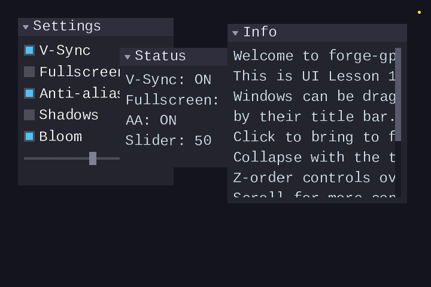 | 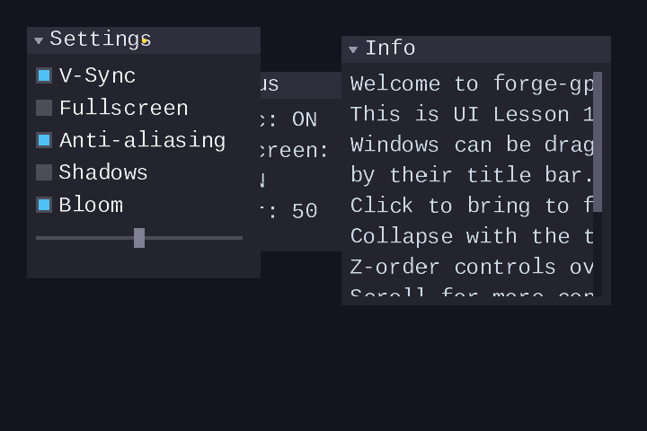 |

Frame 0 shows the initial arrangement with Info (z=2) on top. Frame 1 clicks
the Settings title bar, promoting it to the highest z-order and beginning a
drag.

### Drag interaction

| Frame 2 | Frame 3 |
|---------|---------|
| 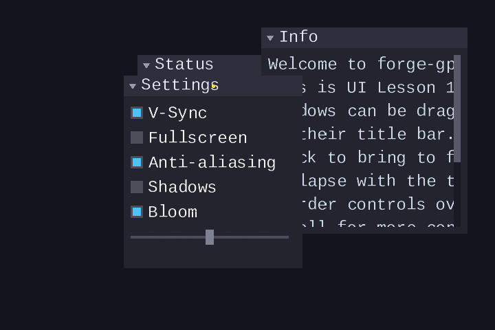 |  |

The Settings window follows the cursor while maintaining the grab offset — the
yellow dot stays at the same relative position within the title bar. Frame 3
shows the window at its new position after release.

### Collapse and expand

| Frame 5 | Frame 7 |
|---------|---------|
| 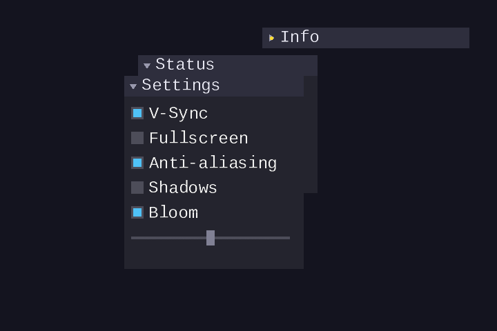 |  |

Frame 5: the Info window is collapsed to its title bar only (right-pointing
triangle). Frame 7: expanded again (down-pointing triangle), content restored.

### Scrolling and input routing

| Frame 9 | Frame 11 |
|---------|----------|
| 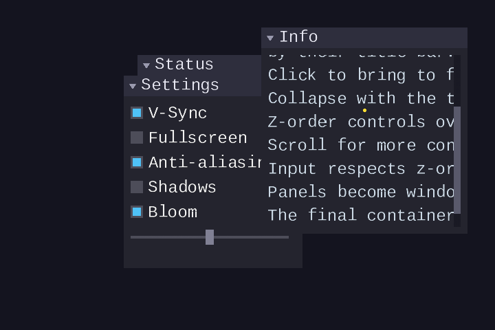 | 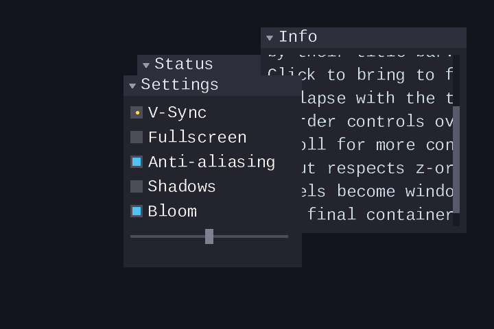 |

Frame 9: Info content scrolled down via mouse wheel. Frame 11: a checkbox in
the Settings window is toggled while Settings overlaps Status — input routing
correctly targets the higher-z window.

## Key concepts

- **ForgeUiWindowState** — application-owned struct with `rect` (position/size,
  updated by drag), `scroll_y` (scrollbar offset), `collapsed` (bool toggle),
  and `z_order` (int priority, higher = on top)
- **Grab offset** — stored on the press frame as `(mouse_x - rect.x,
  mouse_y - rect.y)`, then used every drag frame: `rect.x = mouse_x -
  grab_offset_x`
- **Bring to front** — on any mouse press inside a window, set `z_order =
  max(all z) + 1`
- **Deferred draw** — each window's vertices/indices go into a per-window
  buffer; `wctx_end()` sorts by z_order and appends back-to-front
- **Input routing pre-pass** — at frame start, iterate the previous frame's
  window rects in z-order to find `hovered_window_id` (the topmost window
  containing the mouse); during widget processing, hit tests inside a window
  succeed only if that window is the hovered window

## The details

### Window state

A window needs four persistent values that survive across frames:

```c
typedef struct ForgeUiWindowState {
    ForgeUiRect rect;       /* position and size (updated by drag) */
    float       scroll_y;   /* content scroll offset (same as panel) */
    bool        collapsed;  /* true = only title bar visible */
    int         z_order;    /* draw priority (higher = on top) */
} ForgeUiWindowState;
```

The application owns this struct — it allocates one per window and passes a
pointer to `forge_ui_wctx_window_begin()` each frame. The window system
updates the fields as the user interacts: dragging modifies `rect`, the
scrollbar modifies `scroll_y`, the collapse toggle flips `collapsed`, and
clicking anywhere on the window updates `z_order`.

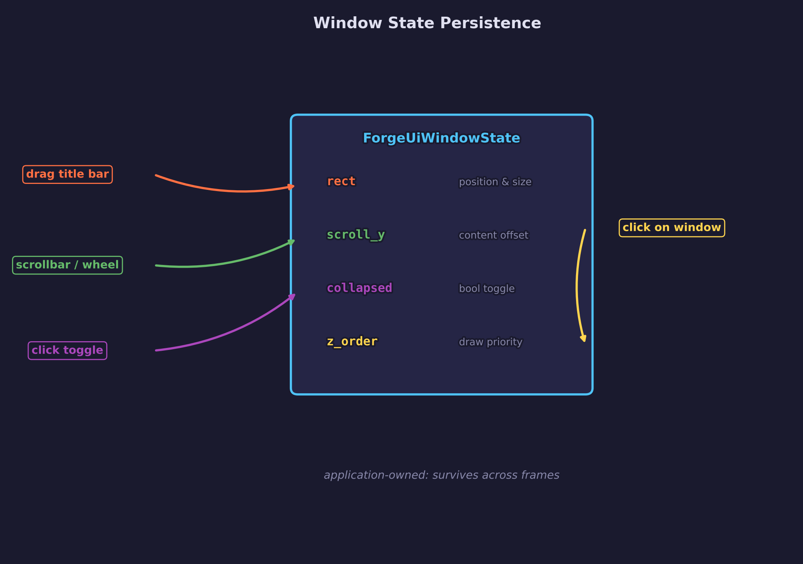

### Window anatomy

A window extends a panel with a collapse toggle and drag capability:

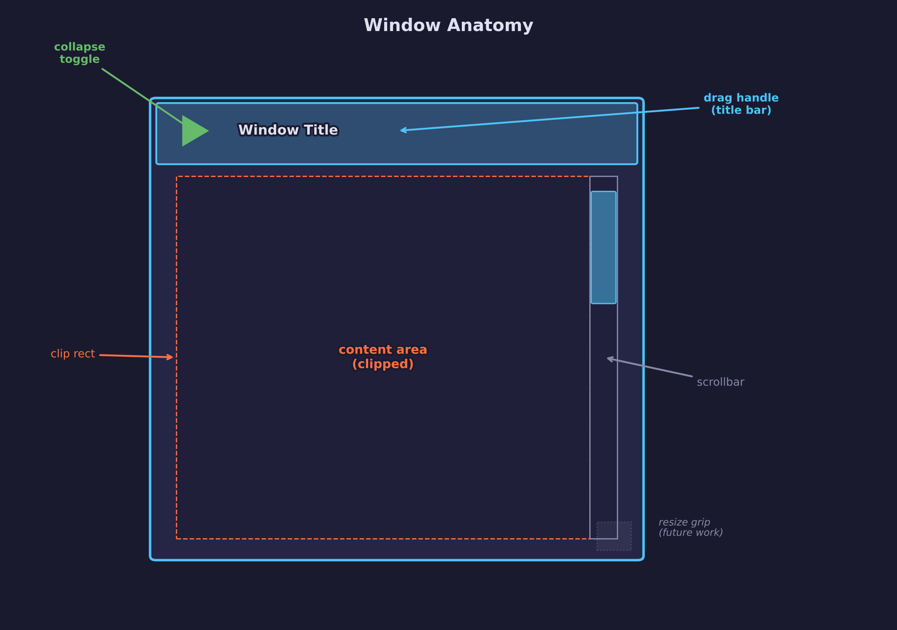

The **collapse toggle** is a small triangle in the title bar: down-pointing
when expanded, right-pointing when collapsed. It uses its own widget ID
(`id + 2`) and follows the standard hot/active state machine — click toggles
`state->collapsed`.

The **title bar** (minus the toggle region) is the drag handle. When the mouse
presses on the title bar, the window becomes active and the grab offset is
recorded. While active, the window rect tracks the mouse position.

### How dragging works

Dragging uses a **grab offset** to keep the window anchored at the point where
the user clicked:

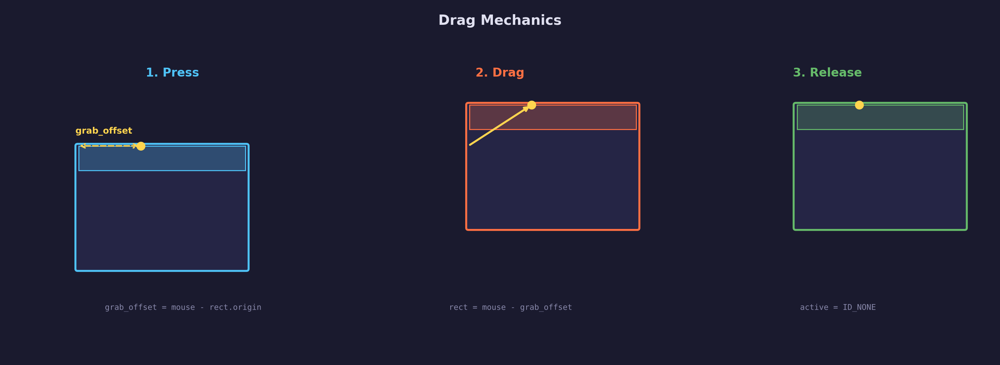

1. **Press**: Record the offset from the mouse to the window's top-left
   corner: `grab_offset_x = mouse_x - rect.x`, `grab_offset_y = mouse_y -
   rect.y`. The title bar widget becomes `active`.
2. **Drag**: Each frame while active, update the window position:
   `rect.x = mouse_x - grab_offset_x`, `rect.y = mouse_y - grab_offset_y`.
   The grab offset is constant, so the window tracks the mouse smoothly
   without jumping.
3. **Release**: Clear `active`. The window stays at its new position because
   `rect` is application-owned persistent state.

The grab offset persists across frames in the `ForgeUiWindowContext` (not
reset by `wctx_begin`) because a drag spans multiple frames.

### Z-ordering and bring-to-front

Each window has a `z_order` integer. Higher values draw on top. When the user
presses the mouse anywhere inside a window (title bar or content area), that
window's `z_order` is set to `max(all z_orders) + 1`:

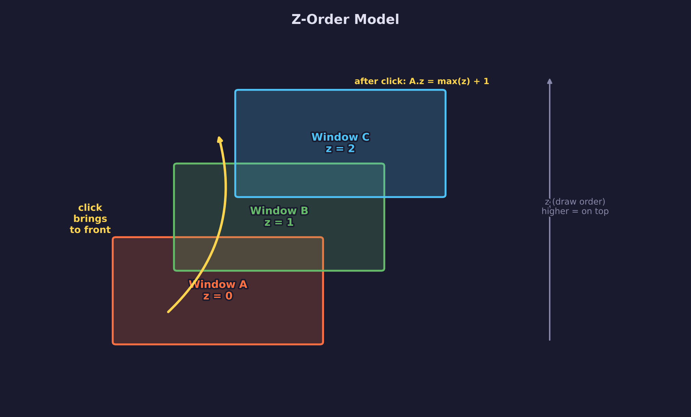

This is the same approach used by desktop window managers — the most recently
interacted window floats to the top.

### The deferred draw problem

Immediate-mode UI declares widgets in code order: the first
`window_begin()`/`window_end()` block emits its vertices first. But correct
overlap requires windows to draw **back-to-front** by z-order. If Window A
(z=0) is declared before Window C (z=2), but C should appear behind A, the
vertices must be reordered.

The solution: **per-window draw lists**.

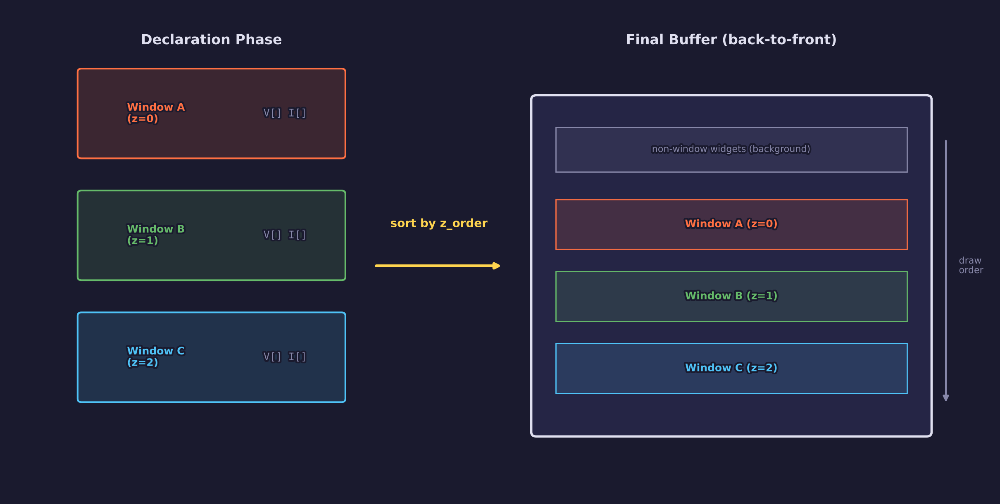

1. **During declaration**: when a window is open (`window_begin` to
   `window_end`), all vertex/index emit functions write to that window's
   private draw list instead of the main context buffers. This is achieved by
   temporarily swapping the context's `vertices`/`indices` pointers to point
   at the window entry's buffers.
2. **At frame end**: `forge_ui_wctx_end()` sorts window entries by `z_order`
   (ascending = back to front) and appends each window's draw list to the main
   buffer. Non-window widgets (labels, buttons declared outside any window)
   remain in the main buffer and draw behind all windows.

### Input routing for overlapping windows

When two windows overlap and the mouse is in the overlap region, both windows'
widgets would pass their hit tests if we did nothing special. This would allow
clicking through a foreground window to activate a widget in a background
window.

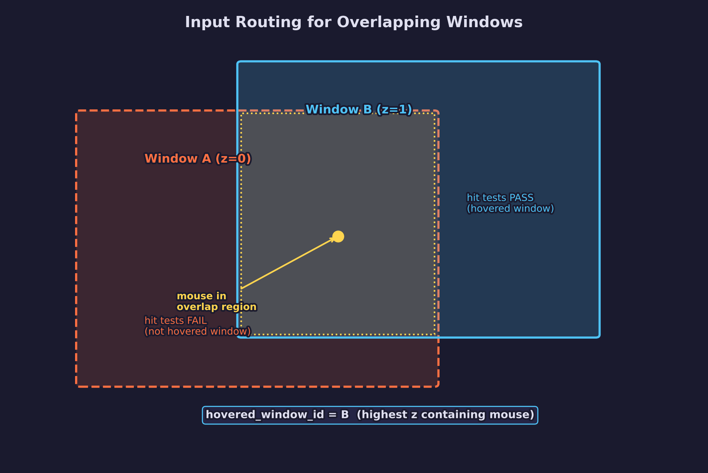

The solution is a **pre-pass** at the start of each frame:

1. `forge_ui_wctx_begin()` scans all **previous frame's** window entries
   (in declaration order) and finds the one with the highest z-order whose
   rect contains the mouse cursor. We cannot use the current frame's data
   because windows have not been declared yet.
2. The highest-z window containing the mouse becomes `hovered_window_id`.
3. During widget processing, hit tests inside a window only succeed if that
   window's ID matches `hovered_window_id`. Widgets in other windows at the
   same screen position silently fail their hit tests.

This one-frame-lag approach (using previous frame data) is standard in
immediate-mode UI — the previous frame's window positions are almost always
identical to the current frame's because windows rarely move more than a few
pixels per frame.

### Collapse and expand

The collapse toggle is a small triangle button in the title bar:

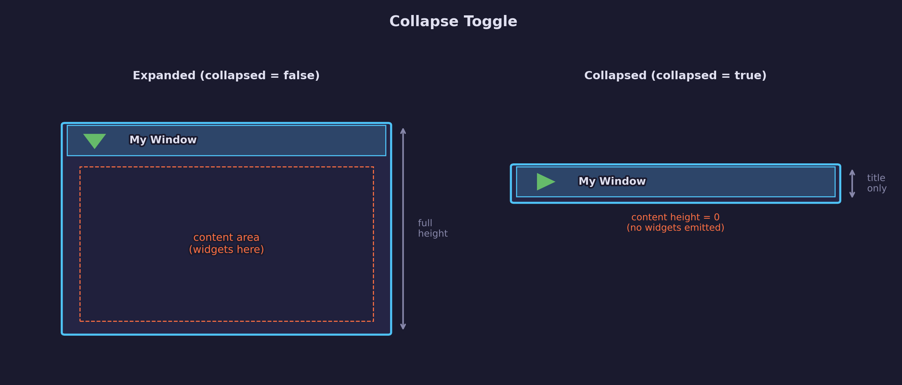

- **Expanded** (down-pointing triangle): the window draws its full background,
  content area with clipping, scrollbar, and all child widgets. The visible
  content height is `rect.h - title_height - 2 * padding`.
- **Collapsed** (right-pointing triangle): `window_begin` returns `false`.
  The caller skips all widget declarations and does **not** call
  `window_end`. Only the title bar is drawn. Content height is effectively
  zero.

Because the collapse state is a simple bool in `ForgeUiWindowState`, the
content is not destroyed — it reappears exactly as before when the user
expands the window again.

### Window vs panel

A window builds directly on the panel infrastructure from lesson 09:


The panel provides the foundation: background fill, title bar, content area
clipping, scrollbar, and layout integration. The window adds three new
capabilities on top:

| Feature | Panel (Lesson 09) | Window (Lesson 10) |
|---------|-------------------|---------------------|
| Position | Fixed (caller provides rect each frame) | Draggable (rect is mutable state) |
| Overlap | No z-ordering | Click-to-front z-ordering |
| Title bar | Display only | Drag handle + collapse toggle |
| Draw order | Immediate (code order) | Deferred (z-sorted) |
| Input routing | No overlap handling | Z-aware hit testing |
| State | `float *scroll_y` only | Full `ForgeUiWindowState` |

### The window API

The window system adds a wrapper context (`ForgeUiWindowContext`) that sits on
top of the existing `ForgeUiContext`:

```c
ForgeUiWindowContext wctx;
forge_ui_wctx_init(&wctx, &ctx);

/* Each frame: */
forge_ui_ctx_begin(&ctx, mouse_x, mouse_y, mouse_down);
forge_ui_wctx_begin(&wctx);

/* Declare windows and their contents */
if (forge_ui_wctx_window_begin(&wctx, 100, "My Window", &win_state)) {
    forge_ui_ctx_label_layout(wctx.ctx, "Hello", 26.0f, 0.9f, 0.9f, 0.9f, 1.0f);
    forge_ui_wctx_window_end(&wctx);
}

forge_ui_wctx_end(&wctx);   /* sorts and assembles draw lists */
forge_ui_ctx_end(&ctx);      /* finalizes hot/active state */
```

Key design decisions:

- **Separate context**: the window context wraps rather than modifies the UI
  context, keeping the simpler non-windowed API unchanged for lessons 05–09.
- **Buffer swapping**: during `window_begin`/`window_end`, the context's
  vertex/index pointers are temporarily redirected to the window's draw list.
  All existing widget functions (`label`, `button`, `checkbox`, `slider`)
  work unchanged — they emit into whatever buffer the context currently
  points to.
- **Panel reuse**: `window_end` delegates to `forge_ui_ctx_panel_end()` for
  content height computation and scrollbar drawing, avoiding code duplication.

## Data output

- **Vertices**: `ForgeUiVertex` — position (x, y), UV (u, v), color (r, g, b,
  a) — 32 bytes per vertex
- **Indices**: `Uint32` triangle list, CCW winding order
- **Textures**: single-channel alpha font atlas (same as all previous UI
  lessons)
- **Draw order**: vertices in the final buffer are ordered so that non-window
  widgets come first (background), then windows in ascending z-order (back to
  front). A single indexed draw call renders the entire UI with correct overlap.

## Where it's used

In forge-gpu lessons:

- [UI Lesson 09 — Panels and Scrolling](../09-panels-and-scrolling/) provides
  the panel, clipping, and scrollbar infrastructure that windows build on
- [UI Lesson 08 — Layout](../08-layout/) provides the layout stack used for
  automatic widget positioning inside windows
- [UI Lesson 05 — Immediate-Mode Basics](../05-immediate-mode-basics/)
  introduces the hot/active state machine that drives all window interactions
- [Engine Lesson 10 — CPU Rasterization](../../engine/10-cpu-rasterization/)
  provides the software rasterizer used to render BMP output

## AI skill

This lesson has a matching Claude Code skill:
[`ui-lesson`](../../../.claude/skills/ui-lesson/SKILL.md) -- invoke it to
scaffold new UI lessons following the same structure and conventions.

A dedicated skill for draggable windows is available:
[`draggable-windows`](../../../.claude/skills/draggable-windows/SKILL.md) --
invoke it to add draggable, z-ordered windows to any `ForgeUiContext`
application.

## Building

```bash
cmake -B build
cmake --build build --config Debug

# Windows
build\lessons\ui\10-windows\Debug\10-windows.exe

# Linux / macOS
./build/lessons/ui/10-windows/10-windows
```

## What's next

- **[UI Lesson 11 -- Game UI](../11-game-ui/)** (planned) -- applying windows
  and panels to game-specific UI patterns such as inventory screens, dialogue
  boxes, and HUDs

## Exercises

1. **Resize handles**: Add a resize grip at the bottom-right corner of each
   window. Store a `min_w`/`min_h` in `ForgeUiWindowState` and clamp during
   resize. Consider how resizing interacts with the content layout.

2. **Close button**: Add an "X" button in the title bar that sets a
   `bool visible` field in `ForgeUiWindowState`. When not visible, skip the
   entire window declaration. Add a way to reopen closed windows (perhaps a
   menu or keyboard shortcut).

3. **Snap to edges**: When dragging a window near the framebuffer edge (within
   10 pixels), snap the window edge to align with the boundary. This prevents
   windows from being dragged partially off-screen.

4. **Z-order compaction**: After many clicks, z_order values grow without
   bound. Add a compaction step in `wctx_end` that reassigns z_orders to
   0, 1, 2, ... based on the current sort order, keeping the values small.

## Further reading

- [UI Lesson 09 — Panels and Scrolling](../09-panels-and-scrolling/) — the
  panel infrastructure that windows extend
- [UI Lesson 11 — Game UI](../11-game-ui/) — applying windows and panels to
  game-specific UI patterns (planned)
- [Casey Muratori — Immediate-Mode Graphical User Interfaces (2005)](https://caseymuratori.com/blog_0001) —
  the foundational talk on immediate-mode UI
- [Dear ImGui](https://github.com/ocornut/imgui) — a production
  immediate-mode UI library that uses the same deferred draw and z-ordering
  approach
