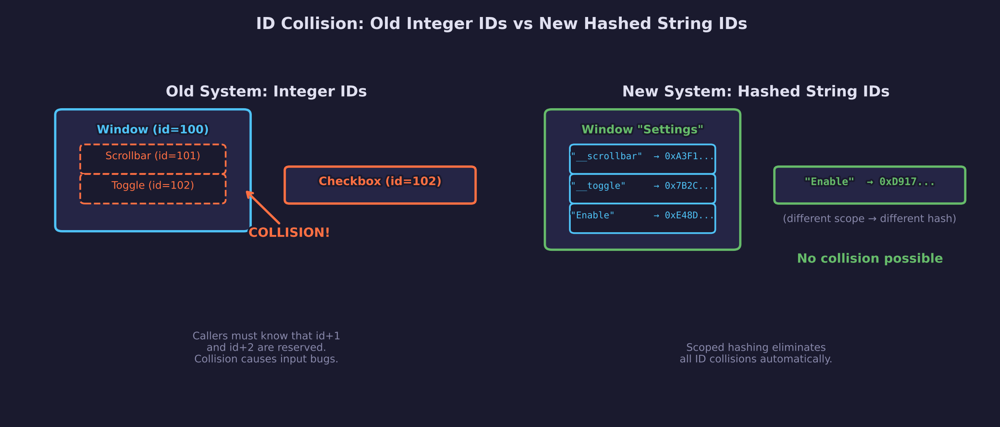

# UI Lesson 11 — Widget ID System

FNV-1a hashed string IDs with hierarchical scope stacking — eliminating
manual ID assignment and the hidden collision problem.

## What you'll learn

- **FNV-1a hashing** — the non-cryptographic hash function that converts
  string labels into `Uint32` widget IDs at virtually zero cost
- **`##` separator** — Dear ImGui's convention for separating display text
  from identity: `"Delete##audio"` displays "Delete" but hashes `"##audio"`
- **ID scope stack** — `forge_ui_push_id` / `forge_ui_pop_id` create
  hierarchical scopes so identical labels in different containers produce
  different hash values
- **Automatic scoping** — panels and windows push their own scope
  automatically, making collisions impossible without caller effort
- **Zero guard** — the hash function guarantees non-zero results, preserving
  `FORGE_UI_ID_NONE == 0` as the null sentinel

## The problem with integer IDs

The previous system required callers to manually assign unique integer IDs to
every widget:

```c
/* Old API — caller must choose unique IDs */
forge_ui_ctx_button(ctx, 42, "OK", rect);
forge_ui_ctx_checkbox(ctx, 43, "Enable", &val, rect);
```

Worse, panels reserved `id+1` for their scrollbar and windows reserved `id+2`
for their collapse toggle.  These hidden reservations created **invisible
collision zones** — if a caller unknowingly picked an ID that collided with a
reserved internal ID, input would silently break.

Issue [#151](https://github.com/RosyGameStudio/forge-gpu/issues/151)
documented this exact bug: a checkbox with ID 102 collided with a window's
collapse toggle (also 102), causing the checkbox to fail.

## The solution: hashed string IDs

Widget labels now double as IDs, hashed automatically with FNV-1a:

```c
/* New API — labels ARE the IDs */
forge_ui_ctx_button(ctx, "OK", rect);
forge_ui_ctx_checkbox(ctx, "Enable", &val, rect);
```

### FNV-1a hash function

FNV-1a (Fowler-Noll-Vo) is a fast, well-distributed hash with a simple
implementation:

```c
Uint32 hash = seed;  /* 0x811c9dc5 at root scope */
for (const char *p = str; *p; p++) {
    hash ^= (Uint32)(unsigned char)*p;
    hash *= 0x01000193u;
}
```

The XOR-then-multiply structure produces excellent avalanche behavior — small
input changes affect many output bits — with only two operations per byte.

### The `##` separator

When two widgets need the same display text (e.g. two "Delete" buttons), the
`##` separator lets callers provide a unique suffix for hashing without
affecting what the user sees:

```c
/* Both display "Delete", but hash differently */
forge_ui_ctx_button(ctx, "Delete##audio", rect_a);
forge_ui_ctx_button(ctx, "Delete##video", rect_b);
```

The hash function finds the `##` separator and hashes only the portion
starting at `##`.  The display functions render only the text before `##`.

### Hierarchical scope stacking

Panels and windows automatically push a scope onto the ID stack, so widgets
with identical labels in different containers get different hashes:

```c
/* Audio window scope */
if (forge_ui_wctx_window_begin(wctx, "Audio", &audio_win)) {
    /* "Enable" hashes as FNV-1a("Enable", seed_from("Audio")) */
    forge_ui_ctx_checkbox_layout(ctx, "Enable", &audio_on, 28);
    forge_ui_wctx_window_end(wctx);
}

/* Video window scope */
if (forge_ui_wctx_window_begin(wctx, "Video", &video_win)) {
    /* "Enable" hashes as FNV-1a("Enable", seed_from("Video")) */
    forge_ui_ctx_checkbox_layout(ctx, "Enable", &video_on, 28);
    forge_ui_wctx_window_end(wctx);
}
```

The two "Enable" checkboxes produce different `Uint32` IDs because their
parent scopes differ.  No manual ID management is needed.

The scope stack supports up to 8 levels of nesting (window > panel > row >
widget), covering all practical UI hierarchies.

### Internal widget IDs

Panels and windows no longer reserve `id+1` or `id+2`.  Instead, they hash
descriptive internal names within their own scope:

```c
/* Inside window scope */
Uint32 toggle_id = forge_ui_hash_id(ctx, "__toggle");
Uint32 sb_id     = forge_ui_hash_id(ctx, "__scrollbar");
```

These names cannot collide with user-chosen labels because they use the `__`
prefix convention and live inside the container's scope.

## Diagrams

### ID collision — old vs new system



The old integer system created hidden collision zones with reserved offsets.
The new hashed system uses scoped string IDs that cannot collide.

### ID scope stack — hierarchical hashing


The scope stack chains FNV-1a seeds through nested push/pop operations. Each
scope level produces a new seed that mixes the parent's seed with the scope
name, ensuring unique hashes at every nesting level.

## Data output

This lesson's `main.c` produces the same vertex/index draw data format as
previous UI lessons.  The key difference is in how widget IDs are computed —
the draw data pipeline is unchanged.

Console output demonstrates the hash values:

```text
Audio/Enable  hash: 0xXXXXXXXX
Video/Enable  hash: 0xYYYYYYYY   (different from Audio/Enable)
Delete##audio hash: 0xAAAAAAAA
Delete##video hash: 0xBBBBBBBB   (different from Delete##audio)
```

## Building and running

```bash
cmake -B build
cmake --build build --target 11-widget-id-system
./build/lessons/ui/11-widget-id-system/11-widget-id-system
```

Output: 9 BMP images (`widget_id_frame_0.bmp` through `widget_id_frame_8.bmp`)
showing two windows with identically-labeled checkboxes operating independently.

## Exercises

1. **Custom scope**: Add a third window ("Network") with its own "Enable" and
   "Verbose" checkboxes.  Verify the hash values differ from both Audio and
   Video.

2. **Manual push/pop**: Use `forge_ui_push_id` / `forge_ui_pop_id` to create
   a custom scope outside of any window.  Place two sliders with the label
   `"##speed"` in different scopes and verify they operate independently.

3. **Hash collision search**: Write a test that hashes millions of random
   strings and counts FNV-1a collisions.  How does the collision rate compare
   to the theoretical rate for a 32-bit hash (birthday bound at ~77K items)?
