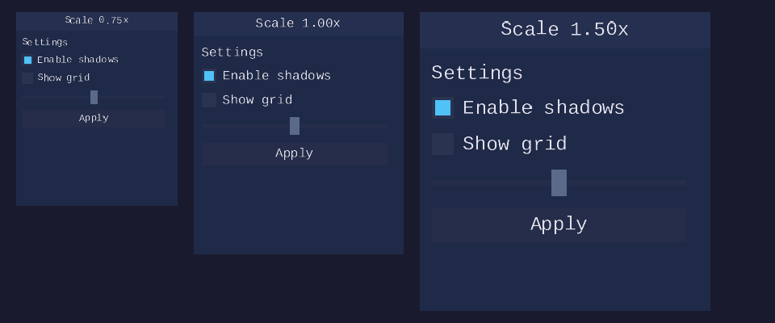
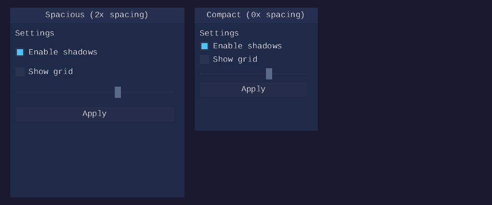
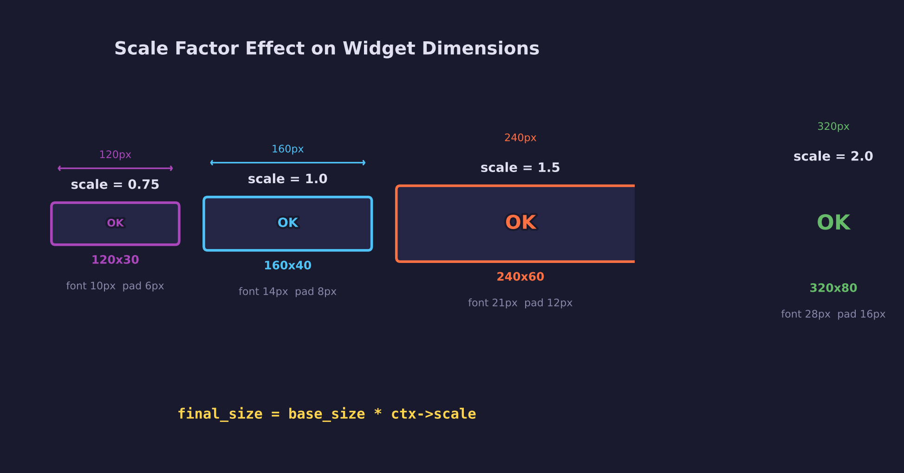
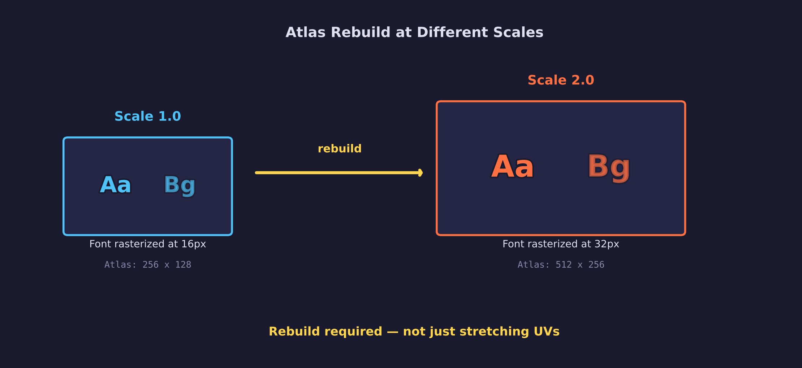
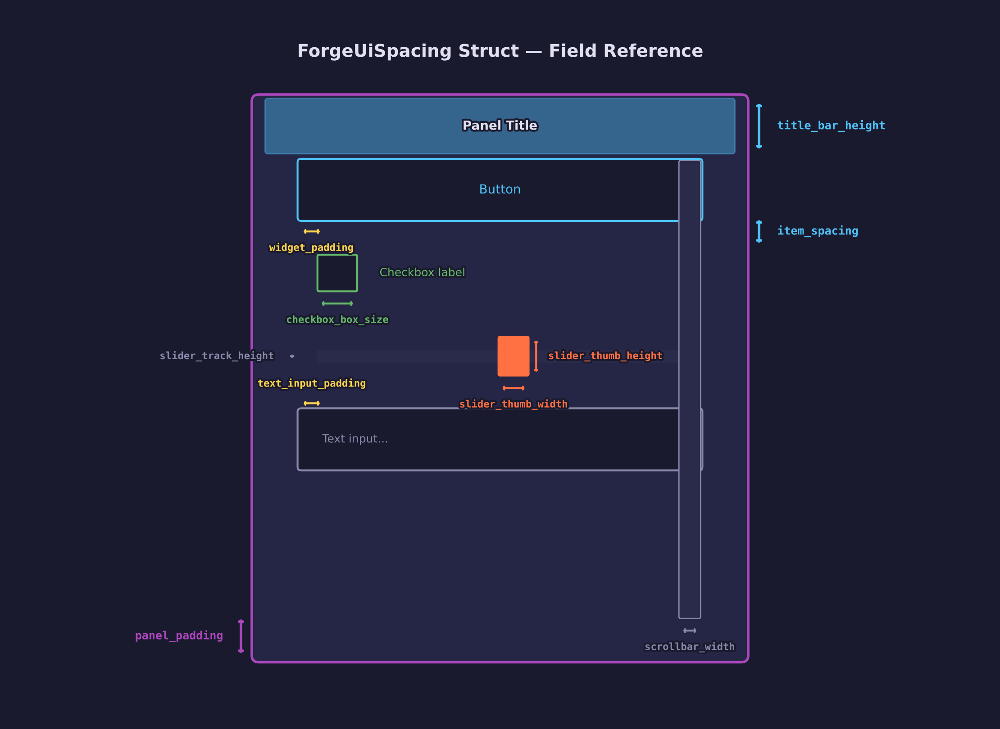
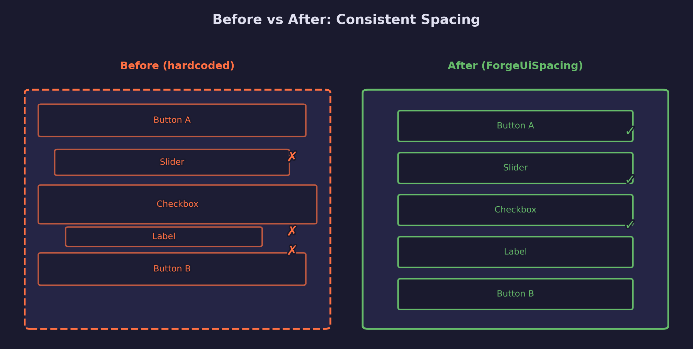
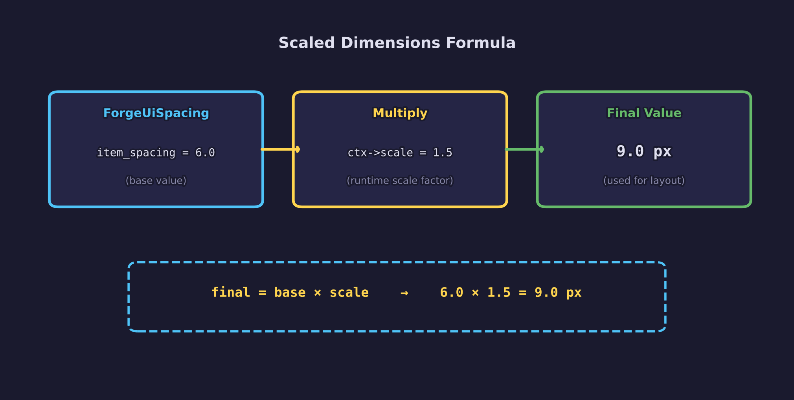

# UI Lesson 12 — Font Scaling and Spacing

Global scale factor and consistent spacing — make the UI readable at any
DPI and eliminate hardcoded padding gaps.

## What you'll learn

- How a global **scale factor** on `ForgeUiContext` makes every widget
  dimension proportional to a single float
- Why the atlas must be **rebuilt** (not stretched) when scale changes,
  and how `base_pixel_height * scale` determines glyph resolution
- The **`ForgeUiSpacing`** struct — a single source of truth for padding,
  gaps, and widget dimensions
- The **`FORGE_UI_SCALED(ctx, value)`** macro that multiplies a base
  spacing value by the context's scale
- How **layout defaults** substitute themed spacing when the caller
  passes zero for padding or spacing
- How to **override** individual spacing fields to create spacious or
  compact layouts without changing the global scale

## Why this matters

Every previous lesson hardcoded widget dimensions — the checkbox box was
always 18 px, the panel title bar was always 30 px, the item spacing was
always 8 px. This works on a single-resolution display, but falls apart on
high-DPI screens (where 18 px becomes physically tiny) and prevents
applications from offering density preferences.

Real UI toolkits solve this with a DPI scale factor: one float that
multiplies every dimension in the system. Combined with a spacing struct
that centralizes all widget measurements, the result is a UI that scales
proportionally from a single knob while remaining easy to customize per
field.

## Result

The demo program renders two frames:

**Frame 1 — Three scales side by side.** The same settings panel (title,
two checkboxes, a slider, and a button) rendered at scale 0.75, 1.0, and
1.5. All widgets, text, padding, and spacing grow proportionally.



**Frame 2 — Spacing overrides.** Two panels at scale 1.0 with different
spacing values: the left panel doubles `widget_padding` and
`item_spacing` for a spacious feel; the right panel halves them for a
compact layout. Same widget content, different density.



## Key concepts

- **Scale factor** — A single `float scale` on `ForgeUiContext` (default
  1.0) that multiplies all widget dimensions, font pixel height, padding,
  and spacing
- **Base pixel height** — The unscaled font design size (e.g. 16.0);
  the atlas is built at `base_pixel_height * scale`
- **ForgeUiSpacing** — A struct of base (unscaled) spacing constants
  stored on the context, accessed via `FORGE_UI_SCALED()`
- **Atlas rebuild** — Scaling requires rebuilding the atlas at the new
  pixel height; stretching UVs would produce blurry glyphs
- **Layout defaults** — `forge_ui_ctx_layout_push()` substitutes themed
  spacing when the caller passes zero, giving consistent gaps by default
- **Per-field override** — Applications can modify individual spacing
  fields after `forge_ui_ctx_init()` for custom density

## The details

### The scale factor

The `ForgeUiContext` gains a `float scale` field, defaulting to 1.0.
Widget code never reads the hardcoded `FORGE_UI_*` defines directly at
draw time — instead it reads the base value from `ctx->spacing` and
multiplies by `ctx->scale`. Multiplying at draw time rather than
pre-computing scaled values keeps things simple: the context stores one
copy of each spacing value (the base), and scale changes take effect
immediately on the next frame without updating every field:

```c
float cb_box = FORGE_UI_SCALED(ctx, ctx->spacing.checkbox_box_size);
/* At scale 1.5: 18.0 * 1.5 = 27.0 px */
```

The macro is defined as:

```c
#define FORGE_UI_SCALED(ctx, value) ((value) * (ctx)->scale)
```



Because every widget dimension flows through `FORGE_UI_SCALED`, an
invalid scale value would corrupt the entire frame: zero produces
zero-size widgets, negative values invert geometry, and NaN or Inf
poisons every result. `forge_ui_ctx_begin()` validates scale at the
start of each frame and resets it to 1.0 if the application set an
invalid value between frames.

### Atlas integration

The atlas `pixel_height` is `base_pixel_height * scale`. At scale 2.0
the glyphs render at double resolution — the atlas texture itself becomes
larger with sharper glyphs. The atlas must be rebuilt when scale changes;
this is an explicit application responsibility:

```c
float base_px = 16.0f;
float scale   = 2.0f;
float atlas_px = base_px * scale;  /* 32.0 — build atlas at this height */

forge_ui_atlas_build(&font, atlas_px, codepoints, count, padding, &atlas);
```



Stretching UVs from a 16 px atlas to fill 32 px rects would produce
blurry, pixelated text. Rebuilding the atlas rasterizes fresh glyph
bitmaps at the target resolution, giving crisp edges at every scale.

### The ForgeUiSpacing struct

`ForgeUiSpacing` centralizes every spacing constant that was previously
a scattered `#define`:

```c
typedef struct ForgeUiSpacing {
    /* General layout */
    float widget_padding;      /* inset inside widget backgrounds */
    float item_spacing;        /* gap between consecutive widgets */
    float panel_padding;       /* inset inside panel content areas */
    float title_bar_height;    /* panel/window title bar */

    /* Checkbox */
    float checkbox_box_size;   /* square side length */
    float checkbox_inner_pad;  /* box edge to check fill */
    float checkbox_label_gap;  /* box to label gap */

    /* Slider */
    float slider_thumb_width;  /* thumb rectangle width */
    float slider_thumb_height; /* thumb rectangle height */
    float slider_track_height; /* thin track bar height */

    /* Text input */
    float text_input_padding;  /* left padding before text */
    float text_input_cursor_w; /* cursor bar width */
    float text_input_border_w; /* focused border width */

    /* Scrollbar */
    float scrollbar_width;     /* track width */
    float scrollbar_min_thumb; /* minimum thumb height */
    float scroll_speed;        /* mouse wheel scroll multiplier */

    /* Window extras */
    float window_toggle_size;  /* collapse toggle side length */
    float window_toggle_pad;   /* toggle padding from left edge */
} ForgeUiSpacing;
```



All values are base (unscaled) floats. `forge_ui_ctx_init()` populates
them from the existing `FORGE_UI_*` defines so every context starts with
the same defaults. Applications can then override individual fields:

```c
ForgeUiContext ctx;
forge_ui_ctx_init(&ctx, &atlas);
ctx.scale = 1.5f;

/* Make buttons more spacious */
ctx.spacing.widget_padding = 10.0f;  /* base, not scaled — FORGE_UI_SCALED applies scale */
```

### Spacing anatomy


Three spacing values control the visual density of a layout:

- **`widget_padding`** — The inset inside each widget background. A
  button's text is inset by `widget_padding` from the button rect edges.
- **`item_spacing`** — The vertical (or horizontal) gap between
  consecutive widgets in a layout. This is the breathing room between
  a checkbox and the slider below it.
- **`panel_padding`** — The inset inside a panel's content area. Child
  widgets are this far from the panel border.

All three are independent: you can increase `item_spacing` for a more
airy layout without touching the padding inside widgets.

### Layout defaults

`forge_ui_ctx_layout_push()` now substitutes themed defaults when the
caller passes zero. Zero is a natural "I don't have a preference" value,
and in practice most layouts want the theme's spacing rather than no
spacing at all — so treating zero as "use the default" avoids forcing
callers to look up and pass the themed values manually:

```c
/* Pass 0 for padding and spacing to get themed defaults */
forge_ui_ctx_layout_push(&ctx, rect, FORGE_UI_LAYOUT_VERTICAL, 0.0f, 0.0f);
/* padding = ctx->spacing.widget_padding * ctx->scale */
/* spacing = ctx->spacing.item_spacing * ctx->scale   */

/* Pass explicit values to override */
forge_ui_ctx_layout_push(&ctx, rect, FORGE_UI_LAYOUT_VERTICAL, 20.0f, 4.0f);
/* padding = 20.0  spacing = 4.0 (no substitution) */
```

True zero padding is a rare edge case (panels whose content area is
already padded), so it gets the less convenient syntax: pass a negative
value, which is clamped to zero after the substitution check. This avoids
adding an extra parameter or flag to the function signature:

```c
forge_ui_ctx_layout_push(&ctx, rect, FORGE_UI_LAYOUT_VERTICAL, -1.0f, 8.0f);
/* padding = 0.0  spacing = 8.0 */
```

### Before and after



The left side shows the old approach: hardcoded `#define` constants read
directly by every widget, producing fixed dimensions regardless of
context. The right side shows the new system: base values stored in
`ForgeUiSpacing`, multiplied by `ctx->scale`, producing dimensions that
adapt to the target resolution.

### The scaling formula



$$
\text{final}\_\text{px} = \text{base}\_\text{value} \times \text{scale}
$$

Concrete example: `widget_padding` has a base value of 6.0. At scale
1.5, `FORGE_UI_SCALED(ctx, 6.0)` produces 9.0 px — the actual inset
used in rect calculations and vertex positions.

### Line height at any scale

Text line advancement uses the atlas scaled metrics. The font's ascender,
descender, and line gap are stored in font units; the atlas records the
pixel height used during rasterization. Because the atlas is rebuilt at
`base_pixel_height * scale`, all metric-to-pixel conversions produce
correctly scaled values automatically:

```c
float scale_factor = atlas->pixel_height / (float)atlas->units_per_em;
float ascender_px  = (float)atlas->ascender * scale_factor;
/* At scale 2.0 with 16px base: pixel_height = 32, ascender_px doubles */
```

Multi-line labels and text input fields use the atlas line metrics
(`ascender - descender + lineGap`) for inter-line spacing, which scales
consistently because the atlas pixel height already incorporates the
scale factor.

## Data output

- **Vertices**: `ForgeUiVertex` — position (vec2), UV (vec2), color
  (vec4), 32 bytes per vertex. All positions are in screen-space pixels
  with scaled dimensions.
- **Indices**: `uint32` triangle list, CCW winding order. Two triangles
  (6 indices) per quad.
- **Textures**: Single-channel alpha atlas, rebuilt at
  `base_pixel_height * scale`. Atlas dimensions grow with scale (e.g.
  128×128 at 12 px, 256×256 at 16 px, 256×256 at 24 px).

## Where it's used

In forge-gpu lessons:

- [GPU Lesson 28 — UI Rendering](../../gpu/28-ui-rendering/) renders the
  vertex/index data produced by the UI context
- [UI Lesson 08 — Layout](../08-layout/) introduced the layout stack
  that now uses themed defaults for padding and spacing
- [UI Lesson 09 — Panels and Scrolling](../09-panels-and-scrolling/)
  introduced panels that now use scaled title bar height, padding, and
  scrollbar width
- [UI Lesson 10 — Windows](../10-windows/) introduced windows that now
  use scaled dimensions for the title bar, collapse toggle, and content
  padding

## Building

```bash
cmake -B build
cmake --build build --config Debug

# Windows
build\lessons\ui\12-font-scaling-and-spacing\Debug\12-font-scaling-and-spacing.exe

# Linux / macOS
./build/lessons/ui/12-font-scaling-and-spacing/12-font-scaling-and-spacing
```

## What's next

**UI Lesson 13 — Theming and Color System** will centralize all UI colors
into a `ForgeUiTheme` struct, enabling runtime theme switching and
eliminating per-call color parameters.

## Exercises

1. **Scale slider** — Add a third frame where a slider controls the
   scale factor from 0.5 to 3.0. Show the panel at the slider's current
   value. This requires rebuilding the atlas each time the scale changes
   significantly (quantize to 0.25 steps to avoid excessive rebuilds).

2. **Per-widget spacing** — Override `checkbox_box_size` to 24.0 and
   `slider_thumb_height` to 30.0 while keeping other spacing at
   defaults. Observe how individual widget proportions change without
   affecting the rest of the layout.

3. **DPI-aware scale** — Query the display DPI (SDL provides this via
   `SDL_GetDisplayContentScale`) and set `ctx->scale` accordingly. A
   200% display scale should produce a scale of 2.0 with the atlas
   rebuilt at double resolution.

## Further reading

- [UI Lesson 08 — Layout](../08-layout/) — the layout system that
  now integrates with themed spacing defaults
- [UI Lesson 09 — Panels and Scrolling](../09-panels-and-scrolling/) —
  panels with scaled dimensions and scrollbar
- [UI Lesson 10 — Windows](../10-windows/) — windows with scaled title
  bar, toggle, and content area
- [Dear ImGui — Style](https://github.com/ocornut/imgui/blob/master/imgui.h) —
  Dear ImGui's `ImGuiStyle` struct is the production equivalent of
  `ForgeUiSpacing`, centralizing all spacing and sizing values
- [SDL_GetDisplayContentScale](https://wiki.libsdl.org/SDL3/SDL_GetDisplayContentScale) —
  SDL3 function for querying display DPI scale
