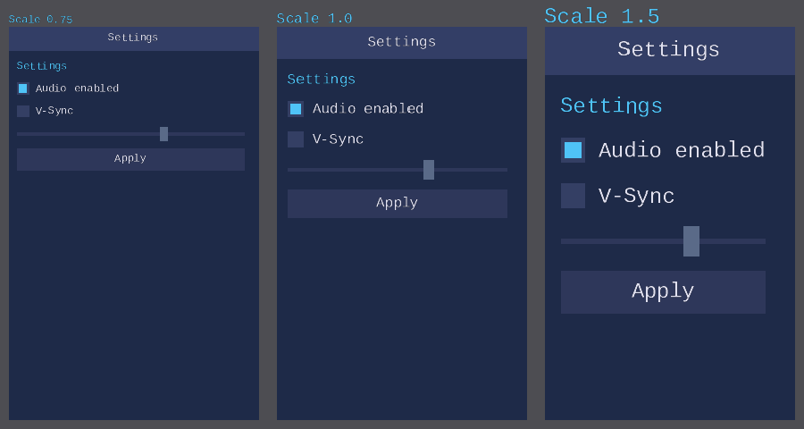
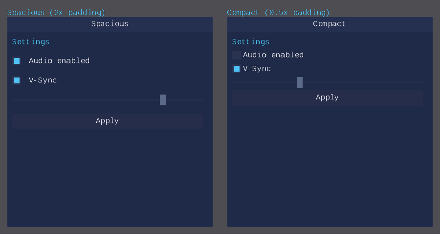
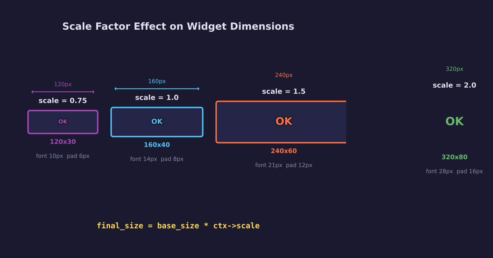
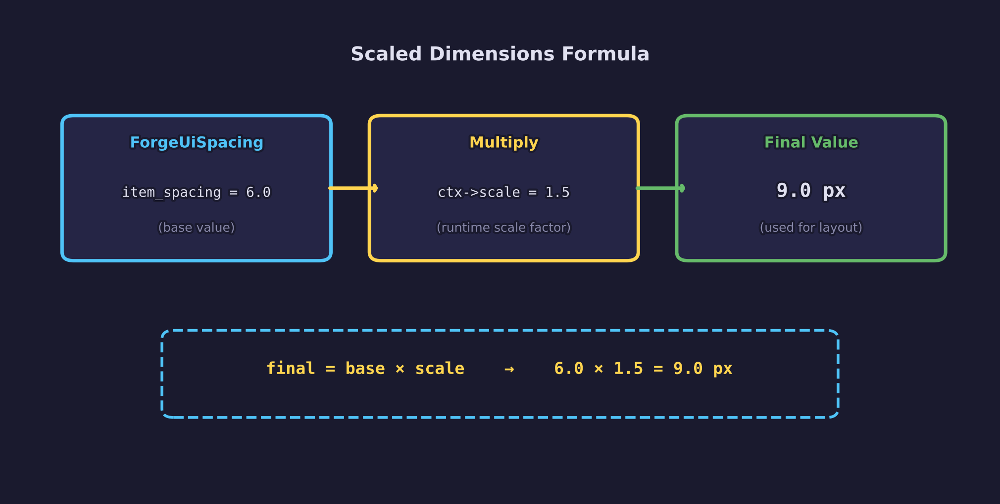
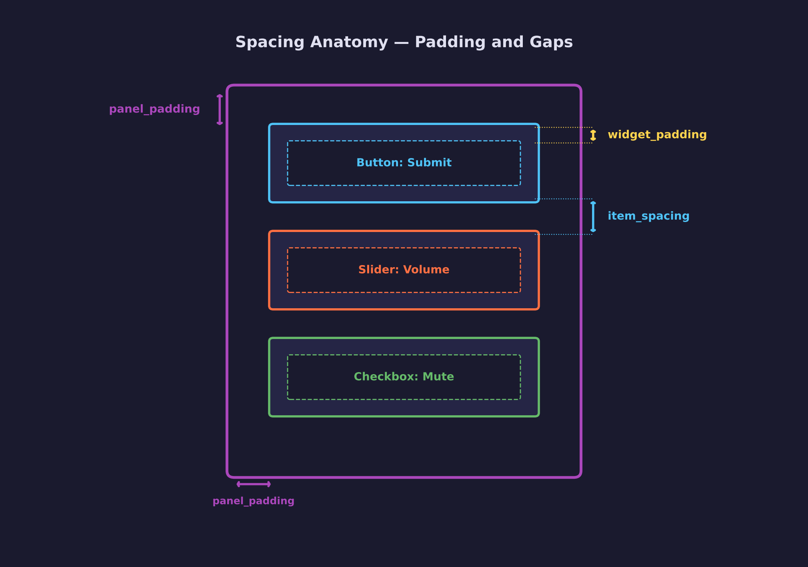
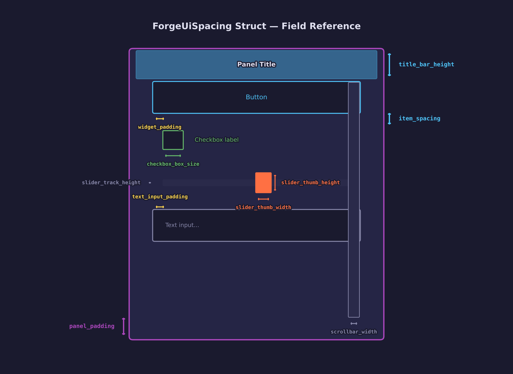
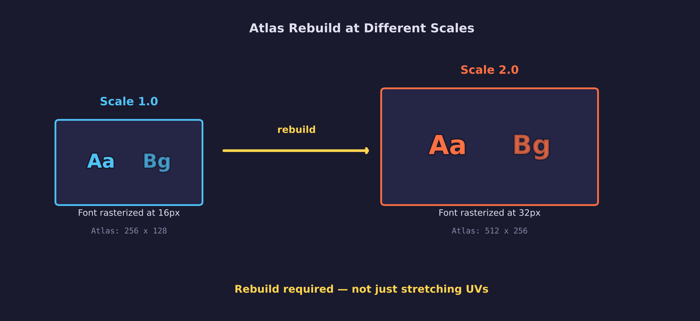
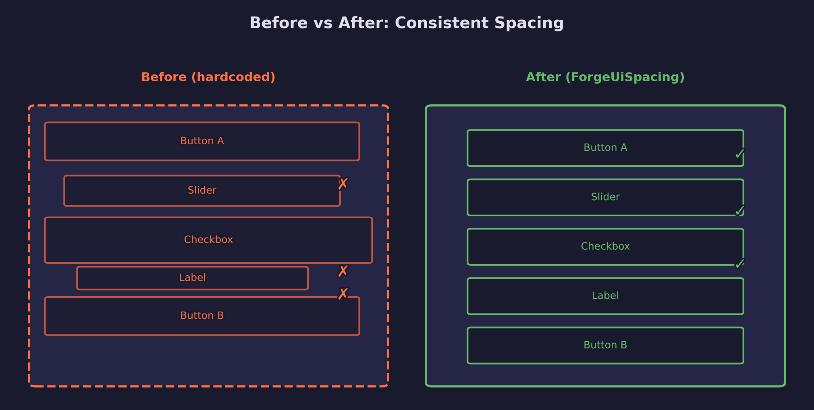

# UI Lesson 12 — Font Scaling and Spacing

Global scale factor and consistent spacing — make the UI readable at any
DPI (dots per inch) and eliminate hardcoded padding gaps.

## What you'll learn

- How a global `scale` factor on `ForgeUiContext` multiplies all widget
  dimensions, font pixel height, padding, and spacing
- The `ForgeUiSpacing` struct: a single source of truth for all layout
  constants (widget padding, item spacing, panel padding, title bar height,
  checkbox box size, slider dimensions, text input padding, scrollbar width)
- The `FORGE_UI_SCALED(ctx, value)` macro for applying scale at draw time
- Why the font atlas must be rebuilt at `base_pixel_height * scale` — you
  cannot stretch low-resolution glyphs to higher DPI
- How `base_pixel_height` and `scaled_pixel_height` let applications track
  both the design size and the final rendered size
- Layout integration: passing 0 for padding or spacing in `layout_push` now
  produces consistent themed defaults rather than zero gaps
- How to override individual spacing values for spacious or compact themes

## Why this matters

Most UI systems hardcode pixel dimensions: a button is 32 px tall, checkbox
boxes are 18 px, panel padding is 10 px.  This works at one DPI, but on a
high-DPI display every element looks too small, and on a low-DPI display
everything crowds the screen.

A global scale factor solves this by multiplying every dimension by a single
float.  At scale 2.0 a 16 px font renders at 32 px, padding doubles, and
widgets grow proportionally.  The key insight is that font glyphs must be
*re-rasterized* at the target size — stretching a 16 px atlas to 32 px
produces blurry text.  The atlas is rebuilt, not scaled.

The spacing struct centralizes all layout constants so they can be tuned once
(for a theme or user preference) and take effect everywhere.  No widget
function reads hardcoded defines at draw time; they all read from
`ctx->spacing` scaled by `ctx->scale`.

## Result

The demo program produces two BMP images showing the scaling and spacing
system in action.

**Frame 1 — Scale comparison** (three panels at 0.75, 1.0, and 1.5):



Each panel contains the same widgets (title label, two checkboxes, a slider,
and a button).  All dimensions — text size, checkbox boxes, slider thumbs,
padding between widgets, and panel chrome — scale proportionally.

**Frame 2 — Spacing override comparison** (spacious vs compact at scale 1.0):



Both panels use scale 1.0 with different `ForgeUiSpacing` overrides: the left
panel doubles `widget_padding` and `item_spacing` for a spacious feel, while
the right panel halves them for a compact layout.

## Key concepts

- **Scale factor** — a single `float scale` on `ForgeUiContext` (default 1.0)
  that multiplies all widget dimensions and spacing
- **ForgeUiSpacing** — a struct holding 10 base (unscaled) spacing constants,
  initialized with sensible defaults and overridable per-context
- **FORGE_UI_SCALED(ctx, value)** — macro returning `value * ctx->scale`
- **Atlas rebuild** — the atlas `pixel_height` is `base_pixel_height * scale`;
  changing scale requires rebuilding the atlas with re-rasterized glyphs
- **Base vs scaled pixel height** — `base_pixel_height` is the design size
  (e.g. 16.0), `scaled_pixel_height` is the actual rendered size
- **Layout defaults** — `layout_push` with padding=0 or spacing=0 now uses
  themed defaults from `ctx->spacing`; negative values mean explicit zero
- **Theme overrides** — set `ctx->spacing.*` after `forge_ui_ctx_init` but
  before the first frame to customize spacing globally

## The details

### The scale factor



The `ForgeUiContext` gains three new fields:

```c
float scale;               /* global multiplier (default 1.0) */
float base_pixel_height;   /* unscaled design font size (e.g. 16.0) */
float scaled_pixel_height; /* base_pixel_height * scale */
```

The application sets `scale` after `forge_ui_ctx_init` but before rendering.
The atlas must be built at `base_pixel_height * scale`:

```c
float scale = 1.5f;
float atlas_px = BASE_PIXEL_HEIGHT * scale;  /* 16 * 1.5 = 24 */

forge_ui_atlas_build(&font, atlas_px, codepoints, count, 2, &atlas);
forge_ui_ctx_init(&ctx, &atlas);

ctx.scale = scale;
ctx.base_pixel_height = BASE_PIXEL_HEIGHT;
ctx.scaled_pixel_height = atlas_px;
```

### The FORGE_UI_SCALED macro



Every widget function reads dimensions through this macro:

```c
#define FORGE_UI_SCALED(ctx, value) ((value) * (ctx)->scale)
```

For example, the checkbox function computes its box size as:

```c
float cb_size = FORGE_UI_SCALED(ctx, ctx->spacing.checkbox_box_size);
```

At scale 1.0 this returns 18.0 (the default).  Increasing scale to 1.5 yields
27.0, while 0.75 produces 13.5.

### The ForgeUiSpacing struct





Ten fields replace the hardcoded `#define` constants:

```c
typedef struct ForgeUiSpacing {
    float widget_padding;      /* inset inside widget backgrounds (10.0) */
    float item_spacing;        /* gap between consecutive widgets (10.0) */
    float panel_padding;       /* inset inside panel content areas (12.0) */
    float title_bar_height;    /* panel/window title bar height (36.0) */
    float checkbox_box_size;   /* checkbox square side length (18.0) */
    float slider_thumb_width;  /* slider thumb width (12.0) */
    float slider_thumb_height; /* slider thumb height (22.0) */
    float slider_track_height; /* slider thin track bar height (4.0) */
    float text_input_padding;  /* left padding in text input (8.0) */
    float scrollbar_width;     /* scrollbar track width (10.0) */
} ForgeUiSpacing;
```

All values are stored unscaled.  `forge_ui_ctx_init` populates them with the
original hardcoded defaults.  The application can override any field:

```c
/* Spacious theme — double padding and spacing */
ctx.spacing.widget_padding = 20.0f;
ctx.spacing.item_spacing   = 20.0f;

/* Compact theme — halve them */
ctx.spacing.widget_padding = 5.0f;
ctx.spacing.item_spacing   = 5.0f;
```

### Atlas rebuild at different scales



The atlas `pixel_height` determines the resolution of rasterized glyphs.
At scale 2.0, a base size of 16 produces glyphs at 32 px — double the
detail.  Stretching a 16 px atlas to 32 px would produce blurry text because
the glyph bitmaps were rasterized at low resolution.

The atlas must be rebuilt when scale changes.  This is an explicit application
responsibility:

1. Free the old atlas and context
2. Build a new atlas at `base_pixel_height * new_scale`
3. Re-initialize the context with the new atlas
4. Set `ctx.scale = new_scale`

### Layout integration

`forge_ui_ctx_layout_push` interprets 0 as "use themed default":

- `padding == 0` → `FORGE_UI_SCALED(ctx, ctx->spacing.widget_padding)`
- `spacing == 0` → `FORGE_UI_SCALED(ctx, ctx->spacing.item_spacing)`

This means application code that passes `(0, 0)` gets consistent themed
spacing instead of zero gaps.  To explicitly request zero padding, pass a
negative value (clamped to 0 internally):

```c
/* Use themed defaults */
forge_ui_ctx_layout_push(&ctx, rect, FORGE_UI_LAYOUT_VERTICAL, 0, 0);

/* Explicit zero padding, themed spacing */
forge_ui_ctx_layout_push(&ctx, rect, FORGE_UI_LAYOUT_VERTICAL, -1, 0);
```

Internal code (panel_begin, window_begin) passes -1 for padding because the
content rect already accounts for panel/window padding.

### How existing widgets changed



Every widget function was refactored to read from `ctx->spacing` at draw time:

| Widget | Before | After |
|--------|--------|-------|
| Checkbox box size | `FORGE_UI_CB_BOX_SIZE` (18.0) | `FORGE_UI_SCALED(ctx, ctx->spacing.checkbox_box_size)` |
| Checkbox label gap | `FORGE_UI_CB_LABEL_GAP` (10.0) | `FORGE_UI_SCALED(ctx, ctx->spacing.widget_padding)` |
| Slider thumb width | `FORGE_UI_SL_THUMB_WIDTH` (12.0) | `FORGE_UI_SCALED(ctx, ctx->spacing.slider_thumb_width)` |
| Slider thumb height | `FORGE_UI_SL_THUMB_HEIGHT` (22.0) | `FORGE_UI_SCALED(ctx, ctx->spacing.slider_thumb_height)` |
| Slider track height | `FORGE_UI_SL_TRACK_HEIGHT` (4.0) | `FORGE_UI_SCALED(ctx, ctx->spacing.slider_track_height)` |
| Text input padding | `FORGE_UI_TI_PADDING` (8.0) | `FORGE_UI_SCALED(ctx, ctx->spacing.text_input_padding)` |
| Panel title height | `FORGE_UI_PANEL_TITLE_HEIGHT` (36.0) | `FORGE_UI_SCALED(ctx, ctx->spacing.title_bar_height)` |
| Panel padding | `FORGE_UI_PANEL_PADDING` (12.0) | `FORGE_UI_SCALED(ctx, ctx->spacing.panel_padding)` |
| Scrollbar width | `FORGE_UI_SCROLLBAR_WIDTH` (10.0) | `FORGE_UI_SCALED(ctx, ctx->spacing.scrollbar_width)` |

The original `#define` constants remain as documentation and as the default
initialization values.  At scale 1.0 with default spacing, the rendering is
pixel-identical to previous lessons.

## Data output

The demo produces standard UI vertex/index data rendered through
`forge_raster_triangles_indexed` (from `common/raster/`):

- **Vertices**: `ForgeUiVertex` — pos (x, y), UV (u, v), color (r, g, b, a)
  — 32 bytes per vertex
- **Indices**: `uint32_t` triangle list, counter-clockwise (CCW) winding
- **Textures**: grayscale font atlas (single-channel alpha), dimensions vary
  by scale (e.g. 256x128 at scale 1.0, larger at scale 2.0)

## Where it's used

In forge-gpu lessons:

- [GPU Lesson 28 — UI Rendering](../../gpu/28-ui-rendering/) renders UI
  vertex data on the GPU with a single draw call
- [UI Lesson 08 — Layout](../08-layout/) introduced the layout system that
  now reads themed defaults from `ForgeUiSpacing`
- [UI Lesson 09 — Panels and Scrolling](../09-panels-and-scrolling/)
  introduced panels whose title bar height, padding, and scrollbar width are
  now read from the spacing struct
- [UI Lesson 10 — Windows](../10-windows/) introduced draggable windows whose
  dimensions now scale with `ctx->scale`
- [UI Lesson 11 — Widget ID System](../11-widget-id-system/) introduced
  FNV-1a hashing — IDs are unaffected by scale changes

## Building

```bash
cmake -B build
cmake --build build --target 12-font-scaling-and-spacing

# Linux / macOS
./build/lessons/ui/12-font-scaling-and-spacing/12-font-scaling-and-spacing

# Windows
build\lessons\ui\12-font-scaling-and-spacing\Debug\12-font-scaling-and-spacing.exe
```

Output: `scaling_comparison.bmp` and `spacing_comparison.bmp` showing the
three-scale comparison and the spacing override comparison.

## Exercises

1. **Scale 2.0 panel**: Add a fourth panel at scale 2.0 to Frame 1.  You will
   need a wider framebuffer (1200 px) and a fourth atlas built at 32 px.
   Verify that text remains sharp — it should not look blurry because the
   atlas was rebuilt at the higher resolution.

2. **Custom theme**: Create a "retro" theme by setting
   `checkbox_box_size = 24`, `slider_thumb_width = 20`,
   `slider_thumb_height = 28`, `title_bar_height = 40`, and
   `panel_padding = 16`.  Render at scale 1.0 and compare with the defaults.

3. **Dynamic scale change**: Write a loop that renders the same panel at
   scales 0.5 through 3.0 in 0.25 increments, rebuilding the atlas each time.
   Output one BMP per scale and verify all dimensions grow proportionally.

## What's next

[UI Lesson 13 — Theming and Color System](../13-theming-and-color-system/)
centralizes the ~50 hardcoded color `#define` constants into a single
`ForgeUiTheme` struct with 14 semantic slots.  It also teaches WCAG 2.1
contrast ratio math and programmatic accessibility validation.

## Further reading

- [UI Lesson 13 — Theming and Color System](../13-theming-and-color-system/)
  centralizes widget colors into a theme struct with contrast validation
- [UI Lesson 03 — Font Atlas](../03-font-atlas/) explains atlas building and
  why glyph bitmaps must be rasterized at the target pixel height
- [UI Lesson 08 — Layout](../08-layout/) covers the layout system that now
  uses themed spacing defaults
- [Math Lesson 01 — Vectors](../../math/01-vectors/) provides the vec2
  arithmetic used for position and size calculations throughout the UI
- [Math Lesson 02 — Coordinate Spaces](../../math/02-coordinate-spaces/)
  covers the screen-space rect math used for widget bounds and layout
- [Engine Lesson 01 — Intro to C](../../engine/01-intro-to-c/) covers the
  struct and `#define` conventions used for `ForgeUiSpacing`
- [Engine Lesson 04 — Pointers and Memory](../../engine/04-pointers-and-memory/)
  explains the allocation patterns behind dynamic vertex/index buffers
- [Apple Human Interface Guidelines — Layout](https://developer.apple.com/design/human-interface-guidelines/layout)
  discusses scaling and spacing in production UI systems
- [Windows DPI Awareness](https://learn.microsoft.com/en-us/windows/win32/hidpi/high-dpi-desktop-application-development-on-windows)
  explains real-world DPI scaling challenges
