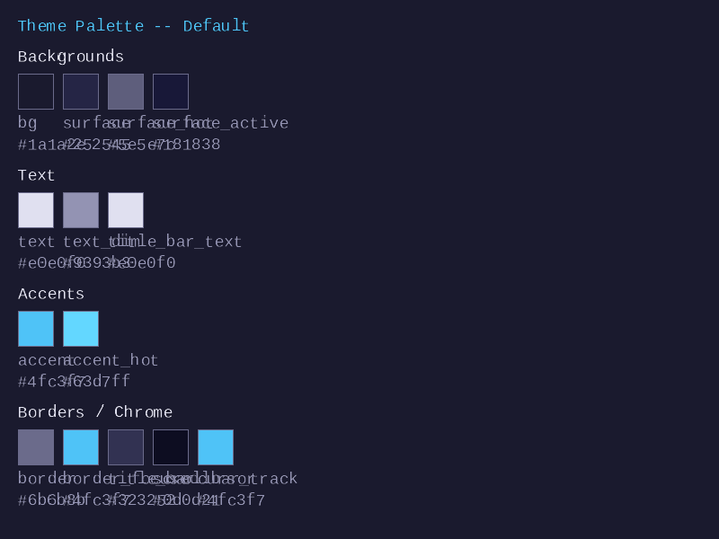
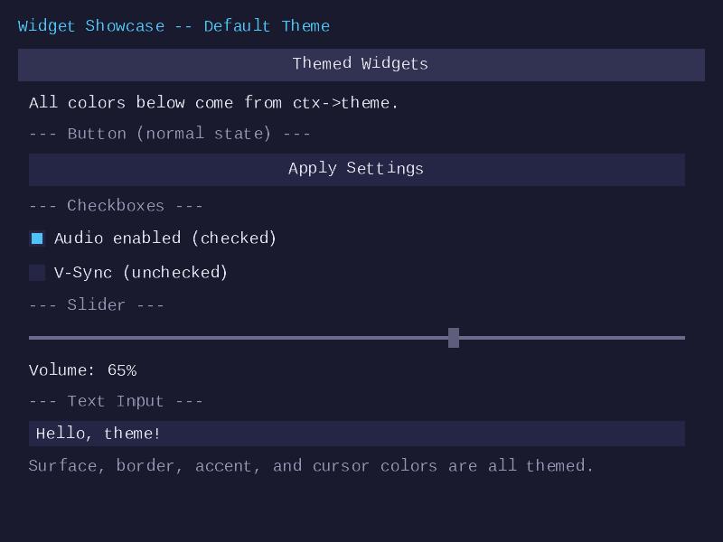
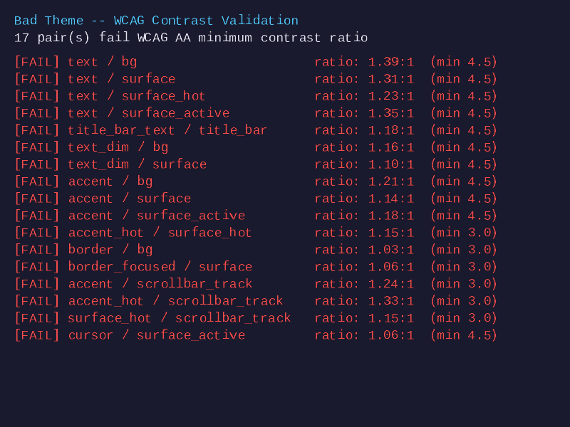
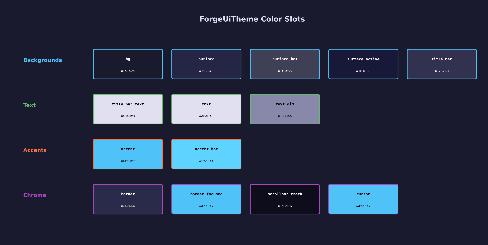
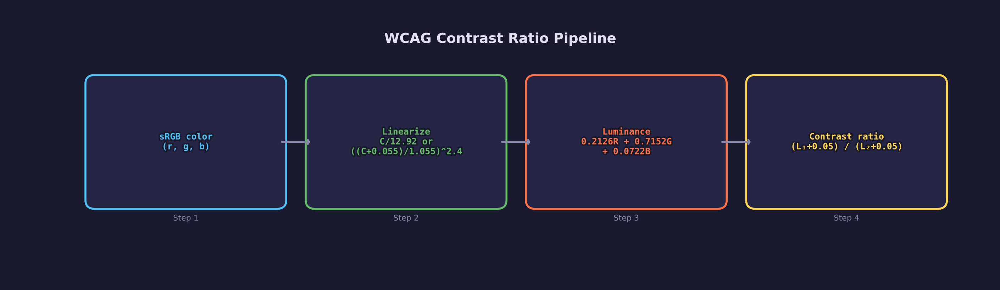
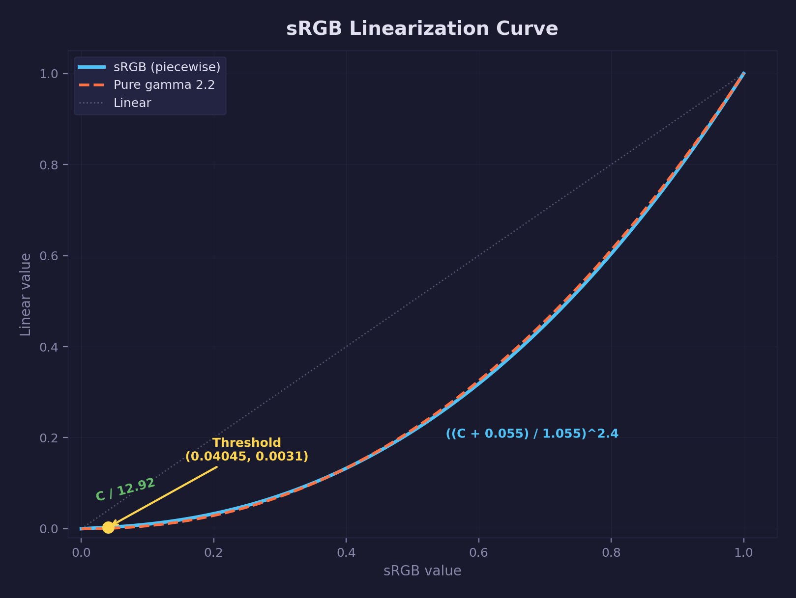
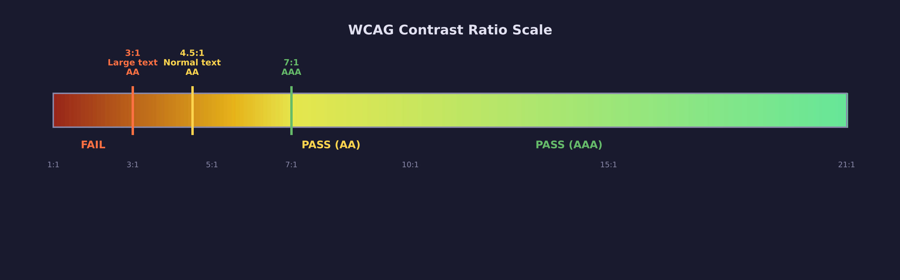
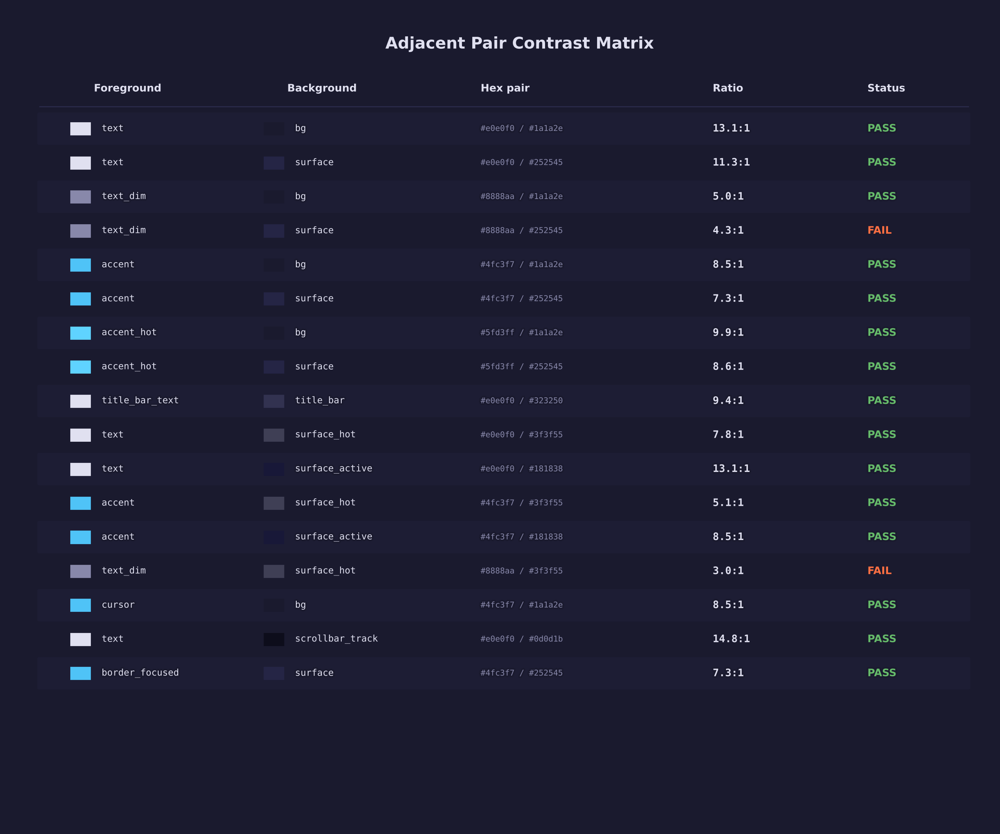
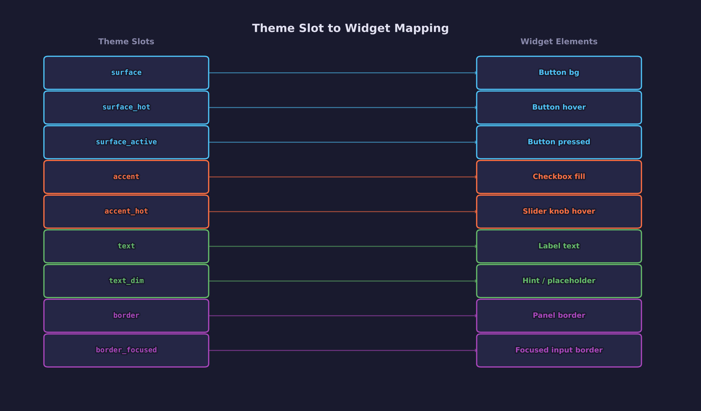

# UI Lesson 13 — Theming and Color System

Centralize all UI colors into a single `ForgeUiTheme` struct and validate
accessibility with WCAG 2.1 contrast ratio checks — swap the entire palette
in one function call.

## What you will learn

- How to centralize UI colors into a `ForgeUiTheme` struct so that changing
  the palette requires editing one place, not fifty scattered `#define` lines
- The `ForgeUiColor` struct: four floats (r, g, b, a) in [0, 1] representing
  a single sRGB color
- WCAG 2.1 contrast ratio math — sRGB linearization, relative luminance via
  the CIE 1931 luminosity coefficients, and the contrast ratio formula
- How to validate accessibility programmatically by checking all adjacent
  color pairs against two AA thresholds — 4.5:1 for text (SC 1.4.3) and
  3:1 for non-text UI components (SC 1.4.11)
- Refactoring from hardcoded `#define` constants to a centralized theme that
  widgets read at draw time

## Why this matters

Before theming, the UI system used roughly fifty `#define` color constants
spread across multiple headers.  Every widget type had its own set of color
values — buttons defined `FORGE_UI_BTN_BG_R`, `FORGE_UI_BTN_BG_G`,
`FORGE_UI_BTN_BG_B`; checkboxes had their own copies; sliders had yet
another set.  Changing the accent color meant editing a dozen constants across
several files and hoping you found them all.

A centralized theme solves this by storing every color in one struct.  Widgets
read from the theme at draw time, so changing `ctx->theme.accent` recolors
every widget that uses the accent — checkboxes, sliders, focused borders, and
the text cursor — in a single assignment.

Accessibility is equally important.  A palette that looks good on a designer's
monitor may be unreadable for users with low vision or in bright ambient light.
WCAG 2.1 provides a mathematical definition of "readable" through the contrast
ratio formula.  Building this check into the theme system means you can
validate any custom palette before shipping it.

## Result

The demo program produces three BMP images demonstrating the theme system.

**Frame 1 — Palette swatches:**



All 14 `ForgeUiTheme` color slots rendered as labeled swatches, organized
by role (backgrounds, text, accents, borders).  Each swatch shows its hex
value so you can visually verify the default palette.

**Frame 2 — Widget showcase:**



Common UI widgets (labels, buttons, checkboxes, sliders, text inputs,
panels) rendered using the default theme.  Every widget reads its colors
from `ctx->theme` instead of hardcoded constants.

**Frame 3 — Bad theme validation:**



A deliberately low-contrast theme is validated with
`forge_ui_theme_validate()`, and the failing color pairs are listed with
their computed contrast ratios.  This demonstrates the WCAG AA checking
built into the theme system.

## Key concepts

- **ForgeUiColor** — a struct of four floats (r, g, b, a) in [0, 1]
  representing a single sRGB color
- **ForgeUiTheme** — a struct of 14 `ForgeUiColor` slots covering every
  color role in the UI: backgrounds, surfaces, text, accents, borders,
  scrollbar, and cursor
- **Default palette** — derived from the project's matplotlib diagram style
  (`scripts/forge_diagrams/_common.py` STYLE dict), ensuring visual
  consistency between diagrams and the live UI
- **sRGB linearization** — the piecewise transfer function that converts
  display-gamma sRGB values to linear-light values for luminance calculation
- **Relative luminance** — the perceived brightness of a color, computed
  with CIE 1931 weights: L = 0.2126R + 0.7152G + 0.0722B
- **Contrast ratio** — (L\_lighter + 0.05) / (L\_darker + 0.05), ranging
  from 1:1 (identical colors) to 21:1 (black on white)
- **WCAG AA thresholds** — two levels based on element type:
  - **4.5:1 (SC 1.4.3)** for normal text — button labels, checkbox labels,
    input text, status messages, any text the user needs to read
  - **3:1 (SC 1.4.11)** for non-text UI components — borders, slider thumbs,
    scrollbar thumbs, checkbox outlines, focus indicators, panel edges — and
    for large text (18 pt regular or 14 pt bold and above)
- **Theme validation** — `forge_ui_theme_validate()` checks 17 adjacent
  color pairs, each against its applicable threshold, and returns the number
  that fail

## The details

### The problem with hardcoded colors

Before this lesson, widget colors were compile-time constants:

```c
/* In multiple headers, each widget had its own color set */
#define FORGE_UI_BTN_BG_R   0.145f
#define FORGE_UI_BTN_BG_G   0.145f
#define FORGE_UI_BTN_BG_B   0.271f

#define FORGE_UI_CB_FILL_R  0.310f
#define FORGE_UI_CB_FILL_G  0.765f
#define FORGE_UI_CB_FILL_B  0.969f

#define FORGE_UI_SL_TRACK_R 0.102f
#define FORGE_UI_SL_TRACK_G 0.102f
#define FORGE_UI_SL_TRACK_B 0.180f
/* ... dozens more ... */
```

Problems with this approach:

1. **Scatter** — colors live in multiple files, often duplicated
2. **No semantic names** — `BTN_BG` does not tell you *why* that color was
   chosen or what other widgets share it
3. **Palette changes are tedious** — changing the accent from cyan to green
   requires finding every `#define` that uses the cyan values
4. **No accessibility validation** — nothing verifies that text is readable
   against its background
5. **No runtime swapping** — `#define` values are baked at compile time

### ForgeUiColor and ForgeUiTheme



The `ForgeUiColor` struct holds a single color:

```c
typedef struct ForgeUiColor {
    float r;
    float g;
    float b;
    float a;
} ForgeUiColor;
```

All components are in [0, 1].  The alpha channel defaults to 1.0 (fully
opaque) for most theme slots.  Using floats rather than bytes avoids
repeated int-to-float conversions in the vertex pipeline and matches the
`ForgeUiVertex` color format from earlier lessons.

The `ForgeUiTheme` struct groups 14 color slots by semantic role:

```c
typedef struct ForgeUiTheme {
    ForgeUiColor bg;              /* app/panel background */
    ForgeUiColor surface;         /* widget backgrounds, input fields */
    ForgeUiColor surface_hot;     /* hovered widget backgrounds */
    ForgeUiColor surface_active;  /* pressed widget backgrounds */
    ForgeUiColor title_bar;       /* panel/window title bar bg */
    ForgeUiColor title_bar_text;  /* title bar label color */
    ForgeUiColor text;            /* primary text */
    ForgeUiColor text_dim;        /* secondary/disabled text */
    ForgeUiColor accent;          /* check fill, active slider, focused border */
    ForgeUiColor accent_hot;      /* hovered accent elements */
    ForgeUiColor border;          /* unfocused borders, panel outlines */
    ForgeUiColor border_focused;  /* focused widget borders */
    ForgeUiColor scrollbar_track; /* scrollbar track bg */
    ForgeUiColor cursor;          /* text input cursor bar */
} ForgeUiTheme;
```

The naming convention encodes both *role* and *state*:

| Suffix | Meaning |
|--------|---------|
| *(none)* | Default / idle state |
| `_hot` | Mouse hovering over the element |
| `_active` | Element is pressed or held |
| `_focused` | Element has keyboard focus |
| `_dim` | De-emphasized or disabled |

### The default palette

The default theme is returned by `forge_ui_theme_default()`.  Every hex
value traces back to the project's matplotlib diagram style dictionary
(`scripts/forge_diagrams/_common.py`), ensuring the live UI matches the
colors used in lesson diagrams.

| Slot | Hex | R | G | B | Purpose |
|------|-----|---|---|---|---------|
| `bg` | `#1a1a2e` | 0.102 | 0.102 | 0.180 | App / panel background |
| `surface` | `#252545` | 0.145 | 0.145 | 0.271 | Widget backgrounds |
| `surface_hot` | `#5e5e7c` | 0.369 | 0.369 | 0.486 | Hovered widgets |
| `surface_active` | `#181838` | 0.095 | 0.095 | 0.221 | Pressed widgets |
| `title_bar` | `#323252` | 0.195 | 0.195 | 0.321 | Title bar background |
| `title_bar_text` | `#e0e0f0` | 0.878 | 0.878 | 0.941 | Title bar label |
| `text` | `#e0e0f0` | 0.878 | 0.878 | 0.941 | Primary text |
| `text_dim` | `#9393b3` | 0.576 | 0.576 | 0.702 | Secondary / disabled text |
| `accent` | `#4fc3f7` | 0.310 | 0.765 | 0.969 | Highlights, checked state |
| `accent_hot` | `#63d8ff` | 0.390 | 0.845 | 1.000 | Hovered highlights |
| `border` | `#6b6b8b` | 0.420 | 0.420 | 0.545 | Unfocused outlines |
| `border_focused` | `#4fc3f7` | 0.310 | 0.765 | 0.969 | Focused outlines (= accent) |
| `scrollbar_track` | `#0d0d21` | 0.052 | 0.052 | 0.130 | Scrollbar track background |
| `cursor` | `#4fc3f7` | 0.310 | 0.765 | 0.969 | Text input cursor (= accent) |

The five core colors from the STYLE dict — `bg` (#1a1a2e), `surface`
(#252545), `text` (#e0e0f0), `accent1` (#4fc3f7), and `grid` (#6b6b8b) —
anchor the palette.  The remaining nine slots are derived by adjusting
brightness (surface\_hot = surface + 0.22, surface\_active = surface - 0.05)
or by aliasing (border\_focused = cursor = accent).

### WCAG contrast ratio math



The Web Content Accessibility Guidelines (WCAG) 2.1 define "readable" text
in terms of the *contrast ratio* between foreground and background colors.
Computing this ratio involves three steps.

#### Step 1: sRGB linearization



Display hardware applies a gamma curve to stored pixel values.  The sRGB
standard (IEC 61966-2-1) defines a piecewise transfer function to convert
from display-gamma values back to linear-light values:

$$
C_{\text{linear}} = \begin{cases}
\dfrac{C_{\text{sRGB}}}{12.92} & \text{if } C_{\text{sRGB}} \leq 0.04045 \\[6pt]
\left(\dfrac{C_{\text{sRGB}} + 0.055}{1.055}\right)^{2.4} & \text{otherwise}
\end{cases}
$$

The threshold 0.04045 and the constants 12.92, 0.055, and 1.055 are chosen
so that the linear and gamma segments meet with matching value and slope at
the junction point.  Below the threshold, the function is linear (avoiding
numerical instability near zero); above it, the 2.4 exponent models the
CRT-era gamma curve that sRGB was designed to match.

In C:

```c
static inline float forge_ui_theme_linearize(float c)
{
    return (c <= 0.04045f)
        ? c / 12.92f
        : powf((c + 0.055f) / 1.055f, 2.4f);
}
```

#### Step 2: Relative luminance

With all three channels linearized, the relative luminance is a weighted
sum using the CIE 1931 color-matching function weights:

$$
L = 0.2126 \, R_{\text{linear}} + 0.7152 \, G_{\text{linear}} + 0.0722 \, B_{\text{linear}}
$$

These weights reflect human visual sensitivity — we perceive green as far
brighter than blue at equal physical intensity.  The CIE 1931 standard
derived these weights from color-matching experiments with human observers.

```c
static inline float forge_ui_theme_relative_luminance(float r, float g, float b)
{
    float rl = forge_ui_theme_linearize(r);
    float gl = forge_ui_theme_linearize(g);
    float bl = forge_ui_theme_linearize(b);
    return 0.2126f * rl + 0.7152f * gl + 0.0722f * bl;
}
```

The returned value is in [0, 1], where 0 is pure black and 1 is pure white.

#### Step 3: Contrast ratio



The contrast ratio between two colors is defined as:

$$
\text{ratio} = \frac{L_{\text{lighter}} + 0.05}{L_{\text{darker}} + 0.05}
$$

The 0.05 offset serves two purposes: it prevents division by zero when the
darker color is pure black (L = 0), and it models the ambient light
reflected off the display surface, which slightly raises the effective
luminance of both colors.

The ratio ranges from 1:1 (identical colors) to 21:1 (pure black on pure
white).  WCAG defines two conformance levels:

| Level | Normal text | Large text / non-text UI |
|-------|-------------|--------------------------|
| AA | 4.5:1 | 3:1 |
| AAA | 7:1 | 4.5:1 |

"Large text" is defined as 18 pt (24 px) regular weight or 14 pt (18.66 px)
bold.

#### Why two thresholds

The two thresholds target different kinds of visual elements based on how
critical they are for comprehension.

**4.5:1 — normal text (SC 1.4.3).** This is the stricter threshold.  It
applies to text that a user needs to read: button labels, checkbox labels,
paragraph text, input field text, status messages.  Text carries semantic
meaning — if you cannot read "Save" on a button, you do not know what the
button does.  The 4.5 ratio was derived from research on visual acuity loss:
it provides sufficient contrast for users with roughly 20/40 vision (moderate
low vision), which is the threshold many countries use for driving
eligibility.  It also accounts for typical ambient lighting conditions that
wash out screens.

**3:1 — large text and non-text UI components (SC 1.4.11).** This is the
relaxed threshold.  It applies to two categories:

- **Large text** (18 pt regular or 14 pt bold and above): the lower ratio is
  acceptable because larger characters are physically easier to perceive —
  more photoreceptors cover each letter, so less contrast is needed to
  distinguish the shape.  Title bar text at larger font sizes could qualify
  here.
- **Non-text UI components**: visual elements that convey meaning through
  shape and position rather than readable characters — borders around input
  fields (the user needs to see where the field is), checkbox outlines (the
  user needs to see the box exists), slider thumbs against the track (the
  user needs to see where the thumb is), scrollbar thumbs, focus indicators,
  and panel/window edges.  These elements are larger and simpler than text
  glyphs — a rectangle outline does not need the same contrast as an 'e'
  versus an 'a' to be distinguishable.

#### Mapping thresholds to theme pairs

In our theme, the practical mapping is:

**4.5:1 pairs (text that users read):**

- `text` on `bg`, `surface`, `surface_hot`, `surface_active`
- `title_bar_text` on `title_bar`
- `text_dim` on `bg`, `surface` — secondary labels are still informational
  in this educational UI, so they use the stricter text threshold
- `accent` on `bg`, `surface`, `surface_active` — accent is used for
  readable labels (checkbox label when checked, link-style text)
- `cursor` on `surface_active` — the cursor bar is thin like text

**3:1 pairs (non-text graphical components):**

- `border` on `bg` — unfocused panel outlines, widget borders
- `border_focused` on `surface` — focused border outline (non-text UI
  component per SC 1.4.11)
- `accent` on `scrollbar_track` — scrollbar thumb visibility
- `accent_hot` on `surface_hot`, `scrollbar_track` — hovered graphical state
- `surface_hot` on `scrollbar_track` — scrollbar thumb on track
The `text_dim` slots deserve careful consideration.  If `text_dim` is used
for disabled or secondary text that the user still needs to read, it should
meet 4.5:1.  If it were purely decorative (like a watermark), WCAG would not
require it to meet any threshold.  In this educational UI, secondary labels
are informational, so 4.5:1 is the safe choice.

The full implementation:

```c
static inline float forge_ui_theme_contrast_ratio(float r1, float g1, float b1,
                                                   float r2, float g2, float b2)
{
    float l1 = forge_ui_theme_relative_luminance(r1, g1, b1);
    float l2 = forge_ui_theme_relative_luminance(r2, g2, b2);

    /* Ensure l1 >= l2 (lighter on top) */
    if (l2 > l1) {
        float tmp = l1;
        l1 = l2;
        l2 = tmp;
    }

    return (l1 + 0.05f) / (l2 + 0.05f);
}
```

### Theme validation



`forge_ui_theme_validate()` checks 17 adjacent color pairs — every
combination of foreground and background that appears in the rendered UI.
"Adjacent" means the two colors are placed next to each other on screen:
text on its background, accent on surface, border against panel, and so on.

Each pair carries its own minimum threshold.  Text pairs use 4.5:1
(SC 1.4.3); non-text graphical UI components use 3:1 (SC 1.4.11):

```c
static inline int forge_ui_theme_validate(const ForgeUiTheme *theme)
{
    if (!theme) return -1;

    /* WCAG AA thresholds */
    const float AA_TEXT    = 4.5f;  /* SC 1.4.3  — normal text */
    const float AA_NONTEXT = 3.0f;  /* SC 1.4.11 — UI components */

    int failures = 0;

    /* Each entry: foreground, background, pair name, threshold.
     * Text pairs use 4.5:1; non-text graphical pairs use 3:1. */
    struct {
        const ForgeUiColor *fg;
        const ForgeUiColor *bg;
        const char *name;
        float min_ratio;
    } pairs[] = {
        /* text on backgrounds (4.5:1) */
        { &theme->text,           &theme->bg,             "text / bg",             AA_TEXT },
        { &theme->text,           &theme->surface,        "text / surface",        AA_TEXT },
        { &theme->text,           &theme->surface_hot,    "text / surface_hot",    AA_TEXT },
        { &theme->text,           &theme->surface_active, "text / surface_active", AA_TEXT },
        { &theme->title_bar_text, &theme->title_bar,      "title_bar_text / title_bar", AA_TEXT },
        /* dim text on backgrounds (4.5:1) */
        { &theme->text_dim,       &theme->bg,             "text_dim / bg",         AA_TEXT },
        { &theme->text_dim,       &theme->surface,        "text_dim / surface",    AA_TEXT },
        /* accent text on backgrounds (4.5:1) */
        { &theme->accent,         &theme->bg,             "accent / bg",           AA_TEXT },
        { &theme->accent,         &theme->surface,        "accent / surface",      AA_TEXT },
        { &theme->accent,         &theme->surface_active, "accent / surface_active", AA_TEXT },
        { &theme->accent_hot,     &theme->surface_hot,    "accent_hot / surface_hot", AA_NONTEXT },
        /* border visibility — non-text UI components (3:1) */
        { &theme->border,         &theme->bg,             "border / bg",           AA_NONTEXT },
        { &theme->border_focused, &theme->surface,        "border_focused / surface", AA_NONTEXT },
        /* scrollbar — non-text UI components (3:1) */
        { &theme->accent,         &theme->scrollbar_track, "accent / scrollbar_track", AA_NONTEXT },
        { &theme->accent_hot,     &theme->scrollbar_track, "accent_hot / scrollbar_track", AA_NONTEXT },
        { &theme->surface_hot,    &theme->scrollbar_track, "surface_hot / scrollbar_track", AA_NONTEXT },
        /* cursor — thin bar, requires text-level contrast (4.5:1, SC 1.4.3) */
        { &theme->cursor,         &theme->surface_active, "cursor / surface_active", AA_TEXT },
    };

    int count = (int)(sizeof(pairs) / sizeof(pairs[0]));
    for (int i = 0; i < count; i++) {
        float ratio = forge_ui_theme_contrast_ratio(
            pairs[i].fg->r, pairs[i].fg->g, pairs[i].fg->b,
            pairs[i].bg->r, pairs[i].bg->g, pairs[i].bg->b);
        if (ratio < pairs[i].min_ratio) {
            failures++;
        }
    }

    return failures;
}
```

The function returns the number of failing pairs.  A return of 0 means
every pair meets its applicable WCAG AA threshold.  When building a custom
theme, call this function and log any failures before shipping.

### Slot-to-widget mapping



Each theme slot maps to specific widget states.  This table shows which
slot controls which visual element:

| Theme slot | Widget / element |
|------------|-----------------|
| `bg` | Panel body background, window content area, app clear color |
| `surface` | Button normal background, checkbox background, slider track, text input background |
| `surface_hot` | Button hovered background, checkbox hovered, slider hovered, scrollbar thumb idle |
| `surface_active` | Button pressed background, checkbox pressed, slider pressed |
| `title_bar` | Panel title bar fill, window title bar fill |
| `title_bar_text` | Panel title label, window title label |
| `text` | Button label, checkbox label, slider value label, text input content |
| `text_dim` | Disabled button label, placeholder text, secondary labels |
| `accent` | Checkbox checked fill, slider active track, focused border, scrollbar thumb, cursor |
| `accent_hot` | Checkbox checked + hovered fill, scrollbar thumb hovered |
| `border` | Unfocused widget outlines, panel borders |
| `border_focused` | Focused widget outlines (same as accent by default) |
| `scrollbar_track` | Scrollbar track background (darker than panel bg) |
| `cursor` | Text input blinking cursor bar (same as accent by default) |

Three slots share the accent color by default (`border_focused`, `cursor`,
and `accent` itself).  This creates visual consistency — the focused state
and the cursor both match the accent highlight.  A custom theme can break
this link by assigning different colors to each slot.

### Using the theme in code

#### Reading theme colors in widget functions

Every widget function reads colors from `ctx->theme` rather than from
compile-time constants:

```c
/* Before (hardcoded): */
float bg_r = FORGE_UI_BTN_BG_R;
float bg_g = FORGE_UI_BTN_BG_G;
float bg_b = FORGE_UI_BTN_BG_B;

/* After (themed): */
ForgeUiColor bg = ctx->theme.surface;
/* use bg.r, bg.g, bg.b, bg.a */
```

For hover and active states, the widget checks the interaction state and
selects the appropriate slot:

```c
ForgeUiColor bg;
if (is_active) {
    bg = ctx->theme.surface_active;
} else if (is_hot) {
    bg = ctx->theme.surface_hot;
} else {
    bg = ctx->theme.surface;
}
```

#### Setting a theme

`forge_ui_ctx_init()` installs the default theme automatically.  To use a
custom theme, call `forge_ui_ctx_set_theme()` after initialization but
before the first frame:

```c
forge_ui_ctx_init(&ctx, &atlas);

/* Create and apply a custom warm theme */
ForgeUiTheme warm = forge_ui_theme_default();
warm.accent     = (ForgeUiColor){ 1.0f, 0.694f, 0.251f, 1.0f }; /* amber */
warm.accent_hot = (ForgeUiColor){ 1.0f, 0.776f, 0.384f, 1.0f };
warm.bg         = (ForgeUiColor){ 0.157f, 0.122f, 0.098f, 1.0f };
warm.surface    = (ForgeUiColor){ 0.220f, 0.180f, 0.149f, 1.0f };

/* Validate before applying */
int fails = forge_ui_theme_validate(&warm);
if (fails > 0) {
    SDL_Log("Warning: custom theme has %d contrast failures", fails);
}

if (!forge_ui_ctx_set_theme(&ctx, warm)) {
    SDL_Log("set_theme failed: out-of-range color component");
}
```

#### Creating a theme from scratch

Start from the default and override only the slots you need.  This ensures
any unmodified slots remain accessible:

```c
ForgeUiTheme high_contrast = forge_ui_theme_default();

/* Push text to pure white, bg to pure black */
high_contrast.text           = (ForgeUiColor){ 1.0f, 1.0f, 1.0f, 1.0f };
high_contrast.title_bar_text = (ForgeUiColor){ 1.0f, 1.0f, 1.0f, 1.0f };
high_contrast.bg             = (ForgeUiColor){ 0.0f, 0.0f, 0.0f, 1.0f };
high_contrast.surface        = (ForgeUiColor){ 0.1f, 0.1f, 0.1f, 1.0f };

/* This theme will pass WCAG AAA (7:1) for text on bg */
int fails = forge_ui_theme_validate(&high_contrast);
SDL_Log("High-contrast theme: %d failures", fails); /* expect 0 */

if (!forge_ui_ctx_set_theme(&ctx, high_contrast)) {
    SDL_Log("set_theme failed");
}
```

## Data output

The demo produces standard UI vertex/index data rendered through
`forge_raster_triangles_indexed` (from `common/raster/`):

- **Vertices**: `ForgeUiVertex` — pos (x, y), UV (u, v), color (r, g, b, a)
  — 32 bytes per vertex
- **Indices**: `uint32_t` triangle list, counter-clockwise (CCW) winding
- **Textures**: grayscale font atlas (single-channel alpha), dimensions vary
  by scale

## Where it is used

In forge-gpu lessons:

- [GPU Lesson 28 — UI Rendering](../../gpu/28-ui-rendering/) renders UI
  vertex data on the GPU with a single draw call
- [UI Lesson 12 — Font Scaling and Spacing](../12-font-scaling-and-spacing/)
  introduced the scale factor and spacing struct — the theme works alongside
  these to provide complete UI customization
- [UI Lesson 09 — Panels and Scrolling](../09-panels-and-scrolling/)
  introduced panels whose title bar and scrollbar now read from the theme
- [UI Lesson 10 — Windows](../10-windows/) introduced draggable windows whose
  chrome colors now come from the theme
- [UI Lesson 11 — Widget ID System](../11-widget-id-system/) introduced
  FNV-1a hashing — widget IDs are independent of theme colors

## Building

```bash
cmake -B build
cmake --build build --target 13-theming-and-color-system

# Linux / macOS
./build/lessons/ui/13-theming-and-color-system/13-theming-and-color-system

# Windows
build\lessons\ui\13-theming-and-color-system\Debug\13-theming-and-color-system.exe
```

Output: `frame1_palette.bmp`, `frame2_widgets.bmp`, and
`frame3_bad_theme.bmp` showing the default palette, themed widgets, and
WCAG validation results.

## Exercises

1. **Solarized dark theme**: Create a theme using the
   [Solarized](https://ethanschoonover.com/solarized/) dark palette
   (base03 = #002b36, base0 = #839496, cyan = #2aa198).  Run
   `forge_ui_theme_validate` and adjust any slots that fail the AA
   threshold.  Compare the result visually with the default theme.

2. **Contrast ratio reporter**: Write a function that iterates all 17
   adjacent pairs and prints each pair's name and contrast ratio.  Sort the
   output by ratio (lowest first) to quickly spot the weakest pairs.  Run
   it on both the default theme and a custom theme of your choosing.

3. **Light theme**: Build a light theme (white background, dark text).
   You will need to invert most slots — `bg` becomes near-white, `text`
   becomes near-black, `surface` becomes a light gray.  Pay attention to
   the accent color: cyan (#4fc3f7) on a white background has poor contrast.
   Choose a darker accent (e.g. #0277bd) and validate with
   `forge_ui_theme_validate`.

4. **Runtime theme picker**: Add a second panel to the demo that lists three
   theme names (Default, Warm, High Contrast) as buttons.  Pressing a button
   calls `forge_ui_ctx_set_theme` with the selected theme and re-renders the
   widget panel.  This demonstrates that theme changes take effect
   immediately without rebuilding the atlas or re-initializing the context.

## Further reading

- [UI Lesson 12 — Font Scaling and Spacing](../12-font-scaling-and-spacing/)
  covers the scale factor and spacing system that works alongside theming
- [UI Lesson 05 — Text Rendering](../05-text-rendering/) explains how glyph
  colors are applied via vertex color, which the theme now controls
- [UI Lesson 08 — Layout](../08-layout/) covers the layout system whose
  spacing defaults complement the theme's color defaults
- [Math Lesson 01 — Vectors](../../math/01-vectors/) provides the float
  arithmetic concepts used in color manipulation
- [Engine Lesson 01 — Intro to C](../../engine/01-intro-to-c/) covers the
  struct and `#define` conventions used for `ForgeUiColor` and `ForgeUiTheme`
- [WCAG 2.1 — Understanding Success Criterion 1.4.3](https://www.w3.org/WAI/WCAG21/Understanding/contrast-minimum.html)
  is the W3C specification for minimum contrast ratios
- [sRGB standard (IEC 61966-2-1)](https://www.color.org/chardata/rgb/srgb.xalter)
  defines the transfer function used in the linearization step
- [CIE 1931 color space](https://en.wikipedia.org/wiki/CIE_1931_color_space)
  documents the luminosity weights used in the relative luminance formula
